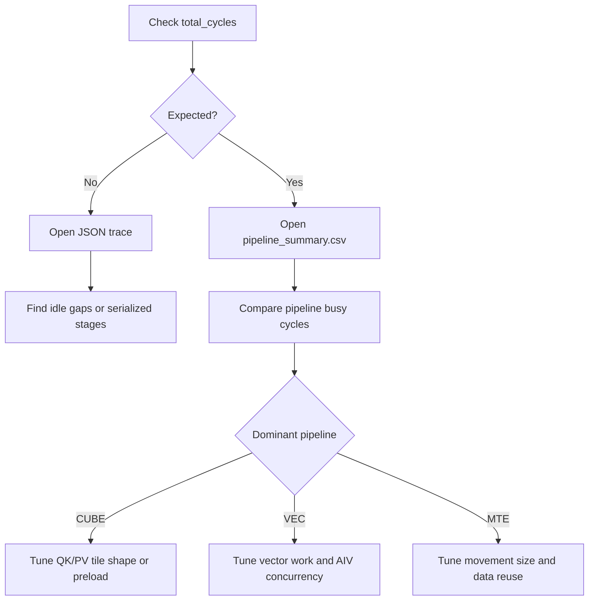

# Perf-Sim User Guide

Perf-Sim is the pipeline-level simulator used by the PTO cost model. It does not execute a kernel on NPU hardware. Instead, it runs the `__COSTMODEL` version of the kernel in a normal C++ process, records PTO instructions and synchronization events, simulates pipeline scheduling, and emits total cycles, pipeline busy cycles, and a JSON trace.

## When To Use It

- Estimate the pipeline behavior and total cycles of a PTO kernel.
- Compare tile shapes, preload depth, and synchronization strategies.
- Check whether AIC/AIV, MTE, VEC, and FIXP pipelines overlap as expected.
- Run quick performance analysis without NPU hardware or a full NPU ST flow.

Perf-Sim is intended for performance modeling and trend analysis. It does not replace hardware profiling.

## Run An Existing Test

The FA perf-sim test is located at:

```text
tests/costmodel/perf_sim_st/testcase/fa_perf_sim
```

Build and run:

```bash
cmake --build tests/costmodel/perf_sim_st/build --target fa_perf_sim --parallel 4
tests/costmodel/perf_sim_st/build/bin/fa_perf_sim
```

Run one test case:

```bash
tests/costmodel/perf_sim_st/build/bin/fa_perf_sim \
  --gtest_filter=FAPerfSim.LongSeq_256x64x2048
```

The default output directory is:

```text
perf_sim_output/
```

## Add A New Kernel

### 1. Use the costmodel test tree

Create a test under `tests/costmodel/perf_sim_st/testcase/<case_name>/` and register the target:

```cmake
pto_costmodel_sim_st(my_perf_sim)
target_include_directories(my_perf_sim PRIVATE
    ${PROJECT_SOURCE_DIR}/../../../kernels/manual/common/my_kernel
)
```

The costmodel project defines:

```cpp
__COSTMODEL
__NPU_ARCH__=2201
PTO_COMM_NOT_SUPPORTED
```

### 2. Include the perf-sim launcher

A typical test entry includes:

```cpp
#include <pto/pto-inst.hpp>
#include <pto/costmodel/perf_sim/launch.hpp>
#include <gtest/gtest.h>

#include "my_kernel.cpp"
```

Under `__COSTMODEL`, `<pto/pto-inst.hpp>` selects the costmodel PTO instruction implementation. `launch.hpp` provides `LAUNCH_KERNEL`, which replaces the real NPU launch in the test.

### 3. Write a plain C++ wrapper

Perf-Sim needs to call the kernel body inside the CPU process. In most cases, do not call the host-side `LaunchXXX` wrapper. Call the kernel function directly:

```cpp
void runMyKernelCase()
{
    runMyKernel<128, 128, 1024>(
        nullptr, nullptr, nullptr);
}

TEST(MyPerfSim, Basic)
{
    LAUNCH_KERNEL(runMyKernelCase, , (1, nullptr, nullptr));
}
```

`LAUNCH_KERNEL(func, targs, (block_dim, l2_ptr, stream), args...)` uses the third argument as a simulated launch config:

| Field | Meaning |
| --- | --- |
| `block_dim` | Number of physical AIC cores. `1` means single core, `4` means four physical cores. |
| `l2_ptr` | Enables the L2 cache model when non-null. Most tests pass `nullptr`. |
| `stream` | Unused in costmodel mode. Usually `nullptr`. |

### 4. Guard host launch code

If the original kernel file contains a host launch wrapper:

```cpp
void LaunchMyKernel(..., aclrtStream stream)
{
    runMyKernel<<<block_dim, nullptr, stream>>>(...);
}
```

The `<<<...>>>` syntax cannot be parsed by a normal C++ compiler. Guard host launch wrappers with `#ifndef __COSTMODEL`:

```cpp
#ifndef __COSTMODEL
void LaunchMyKernel(..., aclrtStream stream)
{
    runMyKernel<<<block_dim, nullptr, stream>>>(...);
}
#endif
```

Do not guard the kernel body itself. Perf-Sim still needs to call it.

### 5. Handle NPU-only headers

Costmodel test targets include this directory first:

```text
include/pto/costmodel/stubs
```

It contains costmodel-only ACL and prefetch stubs. Add new compatibility stubs there when necessary. Avoid changing public NPU headers just to satisfy the costmodel build.

## Outputs

Each `LAUNCH_KERNEL` call emits:

```text
perf_sim_output/<op_name>.json
perf_sim_output/<op_name>_pipeline_summary.csv
```

`<op_name>` is the function name passed to `LAUNCH_KERNEL`, for example `runTFA_256x64x2048`.

### Text Report

The test prints a report similar to:

```text
===== Perf-Sim Report: runTFA_256x64x2048 =====
Cores        : 1
Instructions : 1313
Sync events  : 1046
Total cycles : 60320

Pipeline     | AIC-0   |
-------------+--------+
      Scalar |    580 |
   MTE2(AIC) |  13585 |
        MTE1 |   7216 |
        CUBE |   8384 |
        FIXP |  16144 |
   MTE2(AIV) |  22320 |
         VEC |  72160 |
        MTE3 |   5034 |
```

Key fields:

- `Total cycles`: end-to-end simulated cycles.
- Pipeline busy cycles: accumulated work on each pipeline.
- In multi-core cases, each column represents one physical core.

### pipeline_summary.csv

CSV header:

```csv
op_name,core_id,unit,total_cycles,active_start_cycle,active_end_cycle,active_cycles,busy_cycles,scalar_cycles,mte2_aic_cycles,mte2_aiv_cycles,mte1_cycles,cube_cycles,fixp_cycles,vec_cycles,mte3_cycles
```

Each physical core emits three rows: `AIC`, `AIV0`, and `AIV1`. This keeps the 1C2V structure visible instead of adding both AIV busy-cycle totals together.

| Column | Meaning |
| --- | --- |
| `unit` | `AIC`, `AIV0`, or `AIV1` |
| `total_cycles` | End-to-end cycles of the physical core |
| `active_start_cycle` / `active_end_cycle` | First and last non-zero-duration event of this unit |
| `active_cycles` | `active_end_cycle - active_start_cycle`; use this when comparing with CAModel core/veccore execution windows |
| `busy_cycles` | Sum of busy cycles in this unit |
| `mte2_aic_cycles` / `mte2_aiv_cycles` | MTE2 is split by AIC and AIV. AIC rows use `mte2_aic_cycles`; AIV rows use `mte2_aiv_cycles`. |

Example:

```csv
op_name,core_id,unit,total_cycles,active_start_cycle,active_end_cycle,active_cycles,busy_cycles,scalar_cycles,mte2_aic_cycles,mte2_aiv_cycles,mte1_cycles,cube_cycles,fixp_cycles,vec_cycles,mte3_cycles
runTFA_64x64x512,0,AIC,12438,0,11849,11849,7592,292,2600,0,1560,1120,2020,0,0
runTFA_64x64x512,0,AIV0,12438,1488,12438,10950,9000,0,0,1366,0,0,0,7272,362
runTFA_64x64x512,0,AIV1,12438,1488,12438,10950,9000,0,0,1366,0,0,0,7272,362
```

Typical use:

- Compare `total_cycles` between parameter sets.
- Identify dominant pipelines, such as high `vec_cycles`.
- Check whether rows are close in a multi-core run.

### JSON Trace

`<op_name>.json` uses the Chrome Trace Event format. Open it with Perfetto or Chrome tracing:

```text
chrome://tracing
```

Use the trace to inspect:

- Whether AIC and AIV overlap.
- Whether MTE2/MTE1/CUBE/FIXP/VEC/MTE3 form a steady pipeline.
- Long idle gaps or serial regions.
- Per-core balance in multi-core runs.

## Reading Results



## FAQ

### The build fails on `<<<...>>>`

Costmodel compiled a host launch wrapper. Guard the wrapper with `#ifndef __COSTMODEL` and call the kernel body directly from the test.

### The build cannot find `acl/acl.h`

Make sure the target includes:

```text
include/pto/costmodel/stubs
```

Do not add a global stub under public `include/acl` for costmodel only.

### AIV0 and AIV1 look very different

First check whether the kernel intentionally splits work by subblock. If both AIVs in the same physical core are meant to be equivalent, their task ranges and busy cycles should usually be close.

### Can pipeline busy cycles exceed total cycles?

Yes. `total_cycles` is wall-clock time. Pipeline busy cycles are accumulated durations. With concurrent pipelines or multiple AIVs, accumulated busy cycles can be larger than total cycles.
