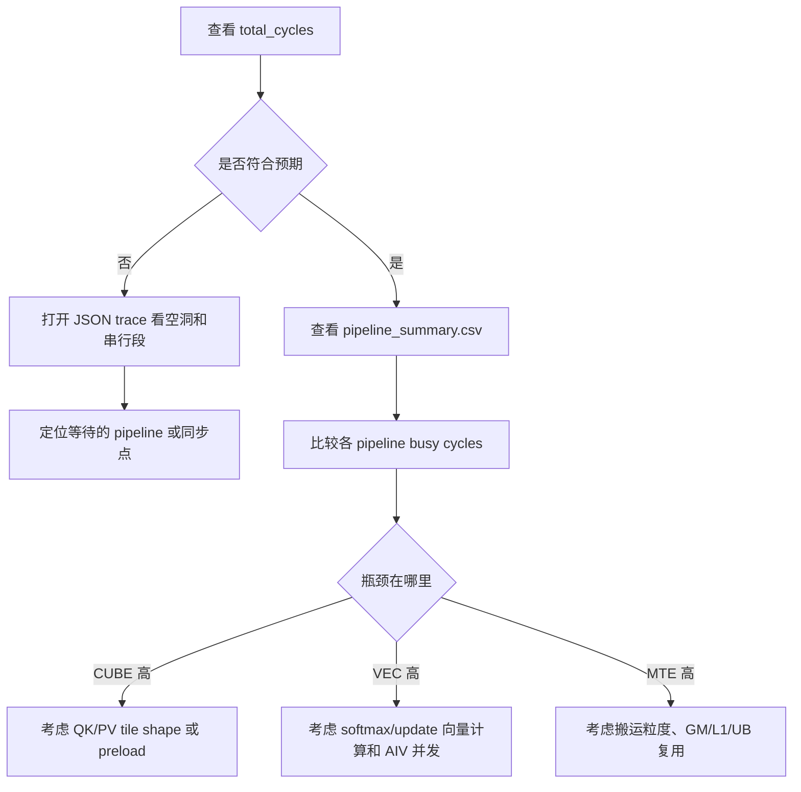

# Perf-Sim 用户指南

Perf-Sim 是 PTO costmodel 下的 pipeline 级算子仿真工具。它不在 NPU 上真正执行 kernel，而是在普通 C++ 进程中运行 `__COSTMODEL` 版本的 kernel，记录 PTO 指令、同步事件和 pipeline 时序，然后输出总周期、各 pipeline 忙碌周期和可视化 trace。

## 适用场景

- 评估一个 PTO kernel 的 pipeline 利用率和总周期。
- 对比不同 tile shape、preload 深度、同步策略的性能趋势。
- 检查 AIC/AIV、MTE、VEC、FIXP 等 pipeline 是否按预期并发。
- 在没有 NPU 硬件或不想跑完整 NPU ST 时做快速分析。

Perf-Sim 的结果用于性能建模和趋势判断，不替代真实硬件 profiling。

## 快速运行现有用例

FA perf-sim 用例位于：

```text
tests/costmodel/perf_sim_st/testcase/fa_perf_sim
```

构建并运行：

```bash
cmake --build tests/costmodel/perf_sim_st/build --target fa_perf_sim --parallel 4
tests/costmodel/perf_sim_st/build/bin/fa_perf_sim
```

只运行某个 case：

```bash
tests/costmodel/perf_sim_st/build/bin/fa_perf_sim \
  --gtest_filter=FAPerfSim.LongSeq_256x64x2048
```

运行后默认输出目录是：

```text
perf_sim_output/
```

## 接入一个新 kernel

### 1. 使用 costmodel 测试工程

推荐在 `tests/costmodel/perf_sim_st/testcase/<case_name>/` 下新增用例目录，并在对应 `CMakeLists.txt` 中注册 target：

```cmake
pto_costmodel_sim_st(my_perf_sim)
target_include_directories(my_perf_sim PRIVATE
    ${PROJECT_SOURCE_DIR}/../../../kernels/manual/common/my_kernel
)
```

costmodel 工程会自动定义：

```cpp
__COSTMODEL
__NPU_ARCH__=2201
PTO_COMM_NOT_SUPPORTED
```

### 2. 包含 perf-sim launch 头

测试入口通常包含：

```cpp
#include <pto/pto-inst.hpp>
#include <pto/costmodel/perf_sim/launch.hpp>
#include <gtest/gtest.h>

#include "my_kernel.cpp"
```

`<pto/pto-inst.hpp>` 在 `__COSTMODEL` 下会选择 costmodel 版本的 PTO 指令实现。`launch.hpp` 提供 `LAUNCH_KERNEL`，用于替换真实 NPU launch。

### 3. 写一个普通 C++ wrapper

Perf-Sim 需要让 kernel body 在 CPU 进程中被调用。通常不要调用 host 侧 `LaunchXXX`，而是直接调用真正的 kernel 函数：

```cpp
void runMyKernelCase()
{
    runMyKernel<128, 128, 1024>(
        nullptr, nullptr, nullptr);
}

TEST(MyPerfSim, Basic)
{
    LAUNCH_KERNEL(runMyKernelCase, , (1, nullptr, nullptr));
}
```

`LAUNCH_KERNEL(func, targs, (block_dim, l2_ptr, stream), args...)` 的第三个参数模拟 NPU launch config：

| 字段 | 含义 |
| --- | --- |
| `block_dim` | 物理 AIC core 数。`1` 是单核，`4` 表示 4 个物理 core。 |
| `l2_ptr` | 非空时启用 L2 cache model；当前常用 `nullptr`。 |
| `stream` | costmodel 下不使用，通常传 `nullptr`。 |

### 4. 处理 host launch 代码

如果原始 kernel 文件里有 host launch wrapper，例如：

```cpp
void LaunchMyKernel(..., aclrtStream stream)
{
    runMyKernel<<<block_dim, nullptr, stream>>>(...);
}
```

这类 `<<<...>>>` 语法普通 C++ 编译器无法解析。建议把 host launch wrapper 用 `#ifndef __COSTMODEL` 包起来：

```cpp
#ifndef __COSTMODEL
void LaunchMyKernel(..., aclrtStream stream)
{
    runMyKernel<<<block_dim, nullptr, stream>>>(...);
}
#endif
```

kernel body 本身不要加这个 guard，否则 Perf-Sim 无法调用它。

### 5. NPU-only 头文件

Costmodel 测试会优先包含：

```text
include/pto/costmodel/stubs
```

这里放置了 costmodel 专用的 ACL / prefetch stub，用于避开普通 C++ 编译器无法处理的 NPU-only 语法。新 stub 尽量放在这个目录下，不要修改公共 NPU 头文件。

## 输出结果

每次 `LAUNCH_KERNEL` 会输出：

```text
perf_sim_output/<op_name>.json
perf_sim_output/<op_name>_pipeline_summary.csv
```

其中 `<op_name>` 是传给 `LAUNCH_KERNEL` 的函数名，例如 `runTFA_256x64x2048`。

### 文本报告

运行测试时会在终端打印：

```text
===== Perf-Sim Report: runTFA_256x64x2048 =====
Cores        : 1
Instructions : 1313
Sync events  : 1046
Total cycles : 60320

Pipeline     | AIC-0   |
-------------+--------+
      Scalar |    580 |
   MTE2(AIC) |  13585 |
        MTE1 |   7216 |
        CUBE |   8384 |
        FIXP |  16144 |
   MTE2(AIV) |  22320 |
         VEC |  72160 |
        MTE3 |   5034 |
```

重点看：

- `Total cycles`：该算子仿真的端到端周期。
- 每个 pipeline 的 busy cycles：越高说明该 pipeline 工作越多。
- 多核场景下每列对应一个物理 core，可观察负载是否均衡。

### pipeline_summary.csv

CSV 表头：

```csv
op_name,core_id,unit,total_cycles,active_start_cycle,active_end_cycle,active_cycles,busy_cycles,scalar_cycles,mte2_aic_cycles,mte2_aiv_cycles,mte1_cycles,cube_cycles,fixp_cycles,vec_cycles,mte3_cycles
```

每个物理 core 输出三行，分别是 `AIC`、`AIV0`、`AIV1`。这样可以直接看到 1C2V 的结构，而不是把两个 AIV 的 busy cycles 加在一起。

| 列 | 含义 |
| --- | --- |
| `unit` | `AIC`、`AIV0` 或 `AIV1` |
| `total_cycles` | 该物理 core 的端到端周期 |
| `active_start_cycle` / `active_end_cycle` | 该 unit 第一条/最后一条非零耗时事件的位置 |
| `active_cycles` | `active_end_cycle - active_start_cycle`，更适合和 CAModel 的 core/veccore 运行窗口对比 |
| `busy_cycles` | 该 unit 内各 pipeline busy cycles 之和 |
| `mte2_aic_cycles` / `mte2_aiv_cycles` | AIC 和 AIV 的 MTE2 分开统计；AIC 行只会有 `mte2_aic_cycles`，AIV 行只会有 `mte2_aiv_cycles` |

示例：

```csv
op_name,core_id,unit,total_cycles,active_start_cycle,active_end_cycle,active_cycles,busy_cycles,scalar_cycles,mte2_aic_cycles,mte2_aiv_cycles,mte1_cycles,cube_cycles,fixp_cycles,vec_cycles,mte3_cycles
runTFA_64x64x512,0,AIC,12438,0,11849,11849,7592,292,2600,0,1560,1120,2020,0,0
runTFA_64x64x512,0,AIV0,12438,1488,12438,10950,9000,0,0,1366,0,0,0,7272,362
runTFA_64x64x512,0,AIV1,12438,1488,12438,10950,9000,0,0,1366,0,0,0,7272,362
```

常见使用方式：

- 比较不同 kernel 参数的 `total_cycles`。
- 看某个 pipeline 是否成为瓶颈，例如 `vec_cycles` 远高于其他 pipeline。
- 看多核每行是否接近，判断 core 间负载是否均衡。

### JSON trace

`<op_name>.json` 是 Chrome Trace Event 格式。可以用 Perfetto 或 Chrome tracing 打开：

```text
chrome://tracing
```

打开后重点观察：

- AIC 和 AIV 是否有重叠执行。
- MTE2/MTE1/CUBE/FIXP/VEC/MTE3 是否形成流水。
- 是否存在长时间空洞。
- 多核场景下各 core 是否开始/结束时间接近。

## 读结果的基本方法



## 常见问题

### 编译报 `<<<...>>>` 相关错误

说明 costmodel 编译到了 host launch wrapper。把 host launch wrapper 放到 `#ifndef __COSTMODEL` 里，测试里直接调用 kernel body。

### 编译找不到 `acl/acl.h`

确认 costmodel target 的 include path 里有：

```text
include/pto/costmodel/stubs
```

不要为了 costmodel 在公共 `include/acl` 下新增全局 stub。

### JSON 中看到 AIV0/AIV1 完全不一致

先确认 kernel 本身是否按 subblock 分工；如果两个 AIV 在同一个物理 core 内理论上等价，通常它们的任务范围和 busy cycles 应接近。

### pipeline busy cycles 大于 total cycles 是否正常

正常。`total_cycles` 是端到端墙钟周期，pipeline busy cycles 是该 pipeline 内所有事件 duration 的累加。多个 AIV 或多条 pipeline 并发时，busy cycles 可能大于 total cycles。
