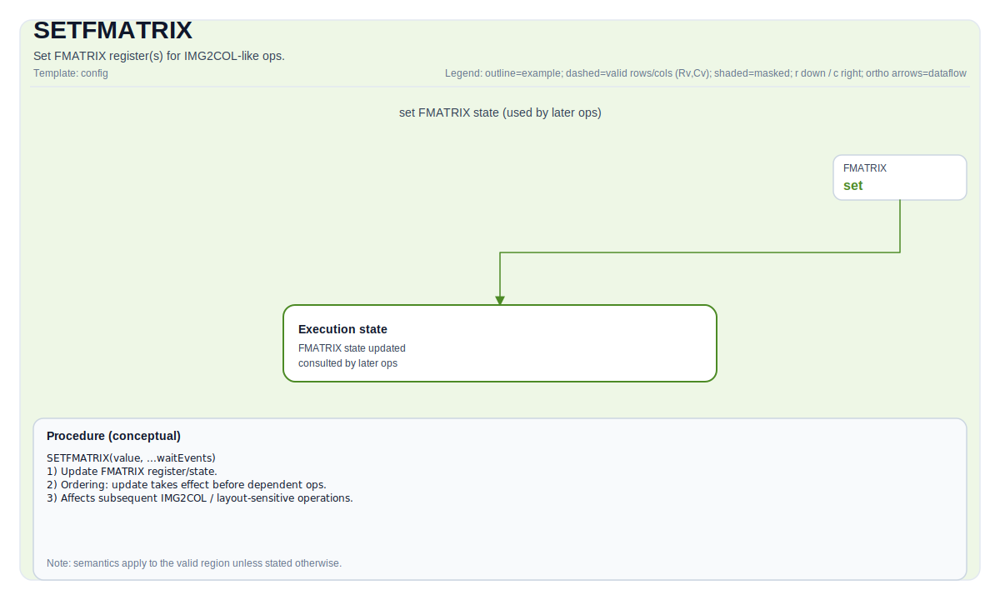

# SETFMATRIX

## 指令示意图



## 简介

为类 IMG2COL 操作设置 FMATRIX 寄存器。

## 数学语义

除非另有说明，语义定义在有效区域上，目标相关行为标记为实现定义。

## C++ 内建接口

声明于 `include/pto/common/pto_instr.hpp`：

```cpp
template <typename ConvTileData, SetFmatrixMode FmatrixMode = SetFmatrixMode::FMATRIX_A_MANUAL, typename... WaitEvents>
PTO_INST RecordEvent SETFMATRIX(ConvTileData &src, WaitEvents &... events);
```

## 约束

类型/布局/位置/形状的合法性由后端决定；对于特定后端，请将实现相关说明视为规范性约束。

## 示例

参见 `docs/isa/` 和 `docs/coding/tutorials/` 中的相关示例。
