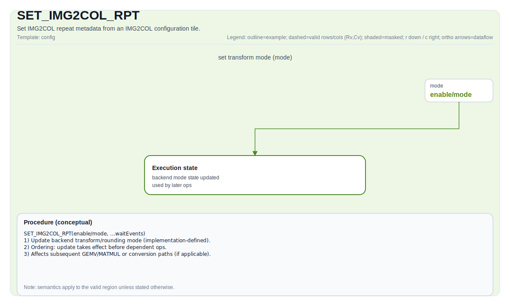

# SET_IMG2COL_RPT

## 指令示意图



## 简介

从 IMG2COL 配置 Tile 设置 IMG2COL 重复次数元数据（实现定义）。

## 数学语义

该指令不直接产生张量算术结果。它会更新后续数据搬运类操作使用的 IMG2COL 控制状态。

## C++ 内建接口

声明于 `include/pto/common/pto_instr.hpp`：

```cpp
template <typename ConvTileData, typename... WaitEvents>
PTO_INST RecordEvent SET_IMG2COL_RPT(ConvTileData &src, WaitEvents &... events);

template <typename ConvTileData, SetFmatrixMode FmatrixMode = SetFmatrixMode::FMATRIX_A_MANUAL, typename... WaitEvents>
PTO_INST RecordEvent SET_IMG2COL_RPT(ConvTileData &src, WaitEvents &... events);
```

在 `MEMORY_BASE` 目标上，还提供不带 `SetFmatrixMode` 模板参数的重载。

## 约束

- 该指令属于后端相关能力，仅在支持 IMG2COL 配置状态的后端可用。
- `src` 必须是目标后端接受的 IMG2COL 配置 Tile 类型。
- 该指令更新的寄存器/元数据字段属于实现定义行为。
- 在同一执行流中，应先设置该状态，再执行依赖的 `TIMG2COL` 指令。

## 示例

```cpp
#include <pto/pto-inst.hpp>

using namespace pto;

void example_set_img2col_rpt(Img2colTileConfig<uint64_t>& cfg) {
  SET_IMG2COL_RPT(cfg);
}
```
