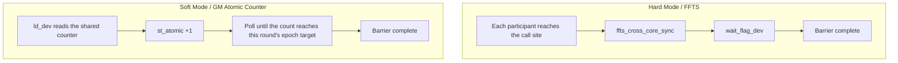

# SYNCALL

## Instruction Diagram

> No `SYNCALL.svg` is provided. `SYNCALL` is a **cross-core control-plane** primitive; it does not describe a data transform on a single Tile. Its meaning is "all participants rendezvous at this point before any may proceed".



## Summary

`SYNCALL` is a cross-core synchronization barrier. Its two template parameters are independent:

- `SyncCoreType` selects the participant set: **AIVOnly** (default), **AICOnly**, **Mix** (AIC+AIV).
- `SyncAllMode` selects the implementation path: **Hard** (FFTS hardware flags, workspace-free overload), **Soft** (shared GM atomic counter, workspace-bearing overload).

## Mathematical Semantics

Not applicable as an elementwise arithmetic operation. `SYNCALL` expresses a **barrier arrival** relation: once every core in the current participant set has executed this `SYNCALL`, any core may proceed. Hard and Soft have identical semantics and differ only in implementation path.

## C++ Built-in Interface

Public header `<pto/pto-inst.hpp>`; declarations live in `include/pto/common/pto_instr.hpp`:

```cpp
// Hardware mode (all CoreType variants)
template <SyncCoreType CoreType = SyncCoreType::AIVOnly>
PTO_INST void SYNCALL();

// Software mode — shared GM atomic counter
template <SyncAllMode Mode, SyncCoreType CoreType = SyncCoreType::AIVOnly, typename GlobalData,
          std::enable_if_t<is_global_data_v<GlobalData>, int> = 0>
PTO_INST void SYNCALL(GlobalData &gmWorkspace, int32_t usedCores = 0);
```

## Parameters

- `gmWorkspace`: a GM buffer used by Soft mode, of type `GlobalTensor<int32_t, pto::Shape<>, pto::Stride<>>`. The instruction uses only its **first int32** as the arrival counter shared by all participants, so one cache line is enough to allocate, and it **must be zeroed before first use**.
- `usedCores`: the number of cores participating in the barrier.
  - When 0, the instruction infers it: AIV-only and AIC-only take the core count of this launch; MIX takes all AIC cores plus their paired AIV cores.
  - When specified explicitly it **may be smaller than the launched core count**, letting only some cores synchronize; cores that do not participate **must not** call `SYNCALL`.

When `Mode` is `Hard`, `gmWorkspace` and `usedCores` are ignored and the behavior is identical to the argument-free `SYNCALL()`.

## Constraints

- `SYNCALL` guarantees barrier **arrival** and nothing else; ordering and visibility of business data are the caller's responsibility. It does not participate in PTO's automatic Event dependency scheduling (it accepts no `WaitEvents` and returns no `RecordEvent`), so it does not wait for preceding data instructions on the same core (e.g. `TSTORE`) to land. Neither hard nor soft mode **flushes the cache for business data**, so cross-core GM accesses around the barrier need explicit `dcci` / `dsb`.
- Soft mode requires every participating core to enter the same barrier group **in the same order and the same number of times**. The instruction derives the current round from the arrival count, so a core that enters one time too many or too few falls out of step with the others and the barrier deadlocks.
- The participant set is determined by how the kernel is compiled and launched, not by `SYNCALL`. The template parameters only declare *which kind of cores* to synchronize; how many cores actually come up and how AIC and AIV are paired depends on the compile arch and the launch method. If the two disagree, some core waits forever.
- Hard AIC-only on A2/A3 cannot be compiled as a pure cube kernel: plain `dav-c220-cube` fails to establish the FFTS context that AIC-only hard sync needs, and hangs in practice. Compile it as MIX (`dav-c220`) instead, with the AIC side calling `SYNCALL<AICOnly>()` and the AIV side left empty. On A5, `dav-c310-cube` works.
- When compiling a kernel by hand (not through chevron auto-split), the kernel meta must be declared explicitly, otherwise the runtime schedules the wrong core type and hard sync hangs for lack of an FFTS context. Declare it with the macros in `include/pto/common/kernel_meta.hpp` (`PTO_SYNCALL_AIV_KERNEL_META` / `PTO_SYNCALL_AIC_KERNEL_META` / `PTO_SYNCALL_MIX_AIC_KERNEL_META`); the macro argument must exactly match the `__global__` entry symbol. Currently only Hard AIV-only and Soft AIC-only on A2/A3 need a hand-written meta; the compiler generates it for all other cases.
- In the auto build path (`__PTO_AUTO__`), `SYNCALL` is a no-op; real synchronization happens only in manual kernels.

## Examples

### Hardware Mode

```cpp
#include <pto/pto-inst.hpp>

using namespace pto;

void example_hard_aiv() { SYNCALL(); }                        // all AIV cores
void example_hard_aic() { SYNCALL<SyncCoreType::AICOnly>(); } // all AIC cores
void example_hard_mix() { SYNCALL<SyncCoreType::Mix>(); }     // AIC + AIV
```

For compilation and launch requirements, see "Constraints".

### Software Mode

```cpp
#include <pto/pto-inst.hpp>

using namespace pto;

// AIV-only: usedCores=0 falls back to get_block_num()
void example_soft_aiv(__gm__ int32_t *gmPtr) {
  GlobalTensor<int32_t, pto::Shape<>, pto::Stride<>> gmWs(gmPtr);
  SYNCALL<SyncAllMode::Soft, SyncCoreType::AIVOnly>(gmWs, 0);
}

// MIX: AIC and AIV participants arrive on the same counter
void example_soft_mix(__gm__ int32_t *gmPtr) {
  GlobalTensor<int32_t, pto::Shape<>, pto::Stride<>> gmWs(gmPtr);
  SYNCALL<SyncAllMode::Soft, SyncCoreType::Mix>(gmWs, 0);
}

// Partial participation: all cores are launched but only the first syncBlocks
// synchronize; the rest must not call SYNCALL.
void example_soft_partial(__gm__ int32_t *gmPtr, int32_t syncBlocks) {
  if (static_cast<int32_t>(get_block_idx()) >= syncBlocks) {
    return;
  }
  GlobalTensor<int32_t, pto::Shape<>, pto::Stride<>> gmWs(gmPtr);
  SYNCALL<SyncAllMode::Soft, SyncCoreType::AIVOnly>(gmWs, syncBlocks);
}
```
