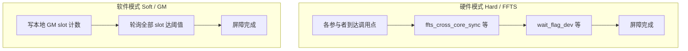

# SYNCALL

## 指令示意图

> 仓库当前未提供 `SYNCALL.svg`（与多数向量算子不同）。`SYNCALL` 为**跨核控制面**原语，不描述单 Tile 上的逐元素数据变换；语义上可理解为「所有选定参与者在同一点汇合后再前进」。

以下概念图区分硬件（FFTS）与软件（GM 轮询）两条路径：



## 简介

`SYNCALL` 是跨核同步屏障，支持 A2/A3 和 A5 NPU 后端。通过模板参数 `SyncCoreType` 选择参与同步的核类型：

- **AIV-only**（默认）：`SYNCALL()` 同步所有 AIV 核。
- **AIC-only**：`SYNCALL<SyncCoreType::AICOnly>()` 同步所有 AIC 核（A2/A3 支持硬件和软件模式；A5 仅支持硬件模式）。
- **MIX（AIC+AIV）**：`SYNCALL<SyncCoreType::Mix>()` 同步 AIC 和 AIV 混合核。

通过 `SyncAllMode`（在带 workspace 的重载中显式给出）选择 **硬件模式（FFTS）** 或 **软件模式（GM 轮询）**。无 workspace 的重载对应硬件路径。

## 数学语义

不适用逐元素算术语义。`SYNCALL` 表达的是 **barrier 完成** 关系：

- 在某一动态程序点上，凡属于当前 `SyncCoreType` 所划定参与者集合的 core，均须执行到该 `SYNCALL` 调用之后，任一参与者方可越过该点继续执行后续代码。
- 硬件模式：由 FFTS 标志与设备侧 `wait_flag_dev` 等原语保证跨核可见顺序。
- 软件模式：由 GM 中各参与者独占 slot 的单调计数与 `dcci`/`dsb` 等一致性原语，在轮询中判定「全员已到达当前代数」。

该语义对 barrier 之后的 GM 或其它 buffer 内容不作额外保证；跨核数据可见性需调用方自行维护，详见「跨核 GM 通信注意事项」。

## C++ 内建接口

声明于 `include/pto/common/pto_instr.hpp`。软件模式接口使用类型安全的 `GlobalTensor` 和 `Tile` 参数：

```cpp
// 硬件模式（所有 CoreType 通用）
template <SyncCoreType CoreType = SyncCoreType::AIVOnly>
PTO_INST void SYNCALL();

// 软件模式 — AIV-only（GlobalTensor + Vec Tile）
template <SyncAllMode Mode, SyncCoreType CoreType = SyncCoreType::AIVOnly,
          typename GlobalData, typename TileData,
          std::enable_if_t<is_global_data_v<GlobalData> &&
                           is_tile_data_v<TileData> && TileData::Loc == TileType::Vec, int> = 0>
PTO_INST void SYNCALL(GlobalData &gmWorkspace, TileData &ubWorkspace, int32_t usedCores = 0);

// 软件模式 — AIC-only（GlobalTensor + Mat Tile）
template <SyncAllMode Mode, SyncCoreType CoreType = SyncCoreType::AICOnly,
          typename GlobalData, typename TileData,
          std::enable_if_t<is_global_data_v<GlobalData> &&
                           is_tile_data_v<TileData> && TileData::Loc == TileType::Mat, int> = 0>
PTO_INST void SYNCALL(GlobalData &gmWorkspace, TileData &l1Workspace, int32_t usedCores = 0);

// 软件模式 — MIX（GlobalTensor + Vec Tile + Mat Tile）
template <SyncAllMode Mode, SyncCoreType CoreType = SyncCoreType::Mix,
          typename GlobalData, typename UbTileData, typename L1TileData,
          std::enable_if_t<is_global_data_v<GlobalData> &&
                           is_tile_data_v<UbTileData> && UbTileData::Loc == TileType::Vec &&
                           is_tile_data_v<L1TileData> && L1TileData::Loc == TileType::Mat, int> = 0>
PTO_INST void SYNCALL(GlobalData &gmWorkspace, UbTileData &ubWorkspace, L1TileData &l1Workspace,
                       int32_t usedCores = 0);
```

## 参数

- `gmWorkspace`: `GlobalTensor<int32_t, pto::Shape<>, pto::Stride<>>`（在 Ascend C 与 `using namespace pto` 并存时，建议写全 `pto::`，避免与编译器内置头中的 `Stride` 枚举同名冲突）。软件模式使用的 GM workspace，调用前需要初始化为 0。每个参与 core 占用 8 个 `int32_t`（按 cache line 隔离同步计数）。
- `ubWorkspace`: `Tile<TileType::Vec, int32_t, 1, N * SYNCALL_SOFT_SLOT_INT32>`，其中 `N >= usedCores`。AIV-only 和 MIX 软件模式使用的 UB scratch，容量至少为 `usedCores * SYNCALL_SOFT_SLOT_INT32 * sizeof(int32_t)`（每个参与 core 独占一条 cache line）。
- `l1Workspace`: `Tile<TileType::Mat, int32_t, 1, N * SYNCALL_SOFT_SLOT_INT32>`，其中 `N >= usedCores`。AIC-only 和 MIX 软件模式使用的 L1 (cbuf) scratch，用于 `create_cbuf_matrix` 填充同步值后经 DMA 搬移到 GM。
- `usedCores`: 参与软件 barrier 的 core 数量。为 0 时自动推算——AIV-only / AIC-only 使用 `get_block_num()`，MIX 使用 `SYNCALL_GET_MIX_PARTICIPANT_COUNT()`（即 `AIC blocks × (1 + AIV ratio)`）。

## Kernel Meta 宏

下列场景需在 ELF 中手写 `.ascend.meta`，供 runtime 正确调度：**Hard AIV-only**、**Soft AIC-only**、以及 **register-ELF 的 MIX**（如 1:1 hard）。`dav-c220` 自动拆分场景由 Bisheng 生成 meta，见本节末尾。宏定义于 `include/pto/common/kernel_meta.hpp`：

> `kernelName` 须与 `__global__` 入口符号**完全一致**（写入 section `.ascend.meta.<kernelName>`）。

```cpp
// AIV 侧 kernel（标记为 MIX_AIV_MAIN，ratio 固定 0:1）
PTO_SYNCALL_AIV_KERNEL_META(kernelName);

// AIC 侧 kernel（标记为 MIX_AIC_MAIN，指定 AIC:AIV 比例）
PTO_SYNCALL_MIX_AIC_KERNEL_META(kernelName, aicRatio, aivRatio);
```

使用示例（1:2 混合模式）：

```cpp
PTO_SYNCALL_MIX_AIC_KERNEL_META(MyKernel_mix_aic, 1, 2);  // AIC kernel ELF
PTO_SYNCALL_AIV_KERNEL_META(MyKernel_mix_aiv);             // AIV kernel ELF
```

Soft AIC-only（单 kernel，chevron 启动）：

```cpp
PTO_SYNCALL_AIC_KERNEL_META(MyKernel);
extern "C" __global__ AICORE void MyKernel(...) { SYNCALL<SyncAllMode::Soft, SyncCoreType::AICOnly>(...); }
```

register-ELF 通用配对（AIC 侧指定比例 + AIV 侧）。注意：当前 `syncall` ST 的 MIX 1:2 已改用 `dav-c220` 自动拆分、无需手写 meta；下例仅演示 register-ELF 路径的宏配对写法：

```cpp
PTO_SYNCALL_MIX_AIC_KERNEL_META(MyKernel_mix_aic, 1, 2);
PTO_SYNCALL_AIV_KERNEL_META(MyKernel_mix_aiv);
```

register-ELF MIX 1:1 hard（**AIC 与 AIV 两侧均用** `PTO_SYNCALL_MIX_AIC_KERNEL_META(..., 1, 1)`，AIV 侧不要单独使用 `PTO_SYNCALL_AIV_KERNEL_META`）：

```cpp
PTO_SYNCALL_MIX_AIC_KERNEL_META(MyKernel_mix_aic, 1, 1);
PTO_SYNCALL_MIX_AIC_KERNEL_META(MyKernel_mix_aiv, 1, 1);
```

**无需手写 meta 的常见场景**（完整对照见下文「编译与调度指南」场景速查表）：

- AIV-only Soft（`dav-c220-vec`）
- MIX 1:2 Hard / Soft、Hard AIC-only（A2/A3，`dav-c220` 自动拆分）
- MIX 1:1 Soft（双流 chevron）

> **dav-c220 自动拆分**：使用 `--cce-aicore-arch=dav-c220` 编译时，Bisheng 会自动生成 AIC/AIV 子 kernel 及对应 `.ascend.meta`，物理比例为 **1:2**（每个 AIC block 配 2 个 AIV subblock）。此时**无需**手写 `PTO_SYNCALL_MIX_AIC_KERNEL_META`，也**不能**通过 meta 把比例改成 1:1（见下文「MIX 1:1」）。

## 编译与调度指南（A2/A3）

本节以 ST 用例 [`tests/npu/a2a3/src/st/testcase/syncall/`](../../tests/npu/a2a3/src/st/testcase/syncall/) 为准，说明不同 `SyncCoreType` / 模式 / AIC:AIV 比例下应采用的**编译 arch**、**Meta** 与 **Host 启动**方式。Host 侧通过 [`syncall_core_config.hpp`](../../tests/npu/a2a3/src/st/testcase/syncall/syncall_core_config.hpp) 在运行时决定 launch grid（910B1：24 AIC + 48 AIV；910B4：20 AIC + 40 AIV），同一套 kernel 二进制可跨芯片复用。

### 场景速查表

| 场景 | 同步模式 | 参与者数 | 编译 `--cce-aicore-arch` | Kernel Meta | Host 启动 | 参考源文件 |
|------|---------|----------|--------------------------|-------------|-----------|-----------|
| AIV-only | Hard | `aiv` | `dav-c220-vec` | `PTO_SYNCALL_AIV_KERNEL_META` | chevron `<<<aiv>>>` | `syncall_kernel.cpp` |
| AIV-only | Soft | `aiv` | `dav-c220-vec` | 无 | chevron `<<<aiv>>>` | `syncall_soft_kernel.cpp` |
| AIC-only | Hard | `aic` | **`dav-c220`**（MIX 自动拆分，AIV 空 stub） | 由 Bisheng 自动生成 | chevron `<<<aic>>>` | `syncall_aic_hard_kernel.cpp` |
| AIC-only | Soft | `aic` | `dav-c220-cube` | `PTO_SYNCALL_AIC_KERNEL_META` | chevron `<<<aic>>>` | `syncall_aic_kernel.cpp` |
| MIX 1:2 | Hard / Soft | `aic×3` | **`dav-c220`** | 由 Bisheng 自动生成 | chevron `<<<aic>>>`（hard/soft 同一 `.so`） | `syncall_mix_1_2_kernel.cpp` |
| MIX 1:1 | Soft | `aic×2` | cube + vec 各编一份 `.o` | 无 | **双流** chevron：AIC `<<<aic>>>` + AIV `<<<aic>>>` | `syncall_mix_1_1_soft_kernel.cpp` |
| MIX 1:1 | Hard | `aic×2` | cube + vec 各编一份 `.o` | **`PTO_SYNCALL_MIX_AIC_KERNEL_META(..., 1, 1)`** | **register ELF** + `rtKernelLaunchWithHandleV2` | `syncall_mix_1_1_kernel.cpp` |

Hard 与 Soft kernel **不可共用同一 `.so`**（AIV-only / AIC-only 等场景下 soft 会污染 hard 的 FFTS 配置导致 hang）；MIX 1:2 的 hard 与 soft 因均走 dav-c220 自动拆分，可放在同一源文件的同一 `.so` 中。

### 各路径说明

#### 1. Chevron 单 arch 编译（AIV-only / AIC-only soft）

- 编译：单个源文件 + 对应 arch（`dav-c220-vec` 或 `dav-c220-cube`），产出独立 `.so`。
- 启动：`kernel<<<blockDim, nullptr, stream>>>(..., totalBlocks)`，`blockDim` 与 `totalBlocks` 由 Host 在运行时传入（ST 中来自 `syncall_cfg::GetCoreConfig()`）。
- Hard AIV-only 须在 kernel 上声明 `PTO_SYNCALL_AIV_KERNEL_META`。

#### 2. Chevron MIX 自动拆分（MIX 1:2、Hard AIC-only）

- 编译：`--cce-aicore-arch=dav-c220`；CMake 使用 `pto_syncall_chevron_kernel(<target> <source>)`。
- 启动：单次 chevron `<<<aic>>>`；runtime 按物理 1:2 拉起全部 MIX 参与者。
- Kernel 参数：`aicBlocks` 与 `totalParticipants` 作为标量从 Host 传入（AIC/AIV 两侧读同一参数），以支持 910B1/910B4 等不同 cube 数。
- **Hard AIC-only 特例**：纯 `dav-c220-cube` 无法建立 AIC-only 硬同步所需的 FFTS 上下文。须用 `dav-c220` MIX 编译：AIC 执行 `SYNCALL<AICOnly>()`，AIV 为空 stub；`totalBlocks` 由 Host 传入。

#### 3. 双 arch 双 stream（MIX 1:1 Soft）

- 原因：ccec/bisheng 路径下 `GetTaskRatio()` 恒为 **2**，`dav-c220` 自动拆分物理固定 **1:2**，无法得到真 1:1。
- 编译：同一源文件分别以 `dav-c220-cube`（`-DSYNCALL_MIX_BUILD_AIC`）和 `dav-c220-vec`（`-DSYNCALL_MIX_BUILD_AIV`）各编一份 `.o`，链接为一个 `.so`；CMake 使用 `pto_syncall_mix11_soft_kernel`。
- 启动：AIC 与 AIV 分别在两个 `aclrtStream` 上 chevron `<<<aic>>>` 与 `<<<aiv>>>`；`aicBlocks` / `totalParticipants` 由 Host 运行时传入。

#### 4. Register ELF（MIX 1:1 Hard）

- 原因：Hard MIX 同步需要单一 MIX FFTS 上下文；chevron 自动拆分在 ccec 下做不到真 1:1。
- 编译：cube / vec 各编带 `PTO_SYNCALL_MIX_AIC_KERNEL_META(name, 1, 1)` 的 `.o`，再以 `-DSYNCALL_MIX_REGISTER_BUILD` 生成 register 专用 `.o`，经 `make_mix_register_elf.py` 合成 registration ELF；CMake 使用 `pto_syncall_mix_kernel`。
- 启动：`rtRegisterAllKernel` + `rtKernelLaunchWithHandleV2(handle, tilingKey, aicBlocks, ...)`；device 侧用 `get_block_num()` 推导参与者数（register 路径仅传 `ffts/out/flags` 三个参数）。

## 模式支持矩阵

### A2/A3

| 核类型 | 硬件模式 | 软件模式 |
|--------|---------|---------|
| AIV-only | 支持 | 支持 |
| AIC-only | 支持 | 支持 |
| MIX | 支持 | 支持 |

### A5

| 核类型 | 硬件模式 | 软件模式 |
|--------|---------|---------|
| AIV-only | 支持 | 支持 |
| AIC-only | 支持 | 不支持 |
| MIX | 不支持 | 支持 |

## 约束

- 软件模式各平台 GM 写入路径：
  - A2/A3（AIC-only 与 MIX 的 AIC 侧）：AIC 通过 `copy_cbuf_to_gm`（L1→GM DMA）写 GM slot；MIX 的 AIV 侧通过 UB workspace 写入。
  - A5 MIX：A5 AIC（`dav-c310-cube`）不支持 `copy_cbuf_to_gm`，改为通过 `intra_block` 信号委托同 block 的 AIV subblock 0 代写 UB→GM。
- A5 平台限制原因（对应「模式支持矩阵」）：
  - AIC-only 软件不可用：A5 AIC 缺少 `copy_cbuf_to_gm` 等独立写 GM 的 DMA 路径，无法实现 GM 轮询。
  - 硬件 MIX 不可用：`rtGetC2cCtrlAddr` 在 A5（`CHIP_DAVID`）返回 `RT_ERROR_FEATURE_NOT_SUPPORT`（207000），取不到 FFTS 基地址。
  - AIC-only 硬件：通过 `ffts_cross_core_sync` + `wait_flag_dev` 实现，不需要 `set_ffts_base_addr`。
- 软件模式要求所有参与 core 以相同顺序进入同一组 barrier（基于单调代数计数，进入次数/顺序不一致会导致错配或死锁）。
- `SYNCALL` 不参与 PTO 的 Event 自动依赖编排：既不接受 `WaitEvents`，也不返回可被后续指令等待的 `RecordEvent`。因此它不会自动等待前序数据指令（如 `TSTORE`）完成，`SYNCALL` 前后与数据指令之间的顺序与可见性需调用方自行保证（见「跨核 GM 通信注意事项」）。
- 在 auto 构建路径（`__PTO_AUTO__`）下，`SYNCALL` 为 no-op，不发射跨核硬件同步（与 `TSYNC` 等一致）；真实同步只在 manual kernel 中发生。

## 跨核 GM 通信注意事项

`SYNCALL` 只提供 barrier 完成语义（hard / soft 皆然），不保证 barrier 前后业务数据的跨核 cache 可见性。当算子在 barrier 前各核写 GM、barrier 后各核读他核 GM（如跨核 histogram / 前缀和）时，调用方需自行满足以下两点，否则会读到脏数据或发生丢写。

### 1. cache 一致性：必须显式 `dcci` / `dsb`

- **写方**：`copy_ubuf_to_gm` / `copy_cbuf_to_gm` 之后接 `dcci(addr, SINGLE_CACHE_LINE)` + `dsb(DSB_DDR)`，把数据刷出到 DDR。
- **读方**：读前 `dcci(addr, SINGLE_CACHE_LINE)`（invalidate）+ `dsb`，确保读到 DDR 最新值而非本核旧 cache。
- 仅有 `set_flag` / `wait_flag`（核内流水同步）**不足以**保证跨核可见性。
- 该要求与 barrier 模式无关：**硬件 FFTS barrier 同样不刷 cache**，只保证「全员到达」的控制面顺序。
- `SYNCALL` 内部对自己的同步槽位已做完整 `dcci` + `dsb(DDR)` 处理，但**不会**替调用方刷业务数据。

### 2. 每核 slot 按 cache line 独占：避免 false sharing 丢写

- `dcci` / DMA 以 **32 Byte cache line** 为粒度操作；若相邻核 slot 共享同一条 cache line，跨核刷新会互相覆盖 / 丢写。
- 每核 slot 应按 32B 对齐并**独占一条 cache line**（`int32` 场景即 stride = 8，而非 4）。
- `SYNCALL` 自身的同步槽位即按此设计：`SYNCALL_SOFT_SLOT_INT32 = 8`（见 `include/pto/common/type.hpp`），调用方的业务 workspace 也应遵循同样的隔离原则。

## 示例

### 自动（Auto）

在 **auto** 构建路径下，`SYNCALL` 与既有同步策略一致，**不直接发射**跨核硬件同步；用于占位或与 host/编译器协同的图级语义。典型算子开发仍以显式 **manual** kernel 中的 `SYNCALL` 为准。

```cpp
#include <pto/pto-inst.hpp>

using namespace pto;

// auto 模式下 SYNCALL 为 no-op（与 TSYNC 等在 auto 下的处理一致）
void example_auto_noop() {
  SYNCALL();  // 不触发 FFTS
}
```

### 手动（Manual）— 硬件模式

```cpp
#include <pto/pto-inst.hpp>

using namespace pto;

// AIV-only：全 AIV 核 FFTS 屏障（需正确 kernel meta / ELF）
void example_hard_aiv() {
  SYNCALL();
}

// AIC-only：仅编译到 AIC（__DAV_CUBE__）单元时可用；A5 上已验证硬模式路径
void example_hard_aic() {
  SYNCALL<SyncCoreType::AICOnly>();
}

// MIX：AIC 与 AIV 配对 ELF，见上文「Kernel Meta 宏」一节
void example_hard_mix() {
  SYNCALL<SyncCoreType::Mix>();
}
```

### 手动（Manual）— 软件模式

软件模式需传入 **已清零** 的 GM workspace 与合法容量的 UB/L1 Tile。`Mode` 须为 `SyncAllMode::Soft`（`Hard` 时忽略 workspace，行为同无参 `SYNCALL_IMPL`）。

```cpp
#include <pto/pto-inst.hpp>

using namespace pto;

void example_soft_aiv(__gm__ int32_t *gmPtr) {
  GlobalTensor<int32_t, pto::Shape<>, pto::Stride<>> gmWs(gmPtr);
  Tile<TileType::Vec, int32_t, 1, SYNCALL_SOFT_SLOT_INT32> ub;
  SYNCALL<SyncAllMode::Soft, SyncCoreType::AIVOnly>(gmWs, ub, 0);
}
```

MIX 软件模式需同时提供 UB 与 L1（Mat）Tile；A5 AIC 侧通过代理路径写 GM，详见「约束」一节。
