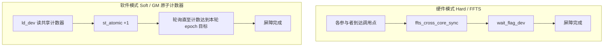

# SYNCALL

## 指令示意图

> 仓库未提供 `SYNCALL.svg`。`SYNCALL` 是**跨核控制面**原语，不描述单Tile上的数据变换，语义为「全体参与者在同一点汇合后再前进」。


```mermaid
flowchart TB
  subgraph hard [硬件模式 Hard / FFTS]
    H1[各参与者到达调用点] --> H2[ffts_cross_core_sync]
    H2 --> H3[wait_flag_dev]
    H3 --> H4[屏障完成]
  end
  subgraph soft [软件模式 Soft / GM 原子计数器]
    S1[ld_dev 读共享计数器] --> S2[st_atomic +1]
    S2 --> S3[轮询直至计数达到本轮 epoch 目标]
    S3 --> S4[屏障完成]
  end
```


## 简介

`SYNCALL` 是跨核同步屏障。两个模板参数各自独立：

- `SyncCoreType` 选参与者集合：**AIVOnly**（默认）、**AICOnly**、**Mix**（AIC+AIV）。
- `SyncAllMode` 选实现路径：**Hard**（FFTS硬件旗标，无workspace重载）、**Soft**（GM共享原子计数器，带workspace重载）。


## 数学语义

不适用逐元素算术语义，表达的是 **barrier 到达** 关系：属于当前参与者集合的每个core都执行过该 `SYNCALL` 之后，任一core方可继续。Hard与Soft的语义完全相同，仅实现路径不同。

## C++内建接口

公共头 `<pto/pto-inst.hpp>`，声明位于 `include/pto/common/pto_instr.hpp`：

```cpp
// 硬件模式（所有 CoreType 通用）
template <SyncCoreType CoreType = SyncCoreType::AIVOnly>
PTO_INST void SYNCALL();

// 软件模式 — GM 共享原子计数器
template <SyncAllMode Mode, SyncCoreType CoreType = SyncCoreType::AIVOnly, typename GlobalData,
          std::enable_if_t<is_global_data_v<GlobalData>, int> = 0>
PTO_INST void SYNCALL(GlobalData &gmWorkspace, int32_t usedCores = 0);
```


## 参数

- `gmWorkspace`：Soft模式使用的一块GM缓冲，类型为 `GlobalTensor<int32_t, pto::Shape<>, pto::Stride<>>`。指令只用它的**首个int32**作为全体参与者共享的到达计数器，因此分配一条cache line即可，且**首次使用前必须清零**。
- `usedCores`：参与同步的核数。
  - 为0时由指令自动推算：AIV-only 与 AIC-only 取本次launch的核数；MIX 取全部AIC核与其配对AIV核之和。
  - 显式指定时**可小于launch核数**，即只让部分核参与同步；此时未参与的核**不得**调用 `SYNCALL`。

`Mode` 为 `Hard` 时忽略 `gmWorkspace` 与 `usedCores`，行为等同无参 `SYNCALL()`。

## 约束

- `SYNCALL` 只保证barrier**到达**这一件事，业务数据的顺序与可见性都要调用方自己负责：它不参与PTO的Event自动依赖编排（不接受 `WaitEvents`，也不返回 `RecordEvent`），不会等待本核前序数据指令（如 `TSTORE`）落地；hard与soft也都**不刷业务数据的cache**，barrier前后跨核读写GM需自行 `dcci` / `dsb`。
- Soft模式要求所有参与的核以**相同顺序、相同次数**进入同一组barrier。指令按到达次数推算当前是第几轮，某个核多进或少进一次，就会与其他核错轮，进而卡死。
- 参与者集合由kernel的编译与启动方式决定，不由 `SYNCALL` 决定。模板参数只是声明「本次要同步哪一类核」，实际拉起多少核、AIC与AIV如何配对，取决于kernel编译成哪种arch、以什么方式启动。两者对不上就会有核一直等待。
- A2/A3 的 Hard AIC-only 不能编译成纯cube kernel：纯 `dav-c220-cube` 建立不起AIC-only硬同步所需的FFTS上下文，实测会hang。须按MIX编译（`dav-c220`），AIC侧调用 `SYNCALL<AICOnly>()`，AIV侧留空。A5 用 `dav-c310-cube` 即可。
- 手工编译kernel（不走chevron自动拆分）时须自行声明kernel meta，否则runtime会按错误的核型调度，硬同步拿不到FFTS上下文而hang。meta用 `include/pto/common/kernel_meta.hpp` 中的宏声明（`PTO_SYNCALL_AIV_KERNEL_META` / `PTO_SYNCALL_AIC_KERNEL_META` / `PTO_SYNCALL_MIX_AIC_KERNEL_META`），宏参须与 `__global__` 入口符号完全一致。当前仅A2/A3的 Hard AIV-only 与 Soft AIC-only 需手写，其余场景由编译器生成。
- auto构建路径（`__PTO_AUTO__`）下 `SYNCALL` 为no-op，真实同步只在manual kernel中发生。


## 示例


### 硬件模式

```cpp
#include <pto/pto-inst.hpp>

using namespace pto;

void example_hard_aiv() { SYNCALL(); }                        // 全AIV核
void example_hard_aic() { SYNCALL<SyncCoreType::AICOnly>(); } // 全AIC核
void example_hard_mix() { SYNCALL<SyncCoreType::Mix>(); }     // AIC+AIV
```

编译与启动方面的要求见「约束」。

### 软件模式

```cpp
#include <pto/pto-inst.hpp>

using namespace pto;

// AIV-only：usedCores=0 自动取 get_block_num()
void example_soft_aiv(__gm__ int32_t *gmPtr) {
  GlobalTensor<int32_t, pto::Shape<>, pto::Stride<>> gmWs(gmPtr);
  SYNCALL<SyncAllMode::Soft, SyncCoreType::AIVOnly>(gmWs, 0);
}

// MIX：AIC与AIV参与者到达同一计数器
void example_soft_mix(__gm__ int32_t *gmPtr) {
  GlobalTensor<int32_t, pto::Shape<>, pto::Stride<>> gmWs(gmPtr);
  SYNCALL<SyncAllMode::Soft, SyncCoreType::Mix>(gmWs, 0);
}

// 部分核参与：launch 全部核，仅前 syncBlocks 个核同步，其余核不得调用 SYNCALL
void example_soft_partial(__gm__ int32_t *gmPtr, int32_t syncBlocks) {
  if (static_cast<int32_t>(get_block_idx()) >= syncBlocks) {
    return;
  }
  GlobalTensor<int32_t, pto::Shape<>, pto::Stride<>> gmWs(gmPtr);
  SYNCALL<SyncAllMode::Soft, SyncCoreType::AIVOnly>(gmWs, syncBlocks);
}
```
