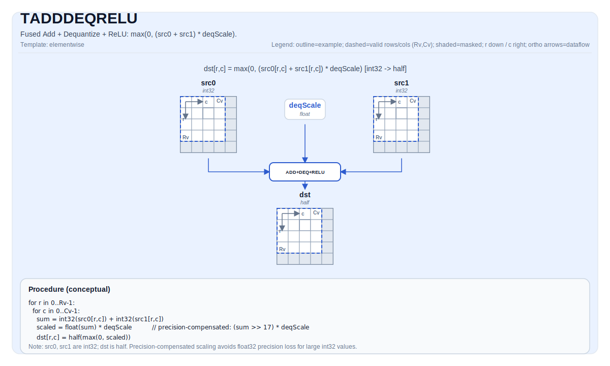

# TADDDEQRELU

## 指令示意图



## 简介

融合 Add + Dequantize + ReLU：两个 int32 Tile 逐元素相加，然后进行反量化缩放和 ReLU 激活，输出 half 精度 Tile。

## 数学语义

对每个元素 `(i, j)` 在有效区域内：

$$ \mathrm{dst}_{i,j} = \max(0, (\mathrm{src0}_{i,j} + \mathrm{src1}_{i,j}) \times \mathrm{deqScale}) $$

反量化使用精度补偿缩放：`(x >> 17) * deqScale << 17`，数学上等价于 `x * deqScale`，但避免了大 int32 中间值的精度损失。

## 汇编语法

同步形式：

```text
%dst = tadddeqrelu %src0, %src1, %deqScale : !pto.tile<...>
```

### AS Level 1（SSA）

```text
%dst = pto.tadddeqrelu %src0, %src1, %deqScale : (!pto.tile<...>, !pto.tile<...>, f32) -> !pto.tile<...>
```

### AS Level 2（DPS）

```text
pto.tadddeqrelu ins(%src0, %src1, %deqScale : !pto.tile_buf<...>, !pto.tile_buf<...>, f32) outs(%dst : !pto.tile_buf<...>)
```

## C++ 内建接口

声明于 `include/pto/common/pto_instr.hpp`：

```cpp
template <typename TileDataDst, typename TileDataSrc0, typename TileDataSrc1, typename TileDataTmp,
          typename... WaitEvents>
PTO_INST RecordEvent TADDDEQRELU(TileDataDst &dst, TileDataSrc0 &src0, TileDataSrc1 &src1, float deqScale,
                                 TileDataTmp &tmp, WaitEvents &... events);
```

## 约束

### 通用约束或检查

- `src0` 和 `src1` 必须是 `TileType::Vec`，元素类型为 `int32_t`。
- `dst` 必须是 `TileType::Vec`，元素类型为 `half`。
- 所有 Tile 必须使用行主序布局（`TileData::isRowMajor`）。
- 运行时有效区域检查：
    - `dst.GetValidRow() > 0` 且 `dst.GetValidCol() > 0`
    - `src0.GetValidRow() == dst.GetValidRow()` 且 `src0.GetValidCol() == dst.GetValidCol()`
    - `src1.GetValidRow() == dst.GetValidRow()` 且 `src1.GetValidCol() == dst.GetValidCol()`
- `deqScale` 为 `float` 标量。

### A2A3 实现检查

- `tmp` 必须是 `TileType::Vec`，元素类型为 `int32_t`。
- `tmp` 必须是行主序。
- `tmp.GetValidRow() >= dst.GetValidRow()` 且 `tmp.GetValidCol() >= dst.GetValidCol()`。

### A5 实现检查

- `tmp` 被接口接受但在 A5 上未验证也未使用。
- 所有中间值保存在向量寄存器中。

## 临时空间

### A2A3

`tmp` **被使用**作为中间暂存存储。A2A3 实现分多步执行融合操作：

1. `tmp = src0 + src1`（vadd）
2. 将 `tmp` 从 int32 转换为 float
3. 应用精度补偿缩放：`floatBuf = (tmp / 131072.0) * deqScale * 131072.0`
4. `reluBuf = max(floatBuf, 0.0)`
5. 将结果转换为 half 并存入 `dst`

- `tmp` 的元素类型必须是 `int32_t`。
- `tmp` 必须是行主序且为 `TileType::Vec`。
- `tmp.GetValidRow() >= dst.GetValidRow()` 且 `tmp.GetValidCol() >= dst.GetValidCol()`。

### A5

`tmp` 被接口接受但 A5 实现**不使用**。A5 后端使用寄存器计算模型（`__VEC_SCOPE__`），所有中间值保存在向量寄存器中，不需要单独的 UB tmp 缓冲区。`tmp` 仅为了与 A2A3 的 API 兼容性而保留在 C++ 内建接口签名中。

## 示例

### 自动（Auto）

```cpp
#include <pto/pto-inst.hpp>

using namespace pto;

void example_auto() {
  using SrcT = Tile<TileType::Vec, int32_t, 16, 16>;
  using DstT = Tile<TileType::Vec, half, 16, 16>;
  using TmpT = Tile<TileType::Vec, int32_t, 16, 16>;
  SrcT src0, src1;
  DstT dst;
  TmpT tmp;
  float deqScale = 0.5f;
  TADDDEQRELU(dst, src0, src1, deqScale, tmp);
}
```

### 手动（Manual）

```cpp
#include <pto/pto-inst.hpp>

using namespace pto;

void example_manual() {
  using SrcT = Tile<TileType::Vec, int32_t, 16, 16>;
  using DstT = Tile<TileType::Vec, half, 16, 16>;
  using TmpT = Tile<TileType::Vec, int32_t, 16, 16>;
  SrcT src0, src1;
  DstT dst;
  TmpT tmp;
  float deqScale = 0.5f;
  TASSIGN(src0, 0x1000);
  TASSIGN(src1, 0x2000);
  TASSIGN(dst,  0x3000);
  TASSIGN(tmp,  0x4000);
  TADDDEQRELU(dst, src0, src1, deqScale, tmp);
}
```

## 汇编示例（ASM）

### 自动模式

```text
# 自动模式：由编译器/运行时负责资源放置与调度。
%dst = pto.tadddeqrelu %src0, %src1, %deqScale : (!pto.tile<...>, !pto.tile<...>, f32) -> !pto.tile<...>
```

### 手动模式

```text
# 手动模式：先显式绑定资源，再发射指令。
# 可选（当该指令包含 tile 操作数时）：
# pto.tassign %arg0, @tile(0x1000)
# pto.tassign %arg1, @tile(0x2000)
%dst = pto.tadddeqrelu %src0, %src1, %deqScale : (!pto.tile<...>, !pto.tile<...>, f32) -> !pto.tile<...>
```

### PTO 汇编形式

```text
%dst = tadddeqrelu %src0, %src1, %deqScale : !pto.tile<...>
# AS Level 2 (DPS)
pto.tadddeqrelu ins(%src0, %src1, %deqScale : !pto.tile_buf<...>, !pto.tile_buf<...>, f32) outs(%dst : !pto.tile_buf<...>)
```
