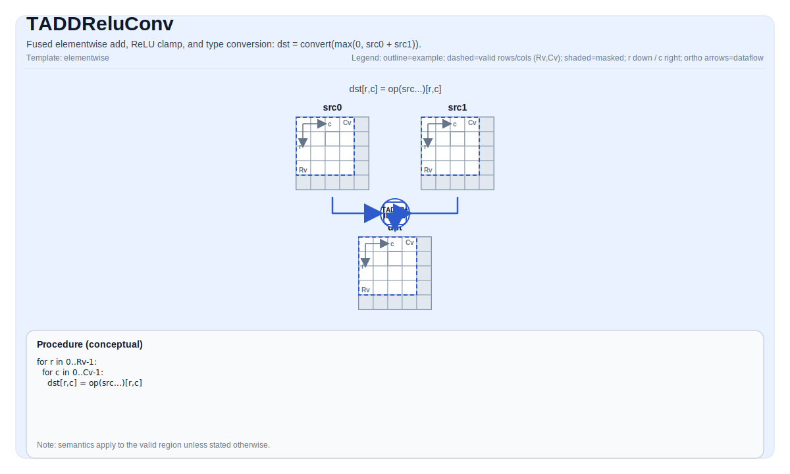

# TADDReluConv

## 指令示意图



## 简介

融合逐元素加法、ReLU 限幅和类型转换。逐元素计算: `dst = convert(max(0, src0 + src1))`。

在 ISA 语义层面, 该操作是单条融合指令 (TADDRELUCONV): 在一个语义步骤内完成加法 + ReLU 限幅 + 降类型转换。后端实现可因架构而异 (例如 A2A3 可使用单条融合内建, A5 可下沉为等价的 VF 序列), 但对用户可见语义一致。

## 数学语义

对每个元素 `(i, j)` 在有效区域内:

$$ \mathrm{dst}_{i,j} = \mathrm{convert}\!\left(\max\!\left(0,\;\mathrm{src0}_{i,j} + \mathrm{src1}_{i,j}\right)\right) $$

其中 `convert` 将结果从源类型窄化到目标类型并采用饱和行为。对于浮点降类型转换, 舍入遵循就近偶数 (round-to-nearest-even)。

## 汇编语法

PTO-AS 形式: 详见 [PTO-AS 规范](../assembly/PTO-AS_zh.md).

同步形式:

```text
%dst = taddreluconv %src0, %src1 : !pto.tile<...>
```

### AS Level 1（SSA）

```text
%dst = pto.taddreluconv %src0, %src1 : (!pto.tile<...>, !pto.tile<...>) -> !pto.tile<...>
```

### AS Level 2（DPS）

```text
pto.taddreluconv ins(%src0, %src1 : !pto.tile_buf<...>, !pto.tile_buf<...>) outs(%dst : !pto.tile_buf<...>)
```
## C++ 内建接口

声明于 `include/pto/common/pto_instr.hpp`:

```cpp
template <typename TileDataDst, typename TileDataSrc0, typename TileDataSrc1, typename... WaitEvents>
PTO_INST RecordEvent TADDRELUCONV(TileDataDst &dst, TileDataSrc0 &src0, TileDataSrc1 &src1, WaitEvents &... events);
```

## 约束

- **源类型约束**: `src0` 和 `src1` 必须具有相同的元素类型 (`ST`)。
- **支持的源 -> 目标类型组合**:
    - `float` -> `half`
    - `half` -> `int8_t`
    - `int16_t` -> `int8_t`
- **布局**: 所有 Tile 必须为行优先布局 (`TileData::isRowMajor`)。
- **位置**: 所有 Tile 必须位于 `TileType::Vec`。
- **有效区域**: `validRow > 0` 且 `validCol > 0`; `src0` 和 `src1` 的有效形状必须与 `dst` 的有效形状匹配。
- **实现说明 (A2A3)**: 使用单条 `vaddreluconv_*` 硬件内建指令 (如 `vaddreluconv_f322f16`, `vaddreluconv_f162s8`, `vaddreluconv_s162s8`) 执行融合加法 + ReLU + 类型转换。
- **实现说明 (A5)**: 无单条 `vaddreluconv_*` 内建指令; 融合操作在 VF 寄存器计算模型中表达: `vlds(src0); vlds(src1); -> add -> maxs(0) -> vcvt -> vsts`。对于 `int16_t -> int8_t`, A5 没有 s16->s8 vcvt, 因此将 (已经为非负的) 和值限幅到 `[0, 127]` 后通过 s16->u8 vcvt 窄化; 对于 `[0, 127]` 范围内的值, `uint8_t` 和 `int8_t` 的字节模式相同。

## 示例

### 自动模式

```cpp
#include <pto/pto-inst.hpp>

using namespace pto;

void example_auto() {
  using SrcTileT = Tile<TileType::Vec, float, 16, 16>;
  using DstTileT = Tile<TileType::Vec, half, 16, 16>;
  SrcTileT src0, src1;
  DstTileT dst;
  TADDRELUCONV(dst, src0, src1);
}
```

### 手动模式

```cpp
#include <pto/pto-inst.hpp>

using namespace pto;

void example_manual() {
  using SrcTileT = Tile<TileType::Vec, float, 16, 16>;
  using DstTileT = Tile<TileType::Vec, half, 16, 16>;
  SrcTileT src0, src1;
  DstTileT dst;
  TASSIGN(src0, 0x1000);
  TASSIGN(src1, 0x2000);
  TASSIGN(dst,  0x3000);
  TADDRELUCONV(dst, src0, src1);
}
```

## 汇编示例 (ASM)

### 自动模式

```text
# 自动模式: 由编译器/运行时负责资源放置与调度.
%dst = pto.taddreluconv %src0, %src1 : (!pto.tile<...>, !pto.tile<...>) -> !pto.tile<...>
```

### 手动模式

```text
# 手动模式: 先显式绑定资源, 再发射指令.
# 可选 (当该指令包含 tile 操作数时):
# pto.tassign %arg0, @tile(0x1000)
# pto.tassign %arg1, @tile(0x2000)
%dst = pto.taddreluconv %src0, %src1 : (!pto.tile<...>, !pto.tile<...>) -> !pto.tile<...>
```

### PTO 汇编形式

```text
%dst = taddreluconv %src0, %src1 : !pto.tile<...>
# AS Level 2 (DPS)
pto.taddreluconv ins(%src0, %src1 : !pto.tile_buf<...>, !pto.tile_buf<...>) outs(%dst : !pto.tile_buf<...>)
```
