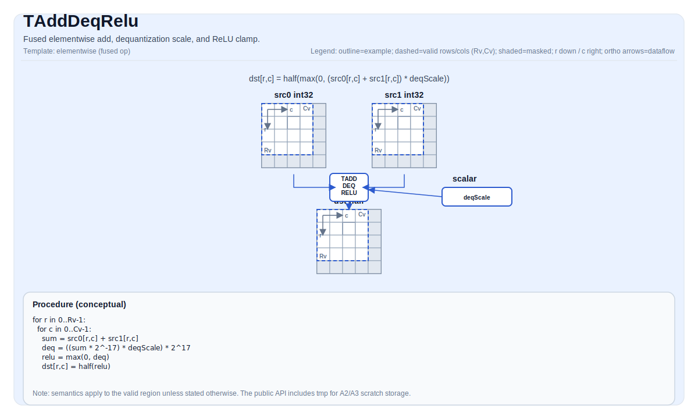

# TAddDeqRelu

## Tile Operation Diagram



## Introduction

Fused elementwise add, dequantization scale, and ReLU clamp. Per element: `dst = max(0, (src0 + src1) * deqScale)` converted to `half`.

At the ISA level, this is a single fused instruction (TADDDEQRELU): add two `int32_t` source tiles, apply the floating-point dequantization scale, clamp negative results to zero, and narrow the result to `half` in one semantic step. Backend realization is architecture-dependent, but user-visible semantics are identical.

## Math Interpretation

For each element `(i, j)` in the valid region:

$$ \mathrm{dst}_{i,j} = \mathrm{half}\!\left(\max\!\left(0,\;\left(\mathrm{src0}_{i,j} + \mathrm{src1}_{i,j}\right) \cdot \mathrm{deqScale}\right)\right) $$

The implementation uses a precision-compensated scaling sequence:

$$ \left(x \cdot 2^{-17}\right) \cdot \mathrm{deqScale} \cdot 2^{17} $$

which is mathematically equivalent to `x * deqScale` for the add result `x = src0 + src1`, while avoiding precision loss for large `int32_t` intermediates. The final conversion to `half` uses saturating behavior; rounding follows round-to-nearest-even.

## Assembly Syntax

PTO-AS form: see [PTO-AS Specification](../assembly/PTO-AS.md).

Synchronous form:

```text
%dst = tadddeqrelu %src0, %src1, %deqScale, %tmp : !pto.tile<...>, !pto.tile<...>, f32, !pto.tile<...>
```

### AS Level 1 (SSA)

```text
%dst = pto.tadddeqrelu %src0, %src1, %deqScale, %tmp : (!pto.tile<...>, !pto.tile<...>, f32, !pto.tile<...>) -> !pto.tile<...>
```

### AS Level 2 (DPS)

```text
pto.tadddeqrelu ins(%src0, %src1, %deqScale, %tmp : !pto.tile_buf<...>, !pto.tile_buf<...>, f32, !pto.tile_buf<...>) outs(%dst : !pto.tile_buf<...>)
```

## C++ Intrinsic

Declared in `include/pto/common/pto_instr.hpp`:

```cpp
template <typename TileDataDst, typename TileDataSrc0, typename TileDataSrc1, typename TileDataTmp,
          typename... WaitEvents>
PTO_INST RecordEvent TADDDEQRELU(TileDataDst &dst, TileDataSrc0 &src0, TileDataSrc1 &src1, float deqScale,
                                 TileDataTmp &tmp, WaitEvents &... events);
```

## Constraints

- **Source types**: `src0` and `src1` must be `int32_t`.
- **Destination type**: `dst` must be `half`.
- **Temporary type**: `tmp` must be `int32_t`.
- **Layout**: All tiles must be row-major (`TileData::isRowMajor`).
- **Location**: All tiles must live in `TileType::Vec`.
- **Valid region**: `validRow > 0` and `validCol > 0`; `src0` and `src1` valid shapes must match `dst` valid shapes.
- **Temporary shape**: `tmp` must be at least as large as the valid region of `dst`.
- **Scale**: `deqScale` is a scalar `float` applied uniformly to every valid element.
- **Implementation notes (A2A3)**: Adds into the `int32_t` temporary tile, converts the temporary result to `float`, applies `2^-17`, `deqScale`, and `2^17`, performs ReLU with zero, then converts `float` to `half`.
- **Implementation notes (A5)**: Keeps intermediates in VF registers and does not need a separate UB scratch buffer internally. The public intrinsic still accepts `tmp` for interface parity with A2/A3.

## Examples

### Auto

```cpp
#include <pto/pto-inst.hpp>

using namespace pto;

void example_auto(float deqScale) {
  using SrcTileT = Tile<TileType::Vec, int32_t, 16, 16>;
  using DstTileT = Tile<TileType::Vec, half, 16, 16>;
  using TmpTileT = Tile<TileType::Vec, int32_t, 16, 16>;
  SrcTileT src0, src1;
  DstTileT dst;
  TmpTileT tmp;
  TADDDEQRELU(dst, src0, src1, deqScale, tmp);
}
```

### Manual

```cpp
#include <pto/pto-inst.hpp>

using namespace pto;

void example_manual(float deqScale) {
  using SrcTileT = Tile<TileType::Vec, int32_t, 16, 16>;
  using DstTileT = Tile<TileType::Vec, half, 16, 16>;
  using TmpTileT = Tile<TileType::Vec, int32_t, 16, 16>;
  SrcTileT src0, src1;
  DstTileT dst;
  TmpTileT tmp;
  TASSIGN(src0, 0x0000);
  TASSIGN(src1, 0x0800);
  TASSIGN(tmp,  0x1000);
  TASSIGN(dst,  0x1800);
  TADDDEQRELU(dst, src0, src1, deqScale, tmp);
}
```

## ASM Form Examples

### Auto Mode

```text
# Auto mode: compiler/runtime-managed placement and scheduling.
%dst = pto.tadddeqrelu %src0, %src1, %deqScale, %tmp : (!pto.tile<...>, !pto.tile<...>, f32, !pto.tile<...>) -> !pto.tile<...>
```

### Manual Mode

```text
# Manual mode: resources must be bound explicitly before issuing the instruction.
# Optional for tile operands:
# pto.tassign %arg0, @tile(0x0000)
# pto.tassign %arg1, @tile(0x0800)
# pto.tassign %tmp,  @tile(0x1000)
%dst = pto.tadddeqrelu %src0, %src1, %deqScale, %tmp : (!pto.tile<...>, !pto.tile<...>, f32, !pto.tile<...>) -> !pto.tile<...>
```

### PTO Assembly Form

```text
%dst = tadddeqrelu %src0, %src1, %deqScale, %tmp : !pto.tile<...>, !pto.tile<...>, f32, !pto.tile<...>
# AS Level 2 (DPS)
pto.tadddeqrelu ins(%src0, %src1, %deqScale, %tmp : !pto.tile_buf<...>, !pto.tile_buf<...>, f32, !pto.tile_buf<...>) outs(%dst : !pto.tile_buf<...>)
```