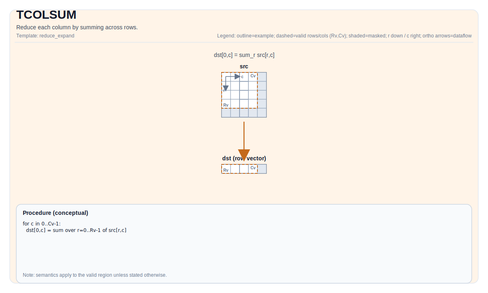

# TCOLSUM


## Tile Operation Diagram



## Introduction

Reduce each column by summing across rows.

## Math Interpretation

Let `R = src.GetValidRow()` and `C = src.GetValidCol()`. For `0 <= j < C`:

$$ \mathrm{dst}_{0,j} = \sum_{i=0}^{R-1} \mathrm{src}_{i,j} $$

`isBinary` selects the implementation path (binary-tree accumulation vs. sequential accumulation).

## Assembly Syntax

PTO-AS form: see [PTO-AS Specification](../assembly/PTO-AS.md).

Synchronous form:

```text
%dst = tcolsum %src {isBinary = false} : !pto.tile<...> -> !pto.tile<...>
```
Lowering may introduce internal scratch tiles; the C++ intrinsic requires an explicit `tmp` operand.

### AS Level 1 (SSA)

```text
%dst = pto.tcolsum %src : !pto.tile<...> -> !pto.tile<...>
%dst = pto.tcolsum %src, %tmp {isBinary = false} : (!pto.tile<...>, !pto.tile<...>) -> !pto.tile<...>
```

### AS Level 2 (DPS)

```text
pto.tcolsum ins(%src : !pto.tile_buf<...>) outs(%dst : !pto.tile_buf<...>)
pto.tcolsum ins(%src, %tmp {isBinary = false} : !pto.tile_buf<...>, !pto.tile_buf<...>) outs(%dst : !pto.tile_buf<...>)
```
## C++ Intrinsic

Declared in `include/pto/common/pto_instr.hpp`:

```cpp
template <typename TileDataOut, typename TileDataIn, typename... WaitEvents>
PTO_INST RecordEvent TCOLSUM(TileDataOut &dst, TileDataIn &src, WaitEvents &... events);

template <typename TileDataOut, typename TileDataIn, typename TileDataTmp, typename... WaitEvents>
PTO_INST RecordEvent TCOLSUM(TileDataOut &dst, TileDataIn &src, TileDataTmp &tmp, bool isBinary, WaitEvents &... events);
```

## Constraints

Implementation checks (NPU):

- Tile location: `dst`, `src`, `tmp` must be `TileType::Vec`.
- Tile layout: all tiles must be ND fractal (`isRowMajor` and `SLayout::NoneBox`).
- DType consistency:
    - A2A3: `src.DType` must be one of `half`, `float`, `int16_t`, `int32_t`, and `dst.DType == tmp.DType == src.DType`.
    - A5: `dst.DType == src.DType` is required by `TColReduceCheck`; the exact supported `src.DType` set is target-defined (see `include/pto/npu/a5/TColReduceOps.hpp`).
- Runtime valid checks:
    - A2A3: `src.GetValidCol() == dst.GetValidCol()`; returns early if `src.GetValidRow() == 0` or `src.GetValidCol() == 0`.
    - A5: `srcValidRow` and `srcValidCol` must be non-zero; `srcValidCol == dstValidCol` is asserted by `TColReduceCheck`.

## Examples

### Auto

```cpp
#include <pto/pto-inst.hpp>

using namespace pto;

void example_auto() {
  using SrcT = Tile<TileType::Vec, float, 16, 16>;
  using DstT = Tile<TileType::Vec, float, 1, 16>;
  using TmpT = Tile<TileType::Vec, float, 16, 16>;
  SrcT src;
  DstT dst;
  TmpT tmp;
  TCOLSUM(dst, src, tmp, /*isBinary=*/false);
}
```

### Manual

```cpp
#include <pto/pto-inst.hpp>

using namespace pto;

void example_manual() {
  using SrcT = Tile<TileType::Vec, float, 16, 16>;
  using DstT = Tile<TileType::Vec, float, 1, 16>;
  using TmpT = Tile<TileType::Vec, float, 16, 16>;
  SrcT src;
  DstT dst;
  TmpT tmp;
  TASSIGN(src, 0x1000);
  TASSIGN(dst, 0x2000);
  TASSIGN(tmp, 0x3000);
  TCOLSUM(dst, src, tmp, /*isBinary=*/false);
}
```

## ASM Form Examples

### Auto Mode

```text
# Auto mode: compiler/runtime-managed placement and scheduling.
%dst = pto.tcolsum %src : !pto.tile<...> -> !pto.tile<...>
```

### Manual Mode

```text
# Manual mode: bind resources explicitly before issuing the instruction.
# Optional for tile operands:
# pto.tassign %arg0, @tile(0x1000)
# pto.tassign %arg1, @tile(0x2000)
%dst = pto.tcolsum %src : !pto.tile<...> -> !pto.tile<...>
```

### PTO Assembly Form

```text
%dst = tcolsum %src {isBinary = false} : !pto.tile<...> -> !pto.tile<...>
# AS Level 2 (DPS)
pto.tcolsum ins(%src : !pto.tile_buf<...>) outs(%dst : !pto.tile_buf<...>)
```

