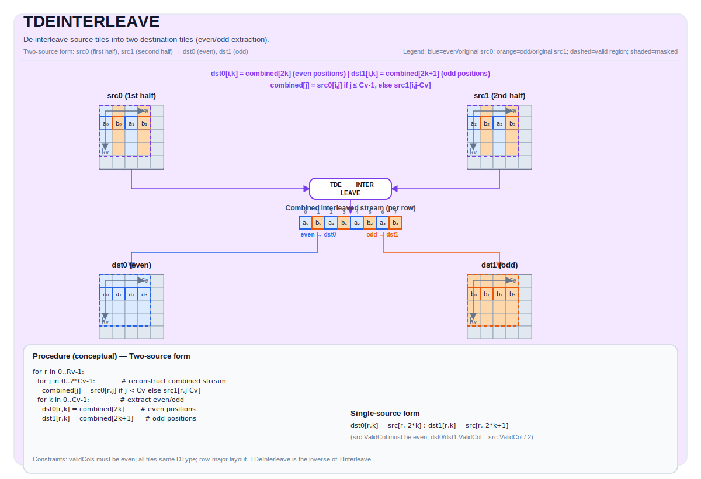

# TDEINTERLEAVE

## 指令示意图



## 简介

将源 Tile 反交织到两个目标 Tile（`dst0` 和 `dst1`）中。该操作逆转交织过程：`dst0` 接收交织流的偶数位置元素，`dst1` 接收奇数位置元素。

`TDeInterleave` 有两种重载形式：

- **双源形式**（`dst1, dst0, src1, src0`）：给定两个持有交织流前半部分和后半部分的源 Tile，反交织为原始的偶元素流和奇元素流。
- **单源形式**（`dst1, dst0, src`）：给定一个包含完整交织数据的源 Tile，反交织为偶数位置和奇数位置的元素流。每个目标行持有 `src.GetValidCol() / 2` 个有效元素。

`TDeInterleave` 是 `TInterleave` 的逆操作。

## 数学语义

### 双源形式

给定两个源 Tile `src0`（前半部分）和 `src1`（后半部分），重构完整交织流并反交织：

$$ \mathrm{combined}_{j} = \begin{cases} \mathrm{src0}_{i, j} & \text{若 } 0 \le j < \mathrm{validCols} \\ \mathrm{src1}_{i, j - \mathrm{validCols}} & \text{若 } \mathrm{validCols} \le j < 2 \times \mathrm{validCols} \end{cases} $$

$$ \mathrm{dst0}_{i, k} = \mathrm{combined}_{2k}, \quad 0 \le k < \mathrm{validCols} $$
$$ \mathrm{dst1}_{i, k} = \mathrm{combined}_{2k+1}, \quad 0 \le k < \mathrm{validCols} $$

其中 `validRows = dst0.GetValidRow()` 且 `validCols = dst0.GetValidCol()`。

### 单源形式

给定一个包含逐行交织数据的源 Tile `src`：

$$ \mathrm{dst0}_{i, k} = \mathrm{src}_{i, 2k}, \quad 0 \le k < \mathrm{halfValidCols} $$
$$ \mathrm{dst1}_{i, k} = \mathrm{src}_{i, 2k+1}, \quad 0 \le k < \mathrm{halfValidCols} $$

其中 `halfValidCols = src.GetValidCol() / 2`。

> **注意**：单源形式要求源 Tile 的行宽至少为 `2 × ElementsPerRepeat` 个元素（其中 `ElementsPerRepeat = 256 / sizeof(T)`，即 `2 × sregLower`），以确保每次重复中加载的两个相邻寄存器大小的数据块不会跨越行边界。

## 汇编语法

PTO-AS 形式：参见 [PTO-AS 规范](../assembly/PTO-AS_zh.md)。

同步形式（双源）：

```text
%dst0, %dst1 = tdeinterleave %src0, %src1 : !pto.tile<...>
```

同步形式（单源）：

```text
%dst0, %dst1 = tdeinterleave %src : !pto.tile<...>
```

### AS Level 1（SSA）

双源形式：

```text
%dst0, %dst1 = pto.tdeinterleave %src0, %src1 : (!pto.tile<...>, !pto.tile<...>) -> (!pto.tile<...>, !pto.tile<...>)
```

单源形式：

```text
%dst0, %dst1 = pto.tdeinterleave %src : (!pto.tile<...>) -> (!pto.tile<...>, !pto.tile<...>)
```

### AS Level 2（DPS）

双源形式：

```text
pto.tdeinterleave ins(%src0, %src1 : !pto.tile_buf<...>, !pto.tile_buf<...>) outs(%dst0, %dst1 : !pto.tile_buf<...>, !pto.tile_buf<...>)
```

单源形式：

```text
pto.tdeinterleave ins(%src : !pto.tile_buf<...>) outs(%dst0, %dst1 : !pto.tile_buf<...>, !pto.tile_buf<...>)
```

## C++ 内建接口

声明于 `include/pto/common/pto_instr.hpp`：
> 公共包含头为 `<pto/pto-inst.hpp>`，内部声明位于 `pto/common/pto_instr.hpp`。

```cpp
// 双源形式
template <typename TileDataDst, typename TileDataSrc, typename... WaitEvents>
PTO_INST RecordEvent TDeInterleave(TileDataDst &dst1, TileDataDst &dst0, TileDataSrc &src1, TileDataSrc &src0,
                                   WaitEvents &...events);

// 单源形式
template <typename TileDataDst, typename TileDataSrc, typename... WaitEvents>
PTO_INST RecordEvent TDeInterleave(TileDataDst &dst1, TileDataDst &dst0, TileDataSrc &src,
                                   WaitEvents &...events);
```

> **注意**：双源形式的参数顺序为 `(dst1, dst0, src1, src0)`。`dst0` 接收交织流的偶数位置元素，`dst1` 接收奇数位置元素。

## 约束

- **实现检查 (A5)**:
    - `TileData::DType` 必须是以下之一：`int32_t`、`uint32_t`、`float`、`int16_t`、`uint16_t`、`half`、`bfloat16_t`、`uint8_t`、`int8_t`。
    - Tile 布局必须是行主序（`TileData::isRowMajor`）。
    - 所有 Tile 必须具有相同的 `DType`。
    - 双源形式：`src0`、`src1`、`dst0`、`dst1` 必须具有相同的有效形状, 且他们的validCols必须为偶数。
    - 单源形式：`src`、`dst0`、`dst1` 必须具有相同的有效形状；`src`的validCols必须为偶数
    - 单源形式：`dst0`/`dst1` 的 `validCols` 必须为 `src` 的 `validCols` 的一半。
- **有效区域**:
    - 双源形式：该操作使用 `dst0.GetValidRow()` / `dst0.GetValidCol()` 作为迭代域。`dst0/dst1` 每行持有 `validCols` 个元素。
    - 单源形式：`dst0/dst1` 每行持有 `src.GetValidCol() / 2` 个有效元素。每行中超出 `halfValidCols` 的元素是**未指定的**。

## 示例

### 自动（Auto）— 双源形式

```cpp
#include <pto/pto-inst.hpp>

using namespace pto;

void example_auto_two_src() {
    using TileT = Tile<TileType::Vec, float, 16, 128>;
    TileT src0(16, 128), src1(16, 128);
    TileT dst0(16, 128), dst1(16, 128);

    TDeInterleave(dst1, dst0, src1, src0);
}
```

### 自动（Auto）— 单源形式

```cpp
#include <pto/pto-inst.hpp>

using namespace pto;

void example_auto_single_src() {
    using TileT = Tile<TileType::Vec, float, 16, 128>;
    TileT src(16, 128);
    TileT dst0(16, 128), dst1(16, 128);

    TDeInterleave(dst1, dst0, src);
}
```

### 手动（Manual）— 双源形式

```cpp
#include <pto/pto-inst.hpp>

using namespace pto;

void example_manual_two_src() {
    using TileT = Tile<TileType::Vec, half, 16, 256, BLayout::RowMajor, 16, 256>;
    TileT src0, src1, dst0, dst1;

    TASSIGN(src0, 0x1000);
    TASSIGN(src1, 0x2000);
    TASSIGN(dst0, 0x3000);
    TASSIGN(dst1, 0x4000);

    TDeInterleave(dst1, dst0, src1, src0);
}
```

### 手动（Manual）— 单源形式

```cpp
#include <pto/pto-inst.hpp>

using namespace pto;

void example_manual_single_src() {
    using TileT = Tile<TileType::Vec, half, 16, 256, BLayout::RowMajor, 16, 256>;
    TileT src, dst0, dst1;

    TASSIGN(src,  0x1000);
    TASSIGN(dst0, 0x2000);
    TASSIGN(dst1, 0x3000);

    TDeInterleave(dst1, dst0, src);
}
```

## 汇编示例（ASM）

### 自动模式

```text
# 自动模式：由编译器/运行时负责资源放置与调度。
# 双源形式：
%dst0, %dst1 = pto.tdeinterleave %src0, %src1 : (!pto.tile<...>, !pto.tile<...>) -> (!pto.tile<...>, !pto.tile<...>)
# 单源形式：
%dst0, %dst1 = pto.tdeinterleave %src : (!pto.tile<...>) -> (!pto.tile<...>, !pto.tile<...>)
```

### 手动模式

```text
# 手动模式：先显式绑定资源，再发射指令。
# 双源形式：
# pto.tassign %src0, @tile(0x1000)
# pto.tassign %src1, @tile(0x2000)
# pto.tassign %dst0, @tile(0x3000)
# pto.tassign %dst1, @tile(0x4000)
%dst0, %dst1 = pto.tdeinterleave %src0, %src1 : (!pto.tile<...>, !pto.tile<...>) -> (!pto.tile<...>, !pto.tile<...>)
# 单源形式：
# pto.tassign %src,  @tile(0x1000)
# pto.tassign %dst0, @tile(0x2000)
# pto.tassign %dst1, @tile(0x3000)
%dst0, %dst1 = pto.tdeinterleave %src : (!pto.tile<...>) -> (!pto.tile<...>, !pto.tile<...>)
```

### PTO 汇编形式

```text
# 双源形式：
%dst0, %dst1 = tdeinterleave %src0, %src1 : !pto.tile<...>
# AS Level 2 (DPS)
pto.tdeinterleave ins(%src0, %src1 : !pto.tile_buf<...>, !pto.tile_buf<...>) outs(%dst0, %dst1 : !pto.tile_buf<...>, !pto.tile_buf<...>)

# 单源形式：
%dst0, %dst1 = tdeinterleave %src : !pto.tile<...>
# AS Level 2 (DPS)
pto.tdeinterleave ins(%src : !pto.tile_buf<...>) outs(%dst0, %dst1 : !pto.tile_buf<...>, !pto.tile_buf<...>)
```

## 相关指令

- [TInterleave](TINTERLEAVE_zh.md) - 将两个 Tile 交织为交替的偶/奇流（TDeInterleave 的逆操作）。
