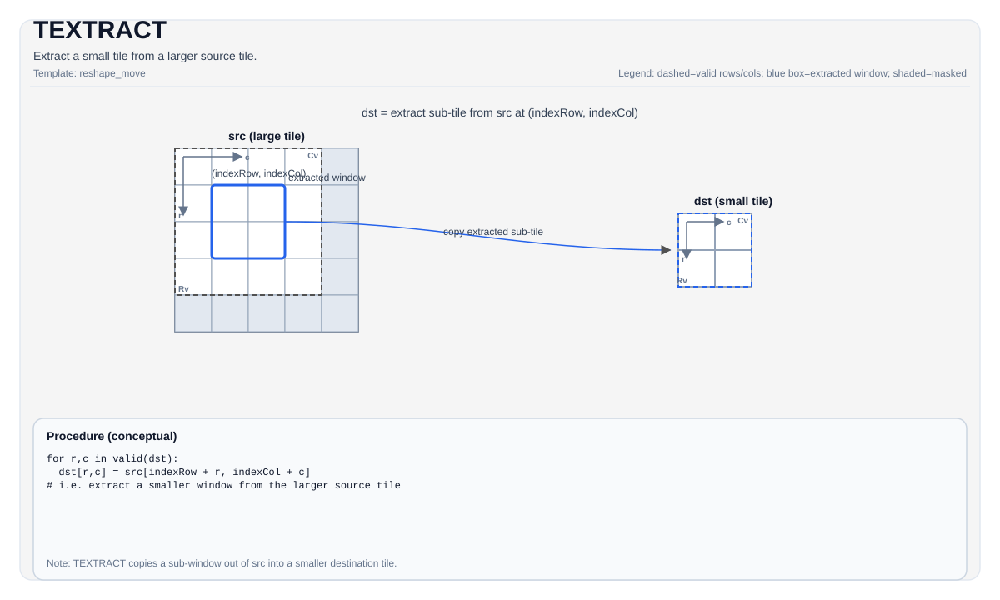

# TEXTRACT


## Tile Operation Diagram



## Introduction

Extract a smaller sub-tile from a larger source tile.

## Math Interpretation

Conceptually copies a smaller window starting at `(indexRow, indexCol)` from the larger `src` tile into `dst`. Exact mapping depends on tile layouts.

Let `R = dst.GetValidRow()` and `C = dst.GetValidCol()`. For `0 <= i < R` and `0 <= j < C`:

$$ \mathrm{dst}_{i,j} = \mathrm{src}_{\mathrm{indexRow}+i,\; \mathrm{indexCol}+j} $$

## Assembly Syntax

Synchronous form:

```text
%dst = textract %src[%r0, %r1] : !pto.tile<...> -> !pto.tile<...>
```

### AS Level 1 (SSA)

```text
%dst = pto.textract %src, %idxrow, %idxcol : (!pto.tile<...>, dtype, dtype) -> !pto.tile<...>
```

### AS Level 2 (DPS)

```text
pto.textract ins(%src, %idxrow, %idxcol : !pto.tile_buf<...>, dtype, dtype) outs(%dst : !pto.tile_buf<...>)
```

### IR Level 1 (SSA)

```text
%dst = pto.textract %src[%r0, %r1] : !pto.tile<...> -> !pto.tile<...>
```

### IR Level 2 (DPS)

```text
pto.textract ins(%src[%r0, %r1] : !pto.tile_buf<...>) outs(%dst : !pto.tile_buf<...>)
```
## C++ Intrinsic

Declared in `include/pto/common/pto_instr.hpp`:

```cpp
template <typename DstTileData, typename SrcTileData, typename... WaitEvents>
PTO_INST RecordEvent TEXTRACT(DstTileData &dst, SrcTileData &src, uint16_t indexRow = 0, uint16_t indexCol = 0, WaitEvents &... events);

template <typename DstTileData, typename SrcTileData, ReluPreMode reluMode, typename... WaitEvents>
PTO_INST RecordEvent TEXTRACT(DstTileData &dst, SrcTileData &src, uint16_t indexRow, uint16_t indexCol, WaitEvents &... events);

template <typename DstTileData, typename SrcTileData, ReluPreMode reluMode = ReluPreMode::NoRelu,
          typename... WaitEvents>
PTO_INST RecordEvent TEXTRACT(DstTileData &dst, SrcTileData &src, uint64_t preQuantScalar, uint16_t indexRow, uint16_t indexCol, WaitEvents &... events);

template <typename DstTileData, typename SrcTileData, typename FpTileData, ReluPreMode reluMode = ReluPreMode::NoRelu,
          typename... WaitEvents>
PTO_INST RecordEvent TEXTRACT(DstTileData &dst, SrcTileData &src, FpTileData &fp, uint16_t indexRow, uint16_t indexCol, WaitEvents &... events);

template <typename DstTileData, typename SrcTileData, typename FpTileData, AccToVecMode mode,
          ReluPreMode reluMode = ReluPreMode::NoRelu, typename... WaitEvents>
PTO_INST RecordEvent TEXTRACT(DstTileData &dst, SrcTileData &src, FpTileData &fp,
                              uint16_t indexRow, uint16_t indexCol, WaitEvents &... events);

template <typename DstTileData, typename SrcTileData, typename FpTileData, ReluPreMode reluMode = ReluPreMode::NoRelu,
          typename... WaitEvents>
PTO_INST RecordEvent TEXTRACT_FP(DstTileData &dst, SrcTileData &src, FpTileData &fp, uint16_t indexRow, uint16_t indexCol, WaitEvents &... events);

template <typename Dst0TileData, typename Dst1TileData, typename SrcTileData, typename... WaitEvents>
PTO_INST RecordEvent TEXTRACT(Dst0TileData &dst0, Dst1TileData &dst1, SrcTileData &src,
                              uint16_t indexRow0 = 0, uint16_t indexCol0 = 0,
                              uint16_t indexRow1 = 0, uint16_t indexCol1 = 0, WaitEvents &... events);
```

`TEXTRACT_FP(...)` is retained for source compatibility with the legacy fp-quantized form and maps directly
to the no-`mode` `TEXTRACT_IMPL(dst, src, fp, indexRow, indexCol)` path. The canonical
`TEXTRACT(..., fp, ...)` overload is selected only for `FpTileData::Loc == TileType::Scaling`.
The canonical interface also provides an explicit `AccToVecMode` form for target-supported Acc-to-Vec routing.

## Constraints

### General constraints / checks

- For same-dtype extraction/layout paths, `DstTileData::DType` must equal `SrcTileData::DType`.
  Acc conversion and quantized paths use the target-specific dtype pairs below.
- Runtime bounds checks:
    - `indexRow + DstTileData::Rows <= SrcTileData::Rows`
    - `indexCol + DstTileData::Cols <= SrcTileData::Cols`

### A2A3 implementation checks

- Supported element types: `int8_t`, `half`, `bfloat16_t`, `float`.
- Source layout must satisfy one of the checked A2A3 extraction layouts:
    - `(SFractal == ColMajor && isRowMajor)`, or
    - `(SFractal == RowMajor && !isRowMajor)`.
- In GEMV scenarios targeting `TileType::Left`, the checked source layout also allows `(SrcTileData::Rows == 1 && SrcTileData::isRowMajor)`.
- Destination must be `TileType::Left` or `TileType::Right` with a target-supported fractal configuration.

### A5 implementation checks

- Supported element types: `int8_t`, `hifloat8_t`, `float8_e5m2_t`, `float8_e4m3_t`, `half`, `bfloat16_t`, `float`, `float4_e2m1x2_t`, `float4_e1m2x2_t`, `float8_e8m0_t`.
- Source layout must satisfy one of the checked A5 extraction layouts:
    - for `Left` / `Right`: `(SFractal == ColMajor && isRowMajor)` or `(SFractal == RowMajor && !isRowMajor)`
    - for `ScaleLeft`: `(SFractal == RowMajor && isRowMajor)`
    - for `ScaleRight`: `(SFractal == ColMajor && !isRowMajor)`
- In GEMV scenarios targeting `Left`, the checked source layout also allows `(SrcTileData::Rows == 1 && SrcTileData::isRowMajor)`.
- Destination supports `TileType::Mat -> TileType::Left/Right/Scale`, `TileType::Acc -> TileType::Mat` (including relu, scalar-quant, and vector-quantized forms), `TileType::Acc -> TileType::Vec`, and specific `TileType::Vec -> TileType::Mat` extraction paths.
- The canonical vector-quantized `TEXTRACT(..., fp, ...)` form additionally requires an `FpTileData`
  scaling operand. `TEXTRACT_FP(...)` remains available as a source-compatible legacy alias and is
  checked by the selected backend implementation.
- The vector-quantized Acc-to-Vec form is exposed only on targets with matching backend support
  (A5, kirin9030, kirinX90, and CPU simulator). It accepts
  `mode = AccToVecMode::{SingleModeVec0, SingleModeVec1, DualModeSplitM, DualModeSplitN}`.
- For `TileType::Acc -> TileType::Vec` with a 32-bit destination type (`float`/`int32_t`), when using `DualModeSplitN` the `ValidCol` (before the split) must be a multiple of `32`.

### Vec → Vec extraction path

In addition to the `Mat/Acc -> ...` paths above, `TEXTRACT` supports a `TileType::Vec -> TileType::Vec` extraction path (ND and NZ layouts), enforced via `CheckTExtractVecToVecCommon`:

- `DstTileData::DType` must equal `SrcTileData::DType`.
- Supported element types (both A2A3 and A5): `int8_t`, `uint8_t`, `int16_t`, `uint16_t`, `int32_t`, `uint32_t`, `half`, `bfloat16_t`, `float` (any 1-/2-/4-byte standard type). This set differs from the primary tile path: it adds `uint8_t`/`int16_t`/`uint16_t`/`int32_t`/`uint32_t`, and on A5 it does **not** include the fp8/fp4 types.
- ND path: source/destination row strides must be 32-byte aligned; `Dst` rows/cols must not exceed `Src`.

### ND → 2×NZ extraction path

The two-destination `TEXTRACT` overload extracts two independent ND sub-windows from a single ND source and writes each as a separate NZ destination in one call. It is implemented entirely with vector-frontend intrinsics (no MTE copy).

- Source must be a `TileType::Vec` ND tile (`BLayout::RowMajor`, `SLayout::NoneBox`); both destinations must be `TileType::Vec` NZ tiles (`BLayout::ColMajor`, `SLayout::RowMajor`).
- `DstTileData::DType` must equal `SrcTileData::DType`.
- Each window is placed by its own `(indexRow, indexCol)`. Runtime bounds checks per window `k`:
    - `indexRow_k + dst_k.GetValidRow() <= SrcTileData::Rows`
    - `indexCol_k + dst_k.GetValidCol() <= SrcTileData::Cols`
- Structural constraints (same as the Vec → Vec paths): destination `Cols` must be `c0`-aligned (NZ fractal width), and source row-stride bytes must be 32-byte aligned.
- Supported element types:
    - A5: `int8_t`, `half`, `bfloat16_t`, `float`, `int32_t`, `hifloat8_t`, `float8_e4m3_t`, `float8_e5m2_t`, `float8_e8m0_t`, `float4_e2m1x2_t`, `float4_e1m2x2_t`.
    - A2A3: `int8_t`, `half`, `bfloat16_t`, `float`, `int32_t`.
- Output compact mode:
    - A5 supports plain NZ (default) and the NZ+1 bank-conflict optimization (`CompactMode::RowPlusOne`).
    - A2A3 supports plain NZ only.

- Index alignment (a window's source base is `srcStart = src + indexRow*rowStride + indexCol`):
    - A5 (SIMD) handles a `c0`-unaligned `indexCol` (sub-`c0` column origin)
    via an element-exact unaligned load/store path; `c0`-aligned windows take
    the faster block path.
    - A2A3 (vec-core) vector engines require the operand base to be 32-byte
    aligned, and `dav-c220-vec` has no unaligned vector load (`vlds`/`vsts`
    are unavailable). A window therefore takes the vector path only when its
    source base is 32-byte aligned, i.e. `indexCol * sizeof(T)` is a multiple
    of 32. Windows whose `indexCol` does not satisfy this (and `1×1` windows)
    use an element-wise scalar copy, which has no alignment constraint.
- A2A3 vector paths (32-byte-aligned source base): `vcopy` reinterprets data
at 16-bit granularity (its smallest element width; there is no 8-bit
`vcopy`). 2-/4-byte types and `int8` with an even `validCol` map directly
through `vcopy`. `int8` with an **odd** `validCol` (odd byte count) uses a
fully vector widen path — `vconv_s82f16` (int8→half) into a scratch, the
ND→NZ reshape in `half`, then `vconv_f162s8` (half→int8) into the NZ
destination (all `int8` values round-trip losslessly through `half`).

| Arch | Mode | Implementation |
|------|------|----------------|
| A5 / A2A3 | `1×1` | scalar copy |
| A5 (SIMD) | `c0`-aligned `indexCol` | `vlds` + `vsstb` |
| A5 (SIMD) | `c0`-unaligned `indexCol` | `vldas` + `vldus` + `vsts` |
| A2A3 (vec-core) | unaligned source base not 32-byte aligned (`indexCol*sizeof(T) % 32 != 0`) | scalar copy |
| A2A3 (vec-core) | aligned base, 2-/4-byte or even-`validCol` `int8` | `vcopy` with 16-bit reinterpretation |
| A2A3 (vec-core) | aligned base, odd-`validCol` `int8` | `vconv_s82f16` + `vconv_f162s8` widen path |

## Examples

### Auto

```cpp
#include <pto/pto-inst.hpp>

using namespace pto;

void example_auto() {
  using SrcT = Tile<TileType::Mat, float, 16, 16, BLayout::RowMajor, 16, 16, SLayout::ColMajor>;
  using DstT = TileLeft<float, 16, 16>;
  SrcT src;
  DstT dst;
  TEXTRACT(dst, src, /*indexRow=*/0, /*indexCol=*/0);
}
```

### Manual

```cpp
#include <pto/pto-inst.hpp>

using namespace pto;

void example_manual() {
  using SrcT = Tile<TileType::Mat, float, 16, 16, BLayout::RowMajor, 16, 16, SLayout::ColMajor>;
  using DstT = TileLeft<float, 16, 16>;
  SrcT src;
  DstT dst;
  TASSIGN(src, 0x1000);
  TASSIGN(dst, 0x2000);
  TEXTRACT(dst, src, /*indexRow=*/0, /*indexCol=*/0);
}
```

## ASM Form Examples

### Auto Mode

```text
# Auto mode: compiler/runtime-managed placement and scheduling.
%dst = pto.textract %src, %idxrow, %idxcol : (!pto.tile<...>, dtype, dtype) -> !pto.tile<...>
```

### Manual Mode

```text
# Manual mode: resources must be bound explicitly before issuing the instruction.
# Optional for tile operands:
# pto.tassign %arg0, @tile(0x1000)
# pto.tassign %arg1, @tile(0x2000)
%dst = pto.textract %src, %idxrow, %idxcol : (!pto.tile<...>, dtype, dtype) -> !pto.tile<...>
```

### PTO Assembly Form

```text
%dst = textract %src[%r0, %r1] : !pto.tile<...> -> !pto.tile<...>
# AS Level 2 (DPS)
pto.textract ins(%src, %idxrow, %idxcol : !pto.tile_buf<...>, dtype, dtype) outs(%dst : !pto.tile_buf<...>)
```
