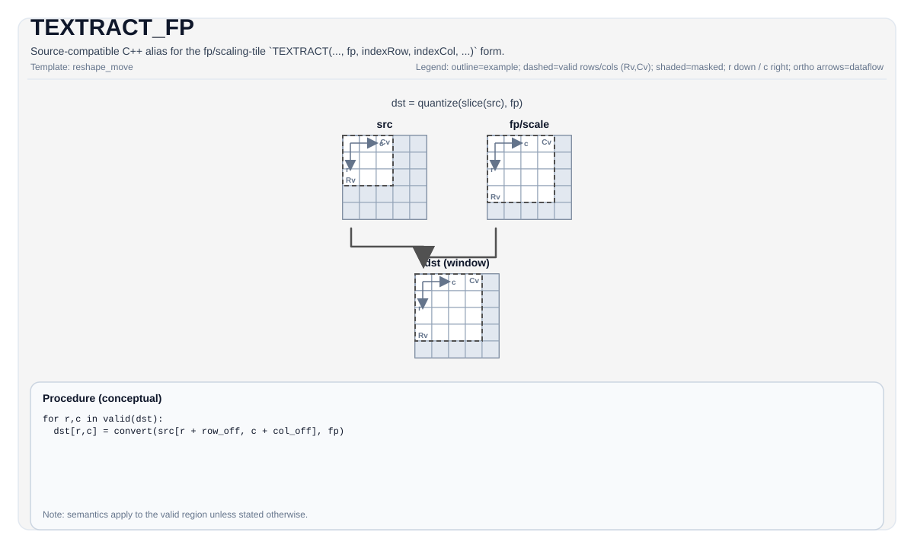

# TEXTRACT_FP


## Tile Operation Diagram



## Introduction

Extract a sub-tile from a source tile, while also providing an `fp` tile used for vector quantization
parameters (target/implementation-defined).

`TEXTRACT_FP(...)` is retained as a source-compatible C++ interface for the legacy no-mode fp extraction
form. It maps directly to the `TEXTRACT_IMPL(dst, src, fp, indexRow, indexCol)` implementation path
without an explicit mode template argument. The canonical `TEXTRACT(..., fp, ...)` overload requires a
`Scaling` tile at the facade layer; the legacy alias preserves the backend-specific `FpTileData` checks
used by existing code.

## See also

- TEXTRACT base instruction: `docs/isa/TEXTRACT.md`.

## C++ Intrinsic

Declared in `include/pto/common/pto_instr.hpp`:

```cpp
template <typename DstTileData, typename SrcTileData, typename FpTileData, ReluPreMode reluMode = ReluPreMode::NoRelu,
          typename... WaitEvents>
PTO_INST RecordEvent TEXTRACT(DstTileData &dst, SrcTileData &src, FpTileData &fp, uint16_t indexRow, uint16_t indexCol, WaitEvents &... events);

template <typename DstTileData, typename SrcTileData, typename FpTileData, ReluPreMode reluMode = ReluPreMode::NoRelu,
          typename... WaitEvents>
PTO_INST RecordEvent TEXTRACT_FP(DstTileData &dst, SrcTileData &src, FpTileData &fp, uint16_t indexRow, uint16_t indexCol, WaitEvents &... events);
```

## Math Interpretation

Unless otherwise specified, semantics are defined over the valid region and target-dependent behavior is marked as implementation-defined.

## Assembly Syntax

### AS Level 1 (SSA)

```text
%dst = pto.textract_fp %src, %fp, %idxrow, %idxcol : (!pto.tile<...>, !pto.tile<...>, dtype, dtype) -> !pto.tile<...>
```

### AS Level 2 (DPS)

```text
pto.textract_fp ins(%src, %fp, %idxrow, %idxcol : !pto.tile_buf<...>, !pto.tile_buf<...>, dtype, dtype) outs(%dst : !pto.tile_buf<...>)
```

### IR Level 1 (SSA)

```text
%dst = pto.textract_fp %src, %fp, %idxrow, %idxcol : (!pto.tile<...>, !pto.tile<...>, dtype, dtype) -> !pto.tile<...>
```

### IR Level 2 (DPS)

```text
pto.textract_fp ins(%src, %fp, %idxrow, %idxcol : !pto.tile_buf<...>, !pto.tile_buf<...>, dtype, dtype) outs(%dst : !pto.tile_buf<...>)
```
## Constraints

Type/layout/location/shape legality is backend-dependent; treat implementation-specific notes as normative
for that backend. The canonical same-name `TEXTRACT(..., fp, ...)` facade requires
`FpTileData::Loc == TileType::Scaling`; the legacy `TEXTRACT_FP(...)` alias is checked by the selected
backend implementation.

## Examples

See related examples in `docs/isa/` and `docs/coding/tutorials/`.

## ASM Form Examples

### Auto Mode

```text
# Auto mode: compiler/runtime-managed placement and scheduling.
%dst = pto.textract_fp %src, %fp, %idxrow, %idxcol : (!pto.tile<...>, !pto.tile<...>, dtype, dtype) -> !pto.tile<...>
```

### Manual Mode

```text
# Manual mode: resources must be bound explicitly before issuing the instruction.
# Optional for tile operands:
# pto.tassign %arg0, @tile(0x1000)
# pto.tassign %arg1, @tile(0x2000)
%dst = pto.textract_fp %src, %fp, %idxrow, %idxcol : (!pto.tile<...>, !pto.tile<...>, dtype, dtype) -> !pto.tile<...>
```

### PTO Assembly Form

```text
%dst = pto.textract_fp %src, %fp, %idxrow, %idxcol : (!pto.tile<...>, !pto.tile<...>, dtype, dtype) -> !pto.tile<...>
# AS Level 2 (DPS)
pto.textract_fp ins(%src, %fp, %idxrow, %idxcol : !pto.tile_buf<...>, !pto.tile_buf<...>, dtype, dtype) outs(%dst : !pto.tile_buf<...>)
```
