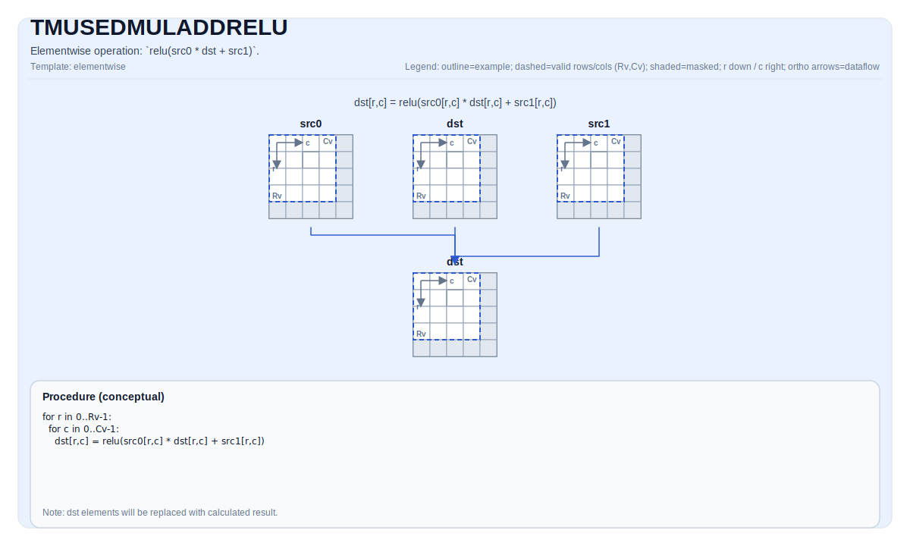

# TFUSEDMULADDRELU

## 指令示意图



## 简介

三元逐元素运算：`src0 * src1 + dst`。

## 数学语义

对每个元素 `(i, j)` 在有效区域内：

$$ \mathrm{dst}_{i,j} = \mathrm{src0}_{i,j} \* \mathrm{src1}_{i,j} + \mathrm{dst}_{i,j} $$

## 汇编语法

同步形式：

```text
%dst = tfusedmuladdrelu %src0, %src1 : !pto.tile<...>, !pto.tile<...>
```

### AS Level 1（SSA）

```text
%dst = pto.tfusedmuladdrelu %src0, %src1 : (!pto.tile<...>, !pto.tile<...>) -> !pto.tile<...>
```

### AS Level 2（DPS）

```text
pto.tfusedmuladdrelu ins(%src0, %src1 : !pto.tile_buf<...>, !pto.tile_buf<...>) outs(%dst : !pto.tile_buf<...>)
```

## C++ 内建接口

声明于 `include/pto/common/pto_instr.hpp`：

```cpp
template <typename TileDataDst, typename TileDataSrc0, typename TileDataSrc1, typename... WaitEvents>
PTO_INST RecordEvent TFUSEDMULADDRELU(TileDataDst &dst, TileDataSrc0 &src0, TileDataSrc1 &src1, WaitEvents &...events);
```

## 约束

- **实现检查**:
    - `TileData::DType` 必须是以下之一：`half`、`float`。
    - Tile 布局必须是行主序（`TileData::isRowMajor`）。
- **通用约束**:
    - Tile 位置必须是向量（`TileData::Loc == TileType::Vec`）。
    - 静态有效边界：`TileData::ValidRow <= TileData::Rows` 且 `TileData::ValidCol <= TileData::Cols`。
    - 运行时：`dst`、`src0` 和 `src1` 的有效行列数必须相同。
    - 标量类型必须与 Tile 数据类型一致。
- 该操作在 `dst.GetValidRow()` / `dst.GetValidCol()` 上迭代。

## 示例

```cpp
#include <pto/pto-inst.hpp>

using namespace pto;

void example() {
  using TileT = Tile<TileType::Vec, float, 16, 16>;
  TileT a, b, out;
  TFUSEDMULADDRELU(out, a, b);
}
```

## 汇编示例（ASM）

### 自动模式

```text
# 自动模式：由编译器/运行时负责资源放置与调度。
%dst = pto.tfusedmuladdrelu %src0, %src1 : (!pto.tile<...>, !pto.tile<...>) -> !pto.tile<...>
```

### 手动模式

```text
# 手动模式：先显式绑定资源，再发射指令。
# 可选（当该指令包含 tile 操作数时）：
# pto.tassign %arg0, @tile(0x1000)
# pto.tassign %arg1, @tile(0x2000)
%dst = pto.tfusedmuladdrelu %src0, %src1 : (!pto.tile<...>, !pto.tile<...>) -> !pto.tile<...>
```

### PTO 汇编形式

```text
%dst = tfusedmuladdrelu %src0, %src1 : !pto.tile<...>, !pto.tile<...>
# AS Level 2 (DPS)
pto.tfusedmuladdrelu ins(%src0, %src1 : !pto.tile_buf<...>, !pto.tile_buf<...>) outs(%dst : !pto.tile_buf<...>)
```

