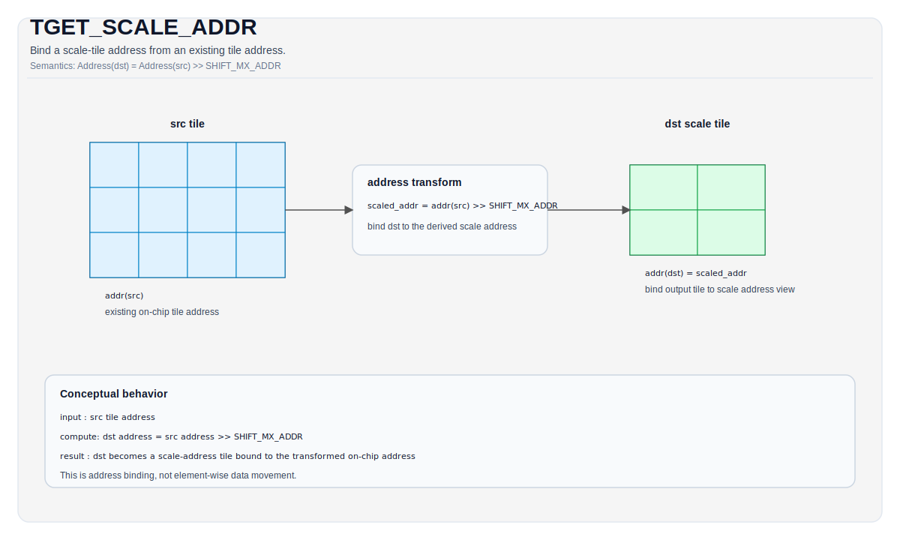

# TGET_SCALE_ADDR

## Tile Operation Diagram



## Introduction

Bind the on-chip address of output tile as a scaled address of the input tile.

The scaling factor is defined by a right-shift amount `SHIFT_MX_ADDR` in `include/pto/npu/a5/utils.hpp`.

## Math Interpretation

Address(`dst`) = Address(`src`) >> `SHIFT_MX_ADDR`

## C++ Intrinsic

Declared in `include/pto/common/pto_instr.hpp`:

```cpp
template <typename TileDataOut, typename TileDataIn, typename... WaitEvents>
PTO_INST RecordEvent TGET_SCALE_ADDR(TileDataOut &dst, TileDataIn &src, WaitEvents &... events);
```

## Constraints

Enforced by `TGET_SCALE_ADDR_IMPL` (A5 only; no A2A3 implementation):

- **Both `src` and `dst` must be Tile instances**
- **Currently only work in auto mode** (will support manual mode in the future)

## Examples

```cpp
#include <pto/pto-inst.hpp>

using namespace pto;

template <typename T, int ARows, int ACols, int BRows, int BCols> 
void example() {
    using LeftTile = TileLeft<T, ARows, ACols>;
    using RightTile = TileRight<T, BRows, BCols>;

    using LeftScaleTile = TileLeftScale<T, ARows, ACols>;
    using RightScaleTile = TileRightScale<T, BRows, BCols>;

    LeftTile aTile;
    RightTile bTile;
    LeftScaleTile aScaleTile;
    RightScaleTile bScaleTile;

    TGET_SCALE_ADDR(aScaleTile, aTile);
    TGET_SCALE_ADDR(bScaleTile, bTile);
}
```
