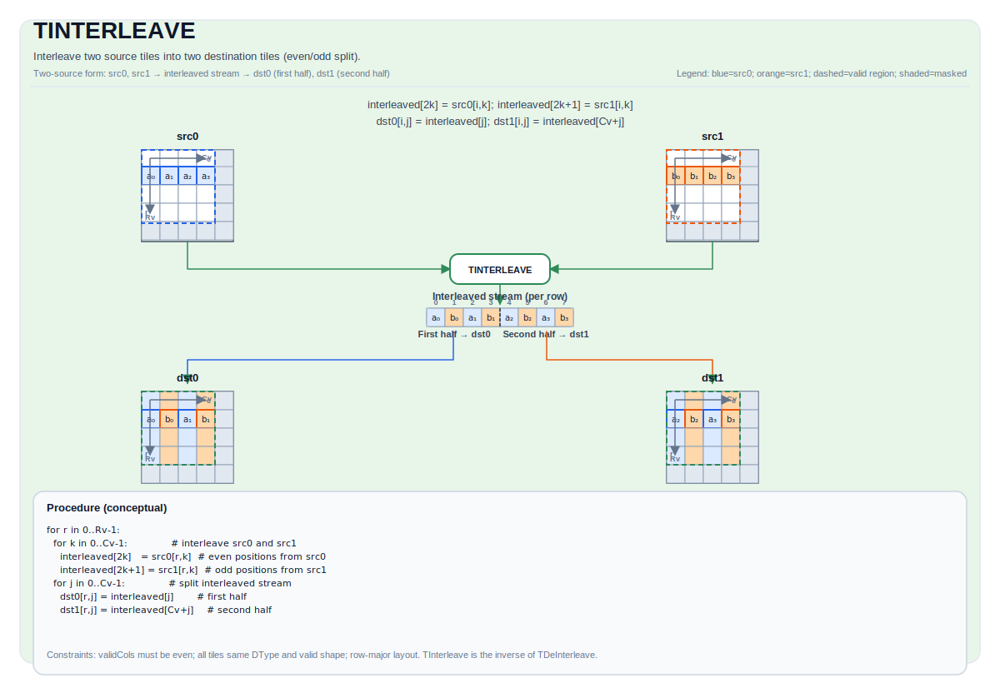

# TINTERLEAVE

## 指令示意图



## 简介

将两个源 Tile（`src0` 和 `src1`）交织到两个目标 Tile（`dst0` 和 `dst1`）中。该操作以交替模式组合 `src0` 和 `src1` 的元素：交织流的偶数位置元素放入 `dst0`，奇数位置元素放入 `dst1`。每个目标 Tile 各持有交织流的一半，在中点处拆分。

`TInterleave` 是 `TDeInterleave` 的逆操作。

## 数学语义

### 双源形式

给定两个具有相同有效形状 `(validRows, validCols)` 的源 Tile `src0` 和 `src1`，为每行构造长度为 `2 × validCols` 的交织流：

$$ \mathrm{interleaved}_{2k} = \mathrm{src0}_{i, k}, \quad \mathrm{interleaved}_{2k+1} = \mathrm{src1}_{i, k}, \quad 0 \le k < \mathrm{validCols} $$

然后将交织流拆分为两半：

$$ \mathrm{dst0}_{i, j} = \mathrm{interleaved}_{j}, \quad 0 \le j < \mathrm{validCols} $$
$$ \mathrm{dst1}_{i, j} = \mathrm{interleaved}_{\mathrm{validCols} + j}, \quad 0 \le j < \mathrm{validCols} $$

其中 `validRows = dst0.GetValidRow()` 且 `validCols = dst0.GetValidCol()`。

## 汇编语法

PTO-AS 形式：参见 [PTO-AS 规范](../assembly/PTO-AS_zh.md)。

同步形式：

```text
%dst0, %dst1 = tinterleave %src0, %src1 : !pto.tile<...>
```

### AS Level 1（SSA）

```text
%dst0, %dst1 = pto.tinterleave %src0, %src1 : (!pto.tile<...>, !pto.tile<...>) -> (!pto.tile<...>, !pto.tile<...>)
```

### AS Level 2（DPS）

```text
pto.tinterleave ins(%src0, %src1 : !pto.tile_buf<...>, !pto.tile_buf<...>) outs(%dst0, %dst1 : !pto.tile_buf<...>, !pto.tile_buf<...>)
```

## C++ 内建接口

声明于 `include/pto/common/pto_instr.hpp`：

```cpp
template <typename TileDataDst, typename TileDataSrc, typename... WaitEvents>
PTO_INST RecordEvent TINTERLEAVE(TileDataDst &dst1, TileDataDst &dst0, TileDataSrc &src1, TileDataSrc &src0,
                                 WaitEvents &...events);
```

> **注意**：参数顺序为 `(dst1, dst0, src1, src0)`。`dst0` 接收交织流的前半部分（位置 `0 … validCols-1`），`dst1` 接收后半部分（位置 `validCols … 2×validCols-1`）。

## 约束

- **实现检查 (A5)**:
    - `TileData::DType` 必须是以下之一：`int32_t`、`uint32_t`、`float`、`int16_t`、`uint16_t`、`half`、`bfloat16_t`、`uint8_t`、`int8_t`。
    - Tile 布局必须是行主序（`TileData::isRowMajor`）。
    - 所有 Tile（`dst0`、`dst1`、`src0`、`src1`）必须具有相同的 `DType`, 相同的有效形状。
    - 所有 Tile 的 `validCol` 必须为偶数（`dst0.GetValidCol() % 2 == 0`）。由于所有 Tile 共享相同的有效形状，这等价于要求 `dst0.GetValidCol() % 2 == 0`。
- **有效区域**:
    - 该操作使用 `dst0.GetValidRow()` / `dst0.GetValidCol()` 作为迭代域；假定 `src0/src1/dst1` 是兼容的。

## 示例

### 自动（Auto）

```cpp
#include <pto/pto-inst.hpp>

using namespace pto;

void example_auto() {
    using TileT = Tile<TileType::Vec, float, 16, 64>;
    TileT src0(16, 64), src1(16, 64);
    TileT dst0(16, 64), dst1(16, 64);

    TINTERLEAVE(dst1, dst0, src1, src0);
}
```

### 手动（Manual）

```cpp
#include <pto/pto-inst.hpp>

using namespace pto;

void example_manual() {
    using TileT = Tile<TileType::Vec, half, 16, 256, BLayout::RowMajor, 16, 256>;
    TileT src0, src1, dst0, dst1;

    TASSIGN(src0, 0x1000);
    TASSIGN(src1, 0x2000);
    TASSIGN(dst0, 0x3000);
    TASSIGN(dst1, 0x4000);

    TINTERLEAVE(dst1, dst0, src1, src0);
}
```

## 汇编示例（ASM）

### 自动模式

```text
# 自动模式：由编译器/运行时负责资源放置与调度。
%dst0, %dst1 = pto.tinterleave %src0, %src1 : (!pto.tile<...>, !pto.tile<...>) -> (!pto.tile<...>, !pto.tile<...>)
```

### 手动模式

```text
# 手动模式：先显式绑定资源，再发射指令。
# 可选（当该指令包含 tile 操作数时）：
# pto.tassign %src0, @tile(0x1000)
# pto.tassign %src1, @tile(0x2000)
# pto.tassign %dst0, @tile(0x3000)
# pto.tassign %dst1, @tile(0x4000)
%dst0, %dst1 = pto.tinterleave %src0, %src1 : (!pto.tile<...>, !pto.tile<...>) -> (!pto.tile<...>, !pto.tile<...>)
```

### PTO 汇编形式

```text
%dst0, %dst1 = tinterleave %src0, %src1 : !pto.tile<...>
# AS Level 2 (DPS)
pto.tinterleave ins(%src0, %src1 : !pto.tile_buf<...>, !pto.tile_buf<...>) outs(%dst0, %dst1 : !pto.tile_buf<...>, !pto.tile_buf<...>)
```

## 相关指令

- [TDeInterleave](TDEINTERLEAVE_zh.md) - 将两个 Tile 反交织回原始的偶/奇流（TInterleave 的逆操作）。