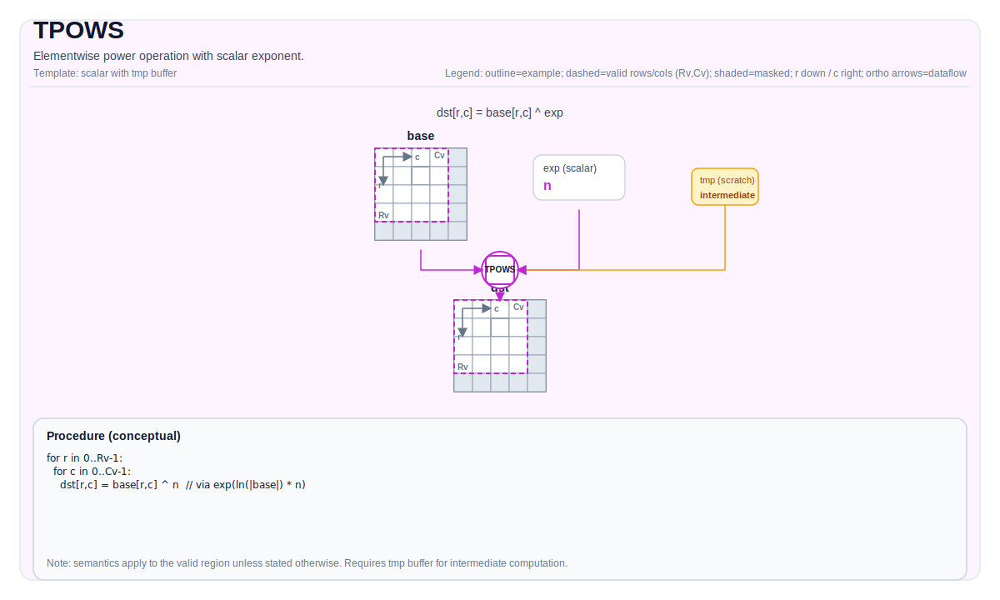

# TPOWS

## 指令示意图



## 简介

逐元素幂运算（标量指数）：计算每个元素的 `base` 的标量 `exp` 次幂。

## 数学语义

设 `R = dst.GetValidRow()`，`C = dst.GetValidCol()`。对 `0 <= i < R`，`0 <= j < C`：

$$ \mathrm{dst}_{i,j} = \mathrm{base}_{i,j}^{\mathrm{exp}} $$

对于浮点类型，计算遵循 `dst = exp(ln(|base|) * exp)`，并对负数底数和整数指数进行特殊处理。

## 汇编语法

PTO-AS 形式：参见 [PTO-AS 规范](../assembly/PTO-AS_zh.md)。

同步形式：

```text
%dst = tpows %base, %exp, %tmp : !pto.tile<...>, dtype
```

降低时可能引入内部临时 Tile；C++ 内建接口需要显式传入 `tmp` 操作数。

### AS Level 1（SSA）

```text
%dst = pto.tpows %base, %exp, %tmp : (!pto.tile<...>, dtype, !pto.tile<...>) -> !pto.tile<...>
```

### AS Level 2（DPS）

```text
pto.tpows ins(%base, %exp, %tmp : !pto.tile_buf<...>, dtype, !pto.tile_buf<...>) outs(%dst : !pto.tile_buf<...>)
```

## C++ 内建接口

声明于 `include/pto/common/pto_instr.hpp`：

```cpp
template <auto PrecisionType = PowAlgorithm::DEFAULT, typename DstTile, typename BaseTile, typename TmpTile,
          typename... WaitEvents>
PTO_INTERNAL RecordEvent TPOWS(DstTile &dst, BaseTile &base, typename DstTile::DType exp, TmpTile &tmp,
                               WaitEvents &... events);
```

`PrecisionType` 可选值：

* `PowAlgorithm::DEFAULT`：普通算法，速度较快但精度较低。
* `PowAlgorithm::HIGH_PRECISION`：高精度算法，速度较慢但精度更高。

## 约束

### 通用约束或检查

- `dst` 和 `base` 必须均为 `TileType::Vec`。
- 所有 Tile 必须使用行主序布局（`TileData::isRowMajor`）。
- `dst` 和 `base` 的元素类型必须一致。
- 静态有效区域约束：`TileData::ValidRow <= TileData::Rows` 且 `TileData::ValidCol <= TileData::Cols`。
- 运行时有效区域检查：
    - `dst.GetValidRow() == base.GetValidRow()`
    - `dst.GetValidCol() == base.GetValidCol()`
- 内建接口签名要求显式传入 `tmp` 操作数。

### A2A3 实现检查

- 支持的元素类型：`int32_t`、`int16_t`、`int8_t`、`uint32_t`、`uint16_t`、`uint8_t`、`float`。
- A2A3 不支持 `HIGH_PRECISION` 算法；`PrecisionType` 选项将被忽略。
- 额外的 `tmp` 运行时有效区域检查：
    - `dst.GetValidRow() == tmp.GetValidRow()`
    - `dst.GetValidCol() == tmp.GetValidCol()`

### A5 实现检查

- `DEFAULT` 算法支持的元素类型：`uint8_t`、`int8_t`、`uint16_t`、`int16_t`、`uint32_t`、`int32_t`、`half`、`float`、`bfloat16_t`。
- `HIGH_PRECISION` 算法支持的元素类型：`half`、`float`、`bfloat16_t`（仅支持浮点类型）。
- 整数类型使用独立的整数幂计算路径。

## 示例

### 自动（Auto）

```cpp
#include <pto/pto-inst.hpp>

using namespace pto;

void example_auto() {
  using TileT = Tile<TileType::Vec, float, 16, 16>;
  TileT base, dst, tmp;
  TPOWS(dst, base, 2.0f, tmp);
  TPOWS<PowAlgorithm::HIGH_PRECISION>(dst, base, 2.0f, tmp);
}
```

### 手动（Manual）

```cpp
#include <pto/pto-inst.hpp>

using namespace pto;

void example_manual() {
  using TileT = Tile<TileType::Vec, float, 16, 16>;
  TileT base, dst, tmp;
  TASSIGN(base, 0x1000);
  TASSIGN(dst, 0x2000);
  TASSIGN(tmp, 0x3000);
  TPOWS(dst, base, 2.0f, tmp);
}
```

## 汇编示例（ASM）

### 自动模式

```text
# 自动模式：由编译器/运行时负责资源放置与调度。
%dst = pto.tpows %base, %exp, %tmp : (!pto.tile<...>, dtype, !pto.tile<...>) -> !pto.tile<...>
```

### 手动模式

```text
# 手动模式：先显式绑定资源，再发射指令。
# 可选（当该指令包含 tile 操作数时）：
# pto.tassign %arg0, @tile(0x1000)
# pto.tassign %arg1, @tile(0x2000)
%dst = pto.tpows %base, %exp, %tmp : (!pto.tile<...>, dtype, !pto.tile<...>) -> !pto.tile<...>
```

### PTO 汇编形式

```text
%dst = tpows %base, %exp, %tmp : !pto.tile<...>, dtype
# AS Level 2 (DPS)
pto.tpows ins(%base, %exp, %tmp : !pto.tile_buf<...>, dtype, !pto.tile_buf<...>) outs(%dst : !pto.tile_buf<...>)
```
"