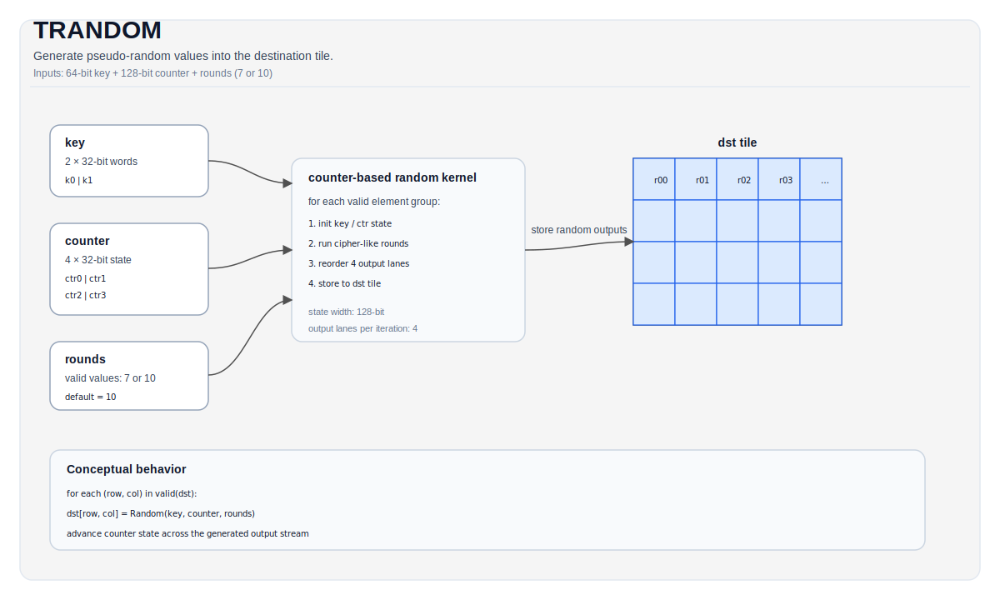

# TRANDOM


## Tile Operation Diagram



## 简介

使用基于计数器的密码算法在目标Tile中生成随机数。

## 数学解释

该指令实现了一个基于计数器的随机数生成器。对于有效区域中的每个元素，它基于密钥和计数器状态，使用可配置轮数的密码类变换生成伪随机值。

该算法使用：
- 128位状态（4 × 32位计数器）
- 64位密钥（2 × 32位字）
- 类似ChaCha的四分之一轮操作，使用向量指令

## 汇编语法

同步形式：

```text
trandom %dst, %key, %counter : !pto.tile<...>
```

### AS Level 1 (SSA)

```text
%dst = pto.trandom %key, %counter : (!pto.tile<...>, !pto.tile<...>) -> !pto.tile<...>
```

### AS Level 2 (DPS)

```text
pto.trandom ins(%key, %counter : !pto.tile_buf<...>, !pto.tile_buf<...>) outs(%dst : !pto.tile_buf<...>)
```

## C++内置函数

声明于 `include/pto/common/pto_instr.hpp`：
> 公共包含头为 `<pto/pto-inst.hpp>`，内部声明位于 `pto/common/pto_instr.hpp`。

```cpp
template <uint16_t Rounds = 10, typename DstTile, typename... WaitEvents>
PTO_INST RecordEvent TRANDOM(DstTile &dst, TRandomKey &key, TRandomCounter &counter, WaitEvents &... events);
```

## 约束条件

- **实现检查（Ascend 950PR/Ascend 950DT）**：
    - `DstTile::DType` 必须为以下类型之一：`int32_t`、`uint32_t`。
    - Tile布局必须为行主序（`DstTile::isRowMajor`）。
    - `Rounds` 必须为7或10（默认为10）。
    - `key` 和 `counter` 不能为空。
- **有效区域**：
    - 该操作使用 `dst.GetValidRow()` / `dst.GetValidCol()` 作为迭代域。

## 示例

### Auto模式

```cpp
#include <pto/pto-inst.hpp>

using namespace pto;

void example_auto() {
  using TileT = Tile<TileType::Vec, uint32_t, 16, 16>;
  TileT dst;
  TRandomKey key = {0x01234, 0x56789};
  TRandomCounter counter = {0, 0, 0, 0};
  TRANDOM(dst, key, counter);
}
```

### Manual模式

```cpp
#include <pto/pto-inst.hpp>

using namespace pto;

void example_manual() {
  using TileT = Tile<TileType::Vec, uint32_t, 16, 16>;
  TileT dst;
  TRandomKey key = {0x01234, 0x56789};
  TRandomCounter counter = {0, 0, 0, 0};
  TASSIGN(dst, 0x0);
  TRANDOM<10>(dst, key, counter);
}
```

## 汇编形式示例

### Auto模式

```text
# Auto 模式：编译器/运行时管理的布局和调度。
%dst = pto.trandom %key, %counter : (!pto.tile<...>, !pto.tile<...>) -> !pto.tile<...>
```

### Manual模式

```text
# Manual 模式：在发出指令之前显式绑定资源。
# Tile 操作数可选：
# pto.tassign %arg0, @tile(0x3000)
%dst = pto.trandom %key, %counter : (!pto.tile<...>, !pto.tile<...>) -> !pto.tile<...>
```

### PTO汇编形式

```text
trandom %dst, %key, %counter : !pto.tile<...>
# AS Level 2 (DPS)
pto.trandom ins(%key, %counter : !pto.tile_buf<...>, !pto.tile_buf<...>) outs(%dst : !pto.tile_buf<...>)
```
