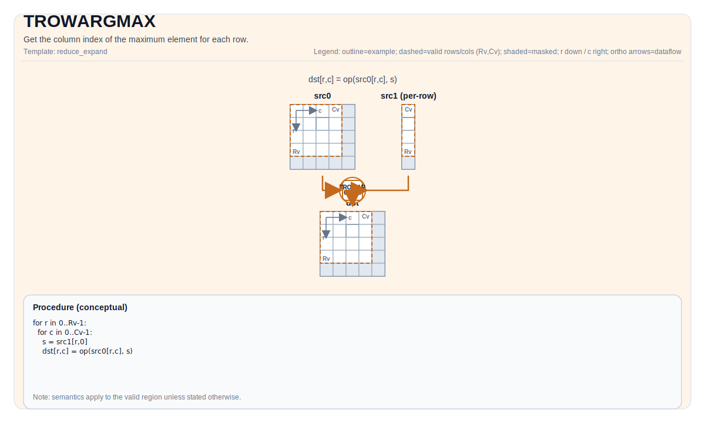

# TROWARGMAX

## Tile Operation Diagram



## Introduction

Get the column index of the maximum element for each row.

## Math Interpretation

Let `R = src.GetValidRow()` and `C = src.GetValidCol()`. For `0 <= i < R`:

$$ \mathrm{dst}_{i,0} = \underset{0 \le j < C}{\operatorname{argmax}} \; \mathrm{src}_{i,j} $$

## Assembly Syntax

PTO-AS form: see `docs/grammar/PTO-AS.md`.

Synchronous form:

```text
%dst = trowargmax %src : !pto.tile<...> -> !pto.tile<...>
```

Lowering may introduce internal scratch tiles; the C++ intrinsic requires an explicit `tmp` operand.

### IR Level 1 (SSA)

```text
%dst = pto.trowargmax %src, %tmp : (!pto.tile<...>, !pto.tile<...>) -> !pto.tile<...>
```

### IR Level 2 (DPS)

```text
pto.trowargmax ins(%src, %tmp : !pto.tile_buf<...>, !pto.tile_buf<...>) outs(%dst : !pto.tile_buf<...>)
```

## C++ Intrinsic

Declared in `include/pto/common/pto_instr.hpp`:

```cpp
template <typename TileDataOut, typename TileDataIn, typename TileDataTmp, typename... WaitEvents>
PTO_INST RecordEvent TROWARGMAX(TileDataOut& dst, TileDataIn& src, TileDataTmp& tmp, WaitEvents&... events);
```

## Constraints

### General constraints / checks

- `dst` and `src` must be `TileType::Vec`.
- Supported source element types: `half`, `float`.
- Supported destination element types: `uint32_t`, `int32_t`.
- Runtime checks follow the shared row-reduce check path:
  - `src.GetValidRow() != 0`
  - `src.GetValidCol() != 0`
  - `src.GetValidRow() == dst.GetValidRow()`

### A2A3 implementation checks

- `src` must use standard ND layout: row-major and non-fractal (`BLayout::RowMajor`, `SLayout::NoneBox`).
- `dst` is checked through the shared row-reduce-index path and may use either of these non-fractal layouts:
  - DN layout with one column (`BLayout::ColMajor`, `Cols == 1`), or
  - ND layout whose valid column count is 1.

### A5 implementation checks

- `dst` and `src` must satisfy the shared row-reduce-index check path used by `TRowArgMax`.
- In the checked A5 implementation path, `tmp` is accepted by the interface but not used by `TROWARGMAX_IMPL`.

### About temporary tile `tmp` for A3

- Temporary tile is not used when `srcValidCol <= ElementPerRepeat`, used when `srcValidCol > ElementPerRepeat`.
- `tmp` tile's rows is the same as `src`.
- Simply set `tmp` tile size the same as `src` when `src` is small.
- `tmp` tile's stride can be calculated out based on `src`'s `validCol` using the following formula:

```text
repeats = ceil(validCol / elementPerRepeat)
stride = ceil(repeats * 2 / elementPerBlock) * elementPerBlock + ceil(repeats / elementPerBlock) * elementPerBlock
```

## Examples

### Auto

```cpp
#include <pto/pto-inst.hpp>

using namespace pto;

void example_auto() {
  using SrcT = Tile<TileType::Vec, float, 16, 16>;
  using DstT = Tile<TileType::Vec, uint32_t, 16, 1, BLayout::ColMajor>;
  using TmpT = Tile<TileType::Vec, float, 16, 16>;
  SrcT src;
  DstT dst;
  TmpT tmp;
  TROWARGMAX(dst, src, tmp);
}
```

### Manual

```cpp
#include <pto/pto-inst.hpp>

using namespace pto;

void example_manual() {
  using SrcT = Tile<TileType::Vec, float, 16, 16>;
  using DstT = Tile<TileType::Vec, uint32_t, 16, 1, BLayout::ColMajor>;
  using TmpT = Tile<TileType::Vec, float, 16, 16>;
  SrcT src;
  DstT dst;
  TmpT tmp;
  TASSIGN(src, 0x1000);
  TASSIGN(dst, 0x2000);
  TASSIGN(tmp, 0x3000);
  TROWARGMAX(dst, src, tmp);
}
```

## ASM Form Examples

### Auto Mode

```text
# Auto mode: compiler/runtime-managed placement and scheduling.
%dst = pto.trowmax %src, %tmp : (!pto.tile<...>, !pto.tile<...>) -> !pto.tile<...>
```

### Manual Mode

```text
# Manual mode: bind resources explicitly before issuing the instruction.
# Optional for tile operands:
# pto.tassign %arg0, @tile(0x1000)
# pto.tassign %arg1, @tile(0x2000)
%dst = pto.trowmax %src, %tmp : (!pto.tile<...>, !pto.tile<...>) -> !pto.tile<...>
```

### PTO Assembly Form

```text
%dst = trowmax %src : !pto.tile<...> -> !pto.tile<...>
# IR Level 2 (DPS)
pto.trowmax ins(%src, %tmp : !pto.tile_buf<...>, !pto.tile_buf<...>) outs(%dst : !pto.tile_buf<...>)
```
