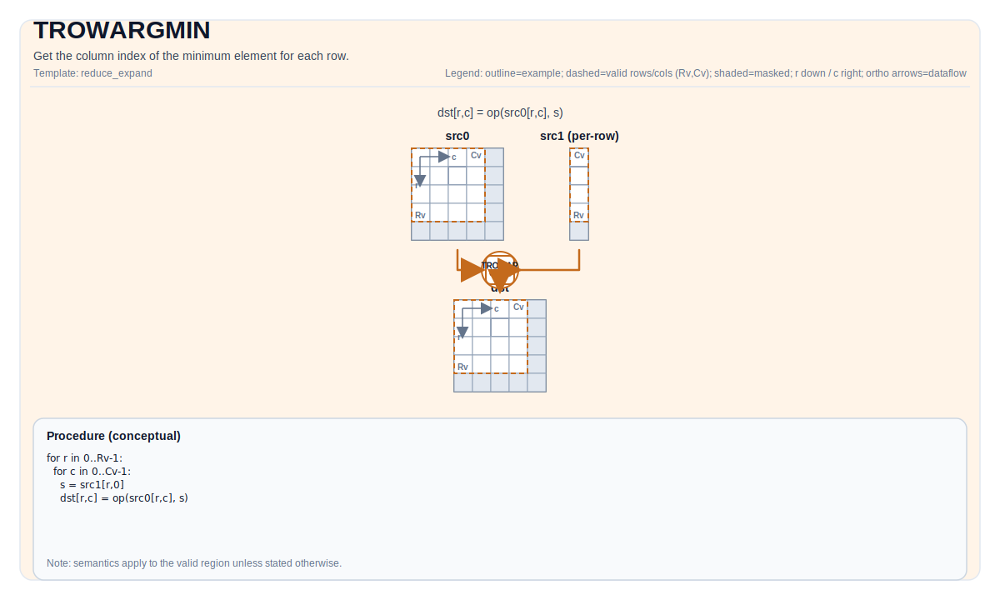

# TROWARGMIN


## Tile Operation Diagram



## Introduction

Get the column index of the minimum element, or both value and column index of the minimum element for each row.

## Math Interpretation

Let `R = src.GetValidRow()` and `C = src.GetValidCol()`. For `0 <= i < R`:

$$ \mathrm{dst}_{i,0} = \underset{0 \le j < C}{\operatorname{argmin}} \; \mathrm{src}_{i,j} $$

$$ \mathrm{dstval}_{i,0} = \min_{0 \le j < C} \mathrm{src}_{i,j} $$

## Assembly Syntax

Synchronous form:

```text
%dst = trowargmin %src : !pto.tile<...> -> !pto.tile<...>
```
Lowering may introduce internal scratch tiles; the C++ intrinsic requires an explicit `tmp` operand.

### IR Level 1 (SSA)

```text
%dst = pto.trowargmin %src, %tmp : (!pto.tile<...>, !pto.tile<...>) -> !pto.tile<...>
```

### IR Level 2 (DPS)

```text
pto.trowargmin ins(%src, %tmp : !pto.tile_buf<...>, !pto.tile_buf<...>) outs(%dst : !pto.tile_buf<...>)
```
## C++ Intrinsic

Declared in `include/pto/common/pto_instr.hpp`:

Output index only:

```cpp
template <typename TileDataOut, typename TileDataIn, typename TileDataTmp, typename... WaitEvents>
PTO_INST RecordEvent TROWARGMIN(TileDataOut& dst, TileDataIn& src, TileDataTmp& tmp, WaitEvents&... events);
```

Output both value and index:

```cpp
template <typename TileDataOutVal, typename TileDataOutIdx, typename TileDataIn, typename TileDataTmp,
          typename... WaitEvents>
PTO_INST RecordEvent TROWARGMIN(TileDataOutVal &dstVal, TileDataOutIdx &dstIdx, TileDataIn &src, TileDataTmp &tmp,
                                WaitEvents &... events)
```

## Constraints

### General constraints / checks

- Supported source element types: `half`, `float`.
- `src` must use standard ND layout: row-major and non-fractal (`BLayout::RowMajor`, `SLayout::NoneBox`).
- When output index only:
    - `dst` and `src` must be `TileType::Vec`.
    - Supported destination element types: `uint32_t`, `int32_t`.
    - Runtime checks follow the shared row-reduce check path:
        - `src.GetValidRow() != 0`
        - `src.GetValidCol() != 0`
        - `src.GetValidRow() == dst.GetValidRow()`
    - `dst` is checked through the shared row-reduce-index path and may use either of these non-fractal layouts:
        - DN layout with one column (`BLayout::ColMajor`, `Cols == 1`), or
        - ND layout whose valid column count is 1.
- When output both value and index:
    - `dstVal`, `dstIdx`, `src` must be `TileType::Vec`.
    - Supported destination element types: `uint32_t`, `int32_t`.
    - Runtime checks follow the shared row-reduce check path:
        - `src.GetValidRow() != 0`
        - `src.GetValidCol() != 0`
        - `src.GetValidRow() == dstIdx.GetValidRow()`
        - `src.GetValidRow() == dstVal.GetValidRow()`
    - `dstVal`, `dstIdx` are checked through the shared row-reduce-index path and may use either of these non-fractal layouts:
        - DN layout with one column (`BLayout::ColMajor`, `Cols == 1`), or
        - ND layout whose valid column count is 1.

### About temporary tile `tmp`

- Temporary tile is only used by A2A3, A5 accepts `tmp` tile but leaves it unused.
- The A2A3 implementation selects one of three code paths based on `srcValidCol` relative to `elementPerRepeat` (abbreviated `elemPerRpt` below):

#### Case 1: `srcValidCol <= elemPerRpt`

- **Index-only mode**: `tmp` is **not used**. The hardware `vcmin` instruction writes directly to `dst`.
- **Value + Index mode**: `tmp` is used as a small buffer (2 elements per row: one value + one index). `tmp` may use either of these non-fractal layouts:
    - DN layout with one column (`BLayout::ColMajor`, `Cols == 1`), rows is twice of `src`.
    - ND layout whose valid column count is 2, rows is the same as `src`.

#### Case 2: `elemPerRpt < srcValidCol <= elemPerRpt²` (Stage 1 reduction)

- `tmp` **is used** for a single-stage reduction.
- Rows of `tmp` tile is equal to `src`.
- `tmp` tile's stride per row can be calculated using:

```text
R1 = ceil(validCol / elemPerRpt)
stride = (ceil(R1 * 2 / elemPerBlock) + ceil(R1 / elemPerBlock)) * elemPerBlock
```

#### Case 3: `srcValidCol > elemPerRpt²` (Stage 2 reduction)

- `tmp` **is used** for a two-stage reduction, requiring more space than Stage 1.
- Rows of `tmp` tile is equal to `src`.
- `tmp` tile's stride per row can be calculated using:

```text
R1 = ceil(validCol / elemPerRpt)
R2 = ceil(R1 / elemPerRpt)
stage1_size = ceil(R1 * 2 / elemPerBlock) * elemPerBlock
stage2_end  = ceil(R1 / elemPerBlock) * elemPerBlock + ceil(R2 * 2 / elemPerBlock) * elemPerBlock
stride = max(stage1_size, stage2_end) + 2
```

- The `+ 2` accounts for the final value + index result stored at the end of each row's tmp region.

## Examples

### Auto

```cpp
#include <pto/pto-inst.hpp>

using namespace pto;

void example_auto() {
  using SrcT = Tile<TileType::Vec, float, 16, 16>;
  using DstT = Tile<TileType::Vec, uint32_t, 16, 1, BLayout::ColMajor>;
  using DstValT = Tile<TileType::Vec, float, 16, 1, BLayout::ColMajor>;
  using TmpT = Tile<TileType::Vec, float, 16, 16>;
  SrcT src;
  DstT dst;
  DstValT dst;
  TmpT tmp;
  TROWARGMIN(dst, src, tmp);
  TROWARGMIN(dstVal, dst, src, tmp);
}
```

### Manual

```cpp
#include <pto/pto-inst.hpp>

using namespace pto;

void example_manual() {
  using SrcT = Tile<TileType::Vec, float, 16, 16>;
  using DstT = Tile<TileType::Vec, uint32_t, 16, 1, BLayout::ColMajor>;
  using DstValT = Tile<TileType::Vec, float, 16, 1, BLayout::ColMajor>;
  using TmpT = Tile<TileType::Vec, float, 16, 16>;
  SrcT src;
  DstT dst;
  TmpT tmp;
  TASSIGN(src, 0x1000);
  TASSIGN(dst, 0x2000);
  TASSIGN(dstVal, 0x3000);
  TASSIGN(tmp, 0x4000);
  TROWARGMIN(dst, src, tmp);
  TROWARGMIN(dstVal, dst, src, tmp);
}
```

## ASM Form Examples

### Auto Mode

```text
# Auto mode: compiler/runtime-managed placement and scheduling.
%dst = pto.trowargmin %src, %tmp : (!pto.tile<...>, !pto.tile<...>) -> !pto.tile<...>
```

### Manual Mode

```text
# Manual mode: resources must be bound explicitly before issuing the instruction.
# Optional for tile operands:
# pto.tassign %arg0, @tile(0x1000)
# pto.tassign %arg1, @tile(0x2000)
%dst = pto.trowargmin %src, %tmp : (!pto.tile<...>, !pto.tile<...>) -> !pto.tile<...>
```

### PTO Assembly Form

```text
%dst = trowargmin %src : !pto.tile<...> -> !pto.tile<...>
# IR Level 2 (DPS)
pto.trowargmin ins(%src, %tmp : !pto.tile_buf<...>, !pto.tile_buf<...>) outs(%dst : !pto.tile_buf<...>)
```

