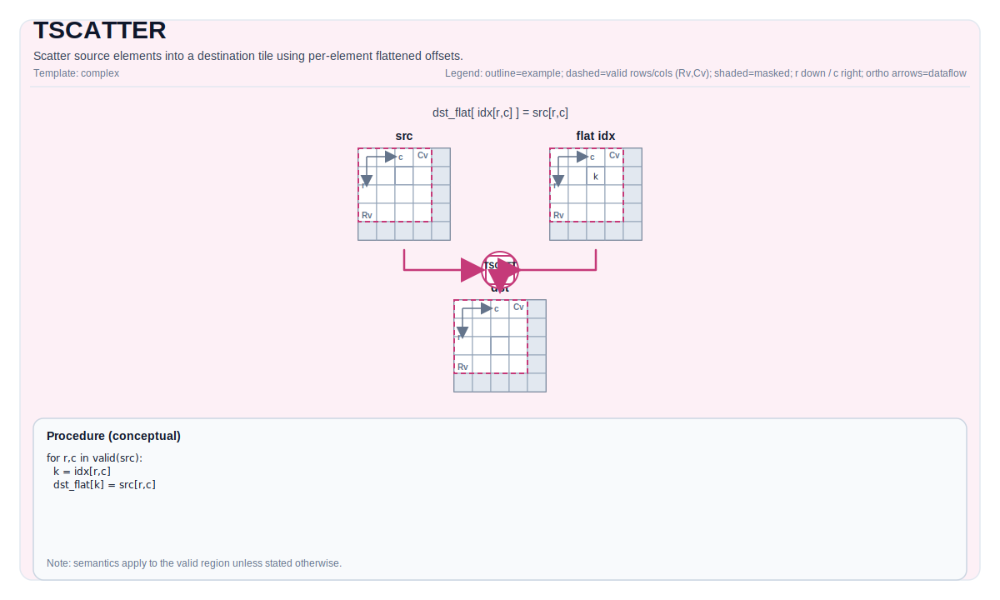

# TSCATTER


## Tile Operation Diagram



## Introduction

Scatter rows of a source tile into a destination tile using per-element row indices.

## Math Interpretation

For each source element `(i, j)`, write:

$$ \mathrm{dst}_{\mathrm{idx}_{i,j},\ j} = \mathrm{src}_{i,j} $$

If multiple elements map to the same destination location, the final value is implementation-defined (last writer wins in the current implementation).

## Assembly Syntax

PTO-AS form: see [docs/grammar/PTO-AS.md](../grammar/PTO-AS.md).

Synchronous form:

```text
%dst = tscatter %src, %idx : !pto.tile<...>, !pto.tile<...> -> !pto.tile<...>
```

### IR Level 1 (SSA)

```text
%dst = pto.tscatter %src, %idx : (!pto.tile<...>, !pto.tile<...>) -> !pto.tile<...>
```

### IR Level 2 (DPS)

```text
pto.tscatter ins(%src, %idx : !pto.tile_buf<...>, !pto.tile_buf<...>) outs(%dst : !pto.tile_buf<...>)
```
## C++ Intrinsic

Declared in `include/pto/common/pto_instr.hpp`:

```cpp
template <typename TileDataD, typename TileDataS, typename TileDataI, typename... WaitEvents>
PTO_INST RecordEvent TSCATTER(TileDataD& dst, TileDataS& src, TileDataI& indexes, WaitEvents&... events);
```

## Constraints

- **Implementation checks (A2A3)**:
  - `TileDataD::Loc`, `TileDataS::Loc`, `TileDataI::Loc` must be `TileType::Vec`.
  - `TileDataD::DType`, `TileDataS::DType` must be one of: `int32_t`, `int16_t`, `int8_t`, `half`, `float32_t`, `uint32_t`, `uint16_t`, `uint8_t`, `bfloat16_t`.
  - `TileDataI::DType` must be one of: `int16_t`, `int32_t`, `uint16_t` or `uint32_t`.
  - No bounds checks are enforced on `indexes` values.
  - Static valid bounds: `TileDataD::ValidRow <= TileDataD::Rows`, `TileDataD::ValidCol <= TileDataD::Cols`, `TileDataS::ValidRow <= TileDataS::Rows`, `TileDataS::ValidCol <= TileDataS::Cols`, `TileDataI::ValidRow <= TileDataI::Rows`, `TileDataI::ValidCol <= TileDataI::Cols`.
  - `TileDataD::DType` and `TileDataS::DType` must be the same.
  - When size of `TileDataD::DType` is 4 bytes, the size of `TileDataI::DType` must be 4 bytes.
  - When size of `TileDataD::DType` is 2 bytes, the size of `TileDataI::DType` must be 2 bytes.
  - When size of `TileDataD::DType` is 1 bytes, the size of `TileDataI::DType` must be 2 bytes.
- **Implementation checks (A5)**:
  - `TileDataD::Loc`, `TileDataS::Loc`, `TileDataI::Loc` must be `TileType::Vec`.
  - `TileDataD::DType`, `TileDataS::DType` must be one of: `int32_t`, `int16_t`, `int8_t`, `half`, `float32_t`, `uint32_t`, `uint16_t`, `uint8_t`, `bfloat16_t`.
  - `TileDataI::DType` must be one of: `int16_t`, `int32_t`, `uint16_t` or `uint32_t`.
  - No bounds checks are enforced on `indexes` values.
  - Static valid bounds: `TileDataD::ValidRow <= TileDataD::Rows`, `TileDataD::ValidCol <= TileDataD::Cols`, `TileDataS::ValidRow <= TileDataS::Rows`, `TileDataS::ValidCol <= TileDataS::Cols`, `TileDataI::ValidRow <= TileDataI::Rows`, `TileDataI::ValidCol <= TileDataI::Cols`.
  - `TileDataD::DType` and `TileDataS::DType` must be the same.
  - When size of `TileDataD::DType` is 4 bytes, the size of `TileDataI::DType` must be 4 bytes.
  - When size of `TileDataD::DType` is 2 bytes, the size of `TileDataI::DType` must be 2 bytes.
  - When size of `TileDataD::DType` is 1 bytes, the size of `TileDataI::DType` must be 2 bytes.

## Examples

### Auto

```cpp
#include <pto/pto-inst.hpp>

using namespace pto;

void example_auto() {
  using TileT = Tile<TileType::Vec, float, 16, 16>;
  using IdxT = Tile<TileType::Vec, uint16_t, 16, 16>;
  TileT src, dst;
  IdxT idx;
  TSCATTER(dst, src, idx);
}
```

### Manual

```cpp
#include <pto/pto-inst.hpp>

using namespace pto;

void example_manual() {
  using TileT = Tile<TileType::Vec, float, 16, 16>;
  using IdxT = Tile<TileType::Vec, uint16_t, 16, 16>;
  TileT src, dst;
  IdxT idx;
  TASSIGN(src, 0x1000);
  TASSIGN(dst, 0x2000);
  TASSIGN(idx, 0x3000);
  TSCATTER(dst, src, idx);
}
```

## ASM Form Examples

### Auto Mode

```text
# Auto mode: compiler/runtime-managed placement and scheduling.
%dst = pto.tscatter %src, %idx : (!pto.tile<...>, !pto.tile<...>) -> !pto.tile<...>
```

### Manual Mode

```text
# Manual mode: bind resources explicitly before issuing the instruction.
# Optional for tile operands:
# pto.tassign %arg0, @tile(0x1000)
# pto.tassign %arg1, @tile(0x2000)
%dst = pto.tscatter %src, %idx : (!pto.tile<...>, !pto.tile<...>) -> !pto.tile<...>
```

### PTO Assembly Form

```text
%dst = tscatter %src, %idx : !pto.tile<...>, !pto.tile<...> -> !pto.tile<...>
# IR Level 2 (DPS)
pto.tscatter ins(%src, %idx : !pto.tile_buf<...>, !pto.tile_buf<...>) outs(%dst : !pto.tile_buf<...>)
```

