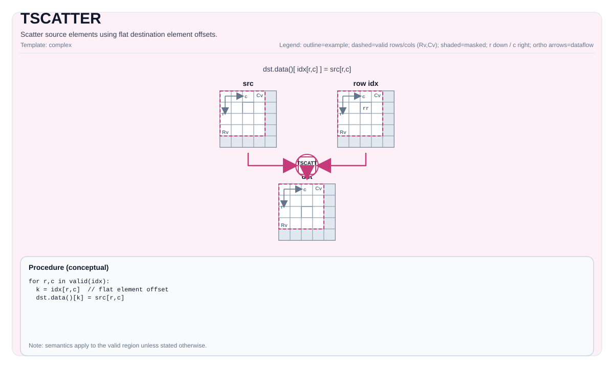

# TSCATTER


## Tile Operation Diagram



## Introduction

TSCATTER provides two operation modes:

1. **Index-based Scatter**: Scatter source elements into a destination tile using per-element flat element offsets.
2. **Mask Scatter**: Scatter source elements into destination with a mask pattern, interleaving zeros between elements. Supports both row-wise (`SCATTER_ROW`) and column-wise (`SCATTER_COL`) scatter modes.

## Math Interpretation

### Index-based Scatter

Let `R = idx.GetValidRow()` and `C = idx.GetValidCol()`. For `0 <= i < R` and `0 <= j < C`, write:

$$ \mathrm{dst.data()}[\mathrm{idx}_{i,j}] = \mathrm{src}_{i,j} $$

`idx[i,j]` is an element offset from `dst.data()`, not a byte offset or row number. Coordinate `(r,c)` has index `r * DstTile::Cols + c` in a RowMajor destination and `c * DstTile::Rows + r` in ColMajor. The source valid region must cover the index valid region. Indices must be nonnegative and below the physical destination element count; the implementation does not check bounds.

If multiple elements map to the same destination location, the final value is implementation-defined; no write order is guaranteed.

### Mask Scatter

For mask pattern `P`, scatter source elements with interleaved zeros. The scatter direction is controlled by `ScatterAxis`:

Let `f` be the expansion factor, `pos_P` the selected position, and `q` range over all other positions `0 <= q < f`. The offsets for `P0101/P1010` are 0/1; for `P0001/P0010/P0100/P1000` they are 0/1/2/3; `P1111` uses 0.

#### SCATTER_ROW (default)

Scatter along columns, expanding column dimension:

$$ \mathrm{dst}_{i, f \cdot j + \mathrm{pos}_P} = \mathrm{src}_{i,j} $$

$$ \mathrm{dst}_{i, f \cdot j + q} = 0 $$

Where:
- `DstTileData::ValidCol` = `SrcTileData::ValidCol` × expansion_factor
- `DstTileData::ValidRow` = `SrcTileData::ValidRow`

#### SCATTER_COL

Scatter along rows, expanding row dimension:

$$ \mathrm{dst}_{f \cdot i + \mathrm{pos}_P, j} = \mathrm{src}_{i,j} $$

$$ \mathrm{dst}_{f \cdot i + q, j} = 0 $$

Where:
- `DstTileData::ValidRow` = `SrcTileData::ValidRow` × expansion_factor
- `DstTileData::ValidCol` = `SrcTileData::ValidCol`

#### Expansion Factor

- For `P1010` or `P0101`: expansion_factor = 2
- For `P0001`, `P0010`, `P0100`, or `P1000`: expansion_factor = 4
- For `P1111`: expansion_factor = 1 (equivalent to `TMOV`)

## Assembly Syntax

Synchronous form:

```text
%dst = tscatter %src, %idx : !pto.tile<...>, !pto.tile<...> -> !pto.tile<...>
```

### AS Level 1 (SSA)

```text
%dst = pto.tscatter %src, %idx : (!pto.tile<...>, !pto.tile<...>) -> !pto.tile<...>
```

### AS Level 2 (DPS)

```text
pto.tscatter ins(%src, %idx : !pto.tile_buf<...>, !pto.tile_buf<...>) outs(%dst : !pto.tile_buf<...>)
```
## C++ Intrinsic

Declared in `include/pto/common/pto_instr.hpp`:

### Index-based Scatter

```cpp
template <typename TileDataD, typename TileDataS, typename TileDataI, typename... WaitEvents>
PTO_INST RecordEvent TSCATTER(TileDataD& dst, TileDataS& src, TileDataI& indexes, WaitEvents&... events);
```

### Mask Scatter

```cpp
template <MaskPattern maskPattern = MaskPattern::P1111, auto ScatterType = ScatterAxis::SCATTER_ROW,
          typename DstTileData, typename SrcTileData, typename... WaitEvents>
PTO_INST RecordEvent TSCATTER(DstTileData& dst, SrcTileData& src, WaitEvents&... events);
```

### MaskPattern Enum

Defined in `include/pto/common/type.hpp`:

| Value | Pattern | Description | Expansion Factor |
|-------|---------|-------------|-----------------|
| `P0101` | 01010101... | Take first element every 2 elements | ×2 |
| `P1010` | 10101010... | Take second element every 2 elements | ×2 |
| `P0001` | 00010001... | Take first element every 4 elements | ×4 |
| `P0010` | 00100010... | Take second element every 4 elements | ×4 |
| `P0100` | 01000100... | Take third element every 4 elements | ×4 |
| `P1000` | 10001000... | Take fourth element every 4 elements | ×4 |
| `P1111` | 11111111... | Take all elements (equivalent to TMOV) | ×1 |

### ScatterAxis Enum

Defined in `include/pto/common/type.hpp`:

| Value | Description |
|-------|-------------|
| `SCATTER_ROW` | Scatter along columns, expanding column dimension (default) |
| `SCATTER_COL` | Scatter along rows, expanding row dimension |

## Constraints

### Index-based Scatter

- **Implementation checks (A2A3)**:
    - `TileDataD::Loc`, `TileDataS::Loc`, `TileDataI::Loc` must be `TileType::Vec`.
    - `TileDataD::DType`, `TileDataS::DType` must be one of: `int32_t`, `int16_t`, `int8_t`, `half`, `float16_t`, `float32_t`, `uint32_t`, `uint16_t`, `uint8_t`, `bfloat16_t`.
    - `TileDataI::DType` must be one of: `int16_t`, `int32_t`, `uint16_t` or `uint32_t`.
    - No bounds checks are enforced on `indexes` values.
    - Static valid bounds: `TileDataD::ValidRow <= TileDataD::Rows`, `TileDataD::ValidCol <= TileDataD::Cols`, `TileDataS::ValidRow <= TileDataS::Rows`, `TileDataS::ValidCol <= TileDataS::Cols`, `TileDataI::ValidRow <= TileDataI::Rows`, `TileDataI::ValidCol <= TileDataI::Cols`.
    - `TileDataD::DType` and `TileDataS::DType` must be the same.
    - When size of `TileDataD::DType` is 4 bytes, the size of `TileDataI::DType` must be 4 bytes.
    - When size of `TileDataD::DType` is 2 bytes, the size of `TileDataI::DType` must be 2 bytes.
    - When size of `TileDataD::DType` is 1 bytes, the size of `TileDataI::DType` must be 2 bytes.
- **Implementation checks (A5)**:
    - `TileDataD::Loc`, `TileDataS::Loc`, `TileDataI::Loc` must be `TileType::Vec`.
    - `TileDataD::DType`, `TileDataS::DType` must be one of: `int32_t`, `int16_t`, `int8_t`, `half`, `float16_t`, `float32_t`, `uint32_t`, `int64_t`, `uint64_t`, `uint16_t`, `uint8_t`, `bfloat16_t`.
    - `TileDataI::DType` must be one of: `int16_t`, `int32_t`, `uint16_t` or `uint32_t`.
    - No bounds checks are enforced on `indexes` values.
    - Static valid bounds: `TileDataD::ValidRow <= TileDataD::Rows`, `TileDataD::ValidCol <= TileDataD::Cols`, `TileDataS::ValidRow <= TileDataS::Rows`, `TileDataS::ValidCol <= TileDataS::Cols`, `TileDataI::ValidRow <= TileDataI::Rows`, `TileDataI::ValidCol <= TileDataI::Cols`.
    - `TileDataD::DType` and `TileDataS::DType` must be the same.
    - When size of `TileDataD::DType` is 4 bytes, the size of `TileDataI::DType` must be 4 bytes.
    - When size of `TileDataD::DType` is 2 bytes, the size of `TileDataI::DType` must be 2 bytes.
    - When size of `TileDataD::DType` is 1 bytes, the size of `TileDataI::DType` must be 2 bytes.

    - 64-bit data requires `int32_t` / `uint32_t` indices. Source and index tiles support RowMajor/ColMajor using their own physical row/column strides.

### Mask Scatter

- **Implementation checks (A2A3)**:
    - `DstTileData::Loc`, `SrcTileData::Loc` must be `TileType::Vec`.
    - `DstTileData::DType`, `SrcTileData::DType` must be one of: `int32_t`, `int16_t`, `int8_t`, `half`, `float16_t`, `float32_t`, `uint32_t`, `uint16_t`, `uint8_t`, `bfloat16_t`.
    - `DstTileData::DType` and `SrcTileData::DType` must be the same.
    - `maskPattern` must be in range `P0101` to `P1111`.
    - Static valid bounds: `DstTileData::ValidCol <= DstTileData::Cols`, `SrcTileData::ValidCol <= SrcTileData::Cols`, `DstTileData::ValidRow <= DstTileData::Rows`, `SrcTileData::ValidRow <= SrcTileData::Rows`.
    - `P1111` mode is equivalent to `TMOV`: requires `validRow` and `validCol` to match respectively, implemented internally via `TMOV_IMPL`.
- **Implementation checks (A5)**:
    - `DstTileData::Loc`, `SrcTileData::Loc` must be `TileType::Vec`.
    - `DstTileData::DType`, `SrcTileData::DType` must be one of: `int32_t`, `int16_t`, `int8_t`, `half`, `float16_t`, `float32_t`, `uint32_t`, `int64_t`, `uint64_t`, `uint16_t`, `uint8_t`, `bfloat16_t`.
    - `DstTileData::DType` and `SrcTileData::DType` must be the same.
    - `maskPattern` must be in range `P0101` to `P1111`.
    - Static valid bounds: `DstTileData::ValidRow <= DstTileData::Rows`, `DstTileData::ValidCol <= DstTileData::Cols`, `SrcTileData::ValidRow <= SrcTileData::Rows`, `SrcTileData::ValidCol <= SrcTileData::Cols`.
    - Runtime assertions for `SCATTER_ROW`:
        - `src.GetValidRow()` must equal `dst.GetValidRow()`.
        - `dst.GetValidCol()` must equal `src.GetValidCol() * expansion_factor`, where expansion_factor depends on mask pattern (1 for P1111, 2 for P1010/P0101, 4 for P0001/P0010/P0100/P1000).
    - Runtime assertions for `SCATTER_COL`:
        - `src.GetValidCol()` must equal `dst.GetValidCol()`.
        - `dst.GetValidRow()` must equal `src.GetValidRow() * expansion_factor`, where expansion_factor depends on mask pattern (1 for P1111, 2 for P1010/P0101, 4 for P0001/P0010/P0100/P1000).

    - The 64-bit mask path requires RowMajor source and destination, and supports all six expansion patterns and both `ScatterAxis` values.
    - `P1111` delegates to [TMOV](TMOV.md) without full-tile zeroing. Current A5 does not support `int64_t` / `uint64_t` Vec-to-Vec moves for this pattern.

## Important Notes

A5 indexed scatter and non-`P1111` mask scatter first zero the complete physical destination tile (`Rows * Cols` elements), then write selected locations. Unselected locations, including physical padding, are zero; padding explicitly selected by an index still receives the source value. Active source, index and destination storage must not overlap.

CPU simulator indexed scatter updates only indexed locations and preserves all others; an empty index valid region also leaves the destination unchanged. Initialize the destination explicitly when portable zero-fill behavior is required. `P1111` follows `TMOV` write semantics and does not follow the full-tile zeroing rule above.

## Examples

### Index-based Scatter (Auto)

```cpp
#include <pto/pto-inst.hpp>

using namespace pto;

void example_auto() {
  using TileT = Tile<TileType::Vec, float, 16, 16>;
  using IdxT = Tile<TileType::Vec, uint32_t, 16, 16>;
  TileT src, dst;
  IdxT idx;
  TSCATTER(dst, src, idx);
}
```

### Index-based Scatter (Manual)

```cpp
#include <pto/pto-inst.hpp>

using namespace pto;

void example_manual() {
  using TileT = Tile<TileType::Vec, float, 16, 16>;
  using IdxT = Tile<TileType::Vec, uint32_t, 16, 16>;
  TileT src, dst;
  IdxT idx;
  TASSIGN(src, 0x1000);
  TASSIGN(dst, 0x2000);
  TASSIGN(idx, 0x3000);
  TSCATTER(dst, src, idx);
}
```

### Mask Scatter (Auto)

```cpp
#include <pto/pto-inst.hpp>

using namespace pto;

void example_mask_auto() {
  // P1010: destination size = source size × 2
  using SrcTileT = Tile<TileType::Vec, half, 16, 64>;
  using DstTileT = Tile<TileType::Vec, half, 16, 128>;
  SrcTileT src;
  DstTileT dst;
  TSCATTER<MaskPattern::P1010>(dst, src);
}

void example_mask_p1000() {
  // P1000: destination size = source size × 4
  using SrcTileT = Tile<TileType::Vec, float, 16, 64>;
  using DstTileT = Tile<TileType::Vec, float, 16, 256>;
  SrcTileT src;
  DstTileT dst;
  TSCATTER<MaskPattern::P1000>(dst, src);
}

void example_mask_scatter_col() {
  // SCATTER_COL: scatter along rows, expanding row dimension
  // P1010: destination rows = source rows × 2
  using SrcTileT = Tile<TileType::Vec, half, 64, 16>;
  using DstTileT = Tile<TileType::Vec, half, 128, 16>;
  SrcTileT src;
  DstTileT dst;
  TSCATTER<MaskPattern::P1010, ScatterAxis::SCATTER_COL>(dst, src);
}
```

### Mask Scatter (Manual)

```cpp
#include <pto/pto-inst.hpp>

using namespace pto;

void example_mask_manual() {
  using SrcTileT = Tile<TileType::Vec, half, 16, 64>;
  using DstTileT = Tile<TileType::Vec, half, 16, 128>;
  SrcTileT src;
  DstTileT dst;
  TASSIGN(src, 0x1000);
  TASSIGN(dst, 0x2000);
  TSCATTER<MaskPattern::P1010>(dst, src);
}

void example_mask_manual_scatter_col() {
  // SCATTER_COL with manual binding
  using SrcTileT = Tile<TileType::Vec, half, 64, 16>;
  using DstTileT = Tile<TileType::Vec, half, 128, 16>;
  SrcTileT src;
  DstTileT dst;
  TASSIGN(src, 0x1000);
  TASSIGN(dst, 0x2000);
  TSCATTER<MaskPattern::P1010, ScatterAxis::SCATTER_COL>(dst, src);
}
```

## ASM Form Examples

### Auto Mode

```text
# Auto mode: compiler/runtime-managed placement and scheduling.
%dst = pto.tscatter %src, %idx : (!pto.tile<...>, !pto.tile<...>) -> !pto.tile<...>
```

### Manual Mode

```text
# Manual mode: resources must be bound explicitly before issuing the instruction.
# Optional for tile operands:
# pto.tassign %arg0, @tile(0x1000)
# pto.tassign %arg1, @tile(0x2000)
%dst = pto.tscatter %src, %idx : (!pto.tile<...>, !pto.tile<...>) -> !pto.tile<...>
```

### PTO Assembly Form

```text
%dst = tscatter %src, %idx : !pto.tile<...>, !pto.tile<...> -> !pto.tile<...>
# AS Level 2 (DPS)
pto.tscatter ins(%src, %idx : !pto.tile_buf<...>, !pto.tile_buf<...>) outs(%dst : !pto.tile_buf<...>)
```
