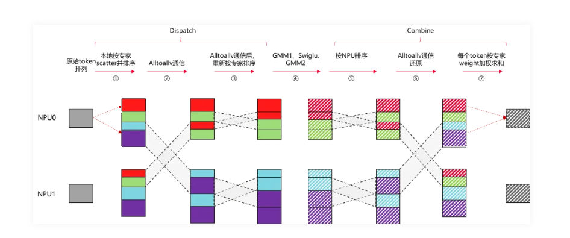
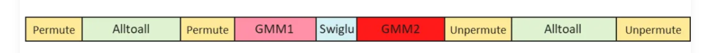
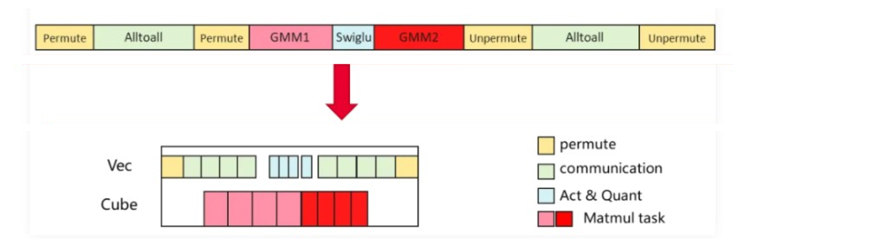
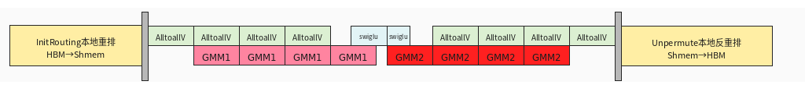
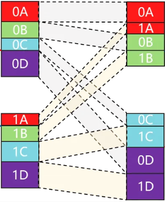
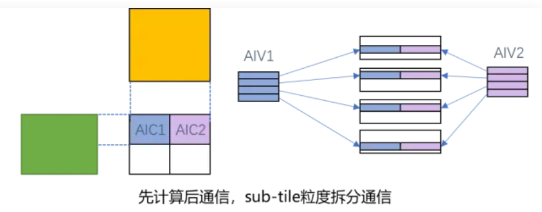
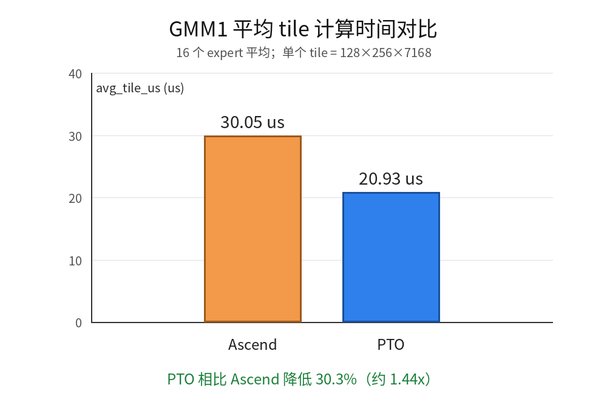
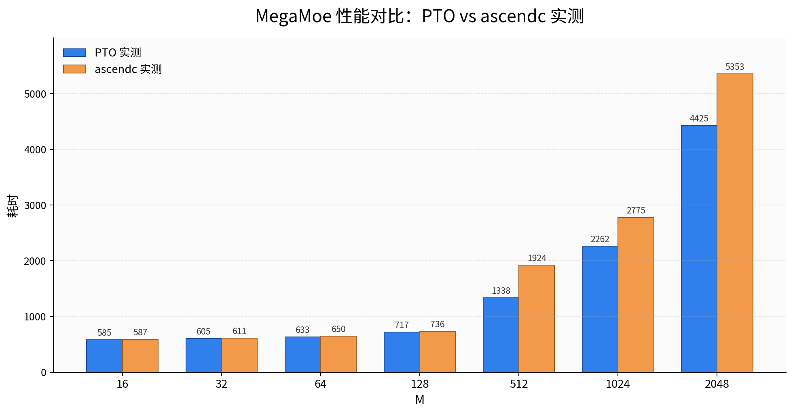
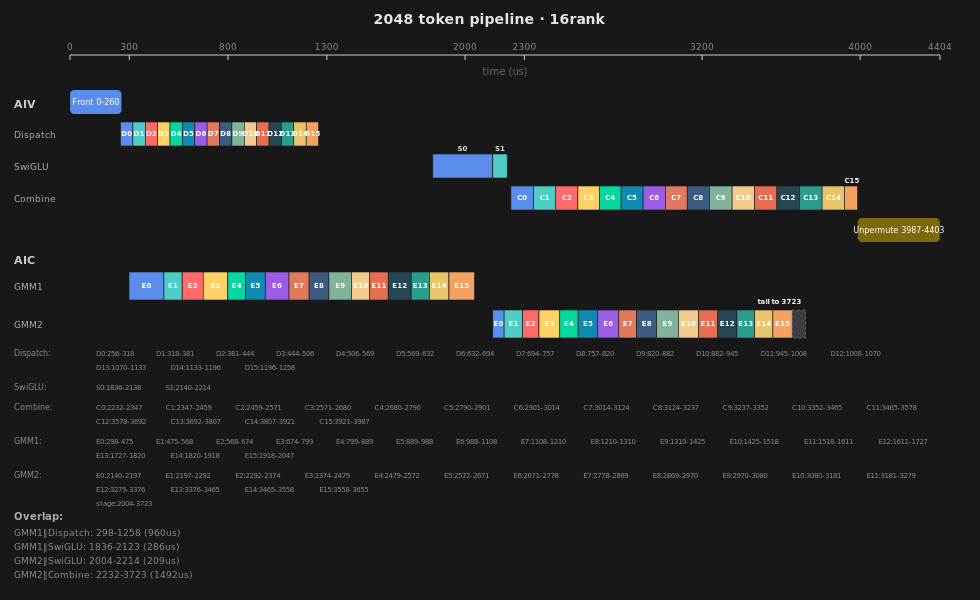

# pto-isa megamo算子

<style>
.pto-api { color: #ff6a00; }
h2, h3 {
  color: #8B0000;
  font-weight: bold;
}
</style>


## MOE介绍

### 传统MOE的流程



- ① 本地token permuate：源卡内 [token,expert,k] 按expert排序 [expert,token,k]
- ② All2All通信：发送 [expert,token,k] 到目标卡
- ③ 通信后permuate： 目标卡将收到的token按照expert再做一次排序 [expert,srcRank,token,k]
- ④ FFN计算：执行GMM1、Swiglu激活函数和GMM2计算。
- ⑤ 计算后unpermuate：目标卡将token按照 [srcRank,expert,token,k] 重新排序
- ⑥ AlltoallV还原：将 [expert,token,k] all2allv发回srcRank源卡 
- ⑦ 源卡按照topk结果累加，并还原原始token顺序 [token，k]

**实际的效果是串行衔接：**



### Ascend的megamoe的overlap方案

**将通信和计算的粒度拆细,在一个大kernel内实现计算和通信的细粒度的掩盖：**



**实际实现采用expert级的流水overlap：**



- ① 开头：两次permuate合并到一起，通过一次轻量的all2all通信对齐内存布局

   

- ② 中间：
  - a.按照expert逐个做AIC和AIV的overlap,第i个专家的GMM可以与第i-1专家的AlltoallV
  - b.swiglu拆成了两段，当GMM1结束的时候，第一段swgilu也已经结束，可以马上开始GMM2
- ③ 结尾: 由于是expert级流水，因此后all2all阶段也省掉了[expert,srcRank,token,k] -> [srcRank,expert,token,k]的重排
  
**ascendc针对decode 小token量场景也做了针对性的优化：**
  - 前重排阶段，能用UB直接完成的场景，全部放到UB里做
  - combine阶段，采用subtile模式提高多核并发

    

### PTO-ISA 的overlap方案

由于 AscendC MegaMoe 的 overlap 设计思路比较精妙，PTO MegaMoe 主体流程借鉴了其中一些关键算法思路：

- AIC 和 AIV 采用 expert 轮转的方式排布流水；SwiGLU 分为两段，第一段 SwiGLU 尽量压在 GMM2 开始之前完成。
- 前重排阶段使用归并排序，并优先考虑将数据放到 UB 中进行排序；按工作集大小分为 FullLoad、OneCore、MultiCore 三个排序场景，并使用 count-as-flag 机制消除 AlltoAll count 后的全同步。
- Dispatch 阶段根据 UB 192 KiB 的容量，多轮 TLOAD 2 行 token + scale 到 UB 中解包。
- Combine 阶段区分 large 和 small 两种 case；small 场景为了提高 AIV 利用率，采用 subtile 模式进行数据 push。

在其基础上尝试了如下优化。

**有效的优化点：**

- 针对核心的 GMM1 和 GMM2 阶段，采用 PTO tile 编程模式进行优化，使用 swizzle、双缓冲、L1→L0 片上多级复用等手段；实测比 Catlass 快约 40%。
  
- 增加参与 combine 的 AIV 核，在 A3 上有些许效果；但不能增加太多，否则会与 GMM2 的 HBM 访问冲突，影响 GMM2 性能。后续可考虑在 A5 上使用 ubuf→cbuf 能力，降低 HBM 压力。

**无效的优化点：**

- 消减掉 combine→unpermute 的全同步：unpermute 阶段需要 fp32 累加，atomic add 会导致数据要用 fp32 传输，实测性能会下降。
- 修改 SwiGLU 的 overlap 粒度，从 segment 改为 expert overlap：kernel 执行耗时波动会变大，无明显优化。
- 尝试将 dispatch 拉取数据的粒度改为多 AIV 并发拉取 GMM1 的 L1 tile：当前 dispatch 阶段每个 rank 每次拉取的 size 并不大，每个 rank 分 128 行已经相当于是 tile 粒度，约 1 MiB；改成多 AIV 拉取对首 expert 的 GMM1 运算无明显提升。
- 将 combine 阶段的 TSTORE 改为 TPUT / TPUT_ASYNC 批量打包：受限于 HBM 带宽，会与 GMM2 竞争，性能下降。

**PTO-ISA 实测效果对比：**



整体来看，PTO megamoe 在小 M 场景下与 ascendc 实测基本持平；随着 M 增大，PTO 的 GMM 和通信计算 overlap 优势逐步体现，在 M=512 及以上 case 中整体领先更明显，可以有20%的提升。

### PTO megamoe 2048 case overlap实况：

- 通信受限于计算的效率，overlap无法再进一步的提升，仅在dispatch->gmm1之间有几十us的计算空闲
- aic是满载运行，aiv在dispatch和combine阶段受限于HBM带宽，也没有用满
- 可以考虑后续在a5上，通过ubuff->cbuff直通，降低aic/aiv对HBM带宽的争用，提高aic/aiv各自的效率



### PTO-ISA megamoe的关键实现逻辑：

算子比较大，除了通算overlap，每个阶段的内部的实现也要考虑性能，整体执行顺序在 `MegaMoe::Process()` 中串起来，逻辑上分成 7 个阶段：

```text
FrontReorder:
  x[M, K] + expert_idx[M, topK]
    -> source rank remoteWindow.offsetA[expert-major rows, K + 32]
    -> expandedRowIdx / localTokenPerExpert / preSumBeforeRank / cumsumMM / expertTokenNums

Dispatch:
  each dst rank pulls needed rows from every src rank offsetA
    -> gmA[expert-major rows, K] + perTokenScale1[rows]

GMM1:
  gmA[int8] @ weight1[int8] + scale1
    -> gmC[rows, N] half

SwiGLU:
  gmC * perTokenScale1
    -> silu(up) * gate
    -> dynamic quant
    -> gmPermutedToken[rows, N/2] int8 + perTokenScale2[rows]

GMM2:
  gmPermutedToken[int8] @ weight2[int8] + scale2
    -> gmm2Output[rows, K] half

Combine:
  gmm2Output * perTokenScale2
    -> source rank remoteWindow.offsetD[expandedRowIdx, K]

Unpermute:
  offsetD + probs + expandedRowIdx
    -> out[M, K]
```

#### 1. FrontReorder：源 rank 内 route 排序、量化、发布 count

关键流程：

- AIV-only 阶段；输入 `x[M, K]` + `expertId[M, topK]`，输出 remote window 的 packed `offsetA` 和 dispatch 用的 count / prefix metadata。
- host 按 UB 预算选 3 个 case，语义相同、实现路径不同：
  - `FullLoad`：route + count + quant 工作集都能进 UB；排序/count/quant 尽量留在 UB，少写 GM 中间态。
  - `OneCore`：route 能一次进 UB 排序，但 FullLoad 全工作集放不下；core0 `TSORT32 + TMRGSORT` 后写 GM 中间态。
  - `MultiCore`：route 太大；多 AIV 先做 VBS sort run（每 run ≤6144），再多轮 VMS 4 路 `TMRGSORT` 归并，core0 sort-out 写 GM 中间态。
- 排序目标：把 `(expertId[route], route)` 排成 expert-major，得到 `sortedExpert[dstRow]`、`sortedSrcRoute[dstRow]`，再反排得到 `expandedRowIdx[srcRoute] = dstRow`。
- `OneCore/MultiCore` 排序后走共享尾段 `FrontRunPostSortPipeline`：计数 → 反排 → gather+quant → count exchange + cumsum。
- `FullLoad` 在 UB 内直接完成 count / expandedRowIdx / quant，再进 `FrontFinalizeRankMetadata`。
- 计数：`localTokenPerExpert[globalExpert]` 统计本 rank 发给每个 global expert 的 route 数。
- data-as-flag count exchange：整行 count 加 `0x800000` marker 写到 peer `tokenPerExpert[srcRank, :]`；peer 用 `TWAIT != 0` 等待，读回后减 marker 恢复真实 count。count row 同时是数据和到达 flag。
- 目的 rank 侧 metadata：`preSumBeforeRank[srcRank, localExpert]` 算从 srcRank.offsetA 哪行开始读；`cumsumMM[srcRank, localExpert]` 算 source rank 0..srcRank 累计 rows；`expertTokenNums[localExpert] = cumsumMM[lastRank, localExpert]`。
- dynamic quant 按 token row 做一次：同一 token 的 topK route 复用同一份 int8 row + scale，scatter 到 `offsetA[dstRow, 0:K+32]`。

关键 PTO 接口：

- 排序：`TSORT32`、`TMRGSORT`、`TGATHER`
- Tile 绑定 / GM 向量：`TASSIGN`、`TLOAD`、`TSTORE`
- 动态量化：`TCVT`、`TABS`、`TROWMAX`、`TSYNC<Op::TROWMAX>`、`TMAX`、`TSYNC<Op::TMAX>`、`TDIV`
- GM/UB helper：`PtoLoadVector`、`PtoStoreVector`、`PtoStoreAtomicAddVector`、`PtoFillUb`、`PtoAddUb`、`PtoAddScalarUb`、`PtoSetValue`
- 跨 rank count ready：`TWAIT`
- 核间同步：`SYNCALL<AIVOnly>`

伪码：

<pre><code>
# ===== Phase 1: 按 expertId 排序（3 case 选一）=====
if case == MultiCore:
  for sortCore / run (each run &lt;= 6144 routes):
    <span class="pto-api">PtoLoadVector</span>(expertUb, expertId[runStart:runStart+runRows])
    payloadUb = 0..runRows-1                              # payload = 原始 srcRoute
    <span class="pto-api">TSORT32</span>(packedUb, expertUb, payloadUb)            # 先按 32-record 小块排序
    <span class="pto-api">TMRGSORT</span>(packedUb, mergeTmpUb)                 # 32 -> 128 -> 512 -> 2048 -> run tail
    write packed sorted run -> frontSortWs0/1           # 每个 sort core 的中间 sorted run

  merge sort-core runs with <span class="pto-api">TMRGSORT</span> (4-way, perList &lt;= 2040)  # 跨 core 多层归并
  sort-out:                                             # core0 抽出最终 int32 表
    <span class="pto-api">TGATHER</span>(sortedExpert, packedRuns)                 # dstRow -> globalExpert
    <span class="pto-api">TGATHER</span>(sortedSrcRoute, packedRuns)               # dstRow -> srcRoute
    <span class="pto-api">PtoStoreVector</span>(frontExpandedExpert, sortedExpert)
    <span class="pto-api">PtoStoreVector</span>(frontExpandDstToSrc, sortedSrcRoute)

elif case == OneCore:
  core0 only:                                            # 其它 AIV 不参与排序
    <span class="pto-api">PtoLoadVector</span>(expertUb, expertId[0:routeElems])
    payloadUb = 0..routeElems-1
    <span class="pto-api">TSORT32</span>(packedUb, expertUb, payloadUb)
    <span class="pto-api">TMRGSORT</span>(packedUb, mergeTmpUb)                 # 单次 UB 内完成全量排序
    <span class="pto-api">TGATHER</span>(sortedExpert, packedUb)
    <span class="pto-api">TGATHER</span>(sortedSrcRoute, packedUb)
    <span class="pto-api">PtoStoreVector</span>(frontExpandedExpert, sortedExpert)   # 写 GM 中间态，后续走共享尾段
    <span class="pto-api">PtoStoreVector</span>(frontExpandDstToSrc, sortedSrcRoute)

elif case == FullLoad:
  each active AIV:                                       # route 小，排序/count/quant 尽量留 UB
    <span class="pto-api">PtoLoadVector</span>(expertUb, expertId[0:routeElems])
    payloadUb = 0..routeElems-1
    <span class="pto-api">TSORT32</span>(packedUb, expertUb, payloadUb)
    <span class="pto-api">TMRGSORT</span>(packedUb, mergeTmpUb)
    sortedExpert[dstRow], sortedSrcRoute[dstRow] stay in UB
    second sort by srcRoute -> expandedRowIdx[srcRoute] = dstRow in UB  # 反排：route -> offsetA 行号
    owner core scan sortedExpert -> localTokenPerExpert in UB          # 扫 expert 边界做 count

<span class="pto-api">SYNCALL&lt;AIVOnly&gt;</span>()                                    # 排序结果 / GM 中间态可见

# ===== Phase 2: 计数 / 反排 / quant scatter =====
if case == FullLoad:
  core0: <span class="pto-api">PtoStoreVector</span>(expandedRowIdx, expandedRowIdxUb)       # 仅 expandedRowIdx 落 GM
  owner core: <span class="pto-api">PtoStoreVector</span>(localTokenPerExpert, countUb)
  each active AIV for assigned route range:
    goto quant_scatter_loop

else:  # OneCore / MultiCore 共享尾段 FrontRunPostSortPipeline
  # 2a. 扫 sortedExpert，统计每个 globalExpert 的 route 数
  <span class="pto-api">PtoFillUb</span>(countUb, 0, expertNumAligned)
  for chunk of frontExpandedExpert assigned to this AIV:
    <span class="pto-api">PtoLoadVector</span>(chunkUb, frontExpandedExpert[chunkStart:chunkStart+rows])
    scan expert transitions:                             # expert 变化处写入 segment count
      <span class="pto-api">PtoSetValue</span>(countUb[expertId], tokenCount)
  <span class="pto-api">PtoStoreAtomicAddVector</span>(localTokenPerExpert, countUb)

  # 2b. 由 sortedSrcRoute 反查 expandedRowIdx[srcRoute] = dstRow
  for chunk of frontExpandDstToSrc assigned to this AIV:
    <span class="pto-api">PtoLoadVector</span>(srcRouteUb, frontExpandDstToSrc[chunkStart:chunkStart+rows])
    dstRowUb = <span class="pto-api">PtoAddScalarUb</span>(assistUb, chunkBaseOffset)   # 批量生成 dstRow，避免逐元素加偏移
    for idx in rows:
      <span class="pto-api">PtoStoreVector</span>(expandedRowIdx[srcRoute[idx]], dstRowUb[idx])

  # 2c. 按 token row 量化一次，scatter 到 offsetA[dstRow]
  for route chunk assigned to this AIV:
    <span class="pto-api">PtoLoadVector</span>(indexUb, expandedRowIdx[routeStart:routeStart+rows])
    quant_scatter_loop:
      for tokenRow in chunk:
        <span class="pto-api">PtoLoadVector</span>(rawUb, x[tokenRow, 0:K])
        <span class="pto-api">TCVT</span>(fp32Ub, rawUb)                           # 输入 cast 到 fp32
        absUb = <span class="pto-api">TABS</span>(fp32Ub)
        <span class="pto-api">TROWMAX</span>(chunkMaxTile, absUb)
        <span class="pto-api">TSYNC&lt;Op::TROWMAX&gt;</span>()
        <span class="pto-api">TMAX</span>(maxAbsTile, previousMaxAbs, chunkMaxTile)
        <span class="pto-api">TSYNC&lt;Op::TMAX&gt;</span>()
        scale = maxAbsTile.GetValue(0) / 127              # per-token dynamic scale
        qFp32 = <span class="pto-api">TDIV</span>(fp32Ub, scale)
        qInt8 = <span class="pto-api">TCVT</span>(qFp32, CAST_ROUND)
        for route in tokenRow.topK slots:                 # 同一 token 的 topK route 复用同一份 quant
          dstRow = expandedRowIdx[route]
          <span class="pto-api">PtoStoreVector</span>(offsetA[dstRow, 0:K+32], packed(qInt8, scale))

<span class="pto-api">SYNCALL&lt;AIVOnly&gt;</span>()                                    # offsetA / localTokenPerExpert 写回完成

# ===== Phase 3: data-as-flag count exchange =====
for dstRank = coreIdx; dstRank &lt; rankSize; dstRank += coreNum:
  <span class="pto-api">PtoLoadVector</span>(countRowUb, localTokenPerExpert)
  <span class="pto-api">PtoAddScalarUb</span>(countRowUb, countRowUb, +0x800000)      # marker：count=0 时也能表示“已到达”
  <span class="pto-api">PtoStoreVector</span>(peer[dstRank].tokenPerExpert[myRank, :], countRowUb)

for srcRank in 0..rankSize-1:
  <span class="pto-api">TWAIT</span>(tokenPerExpert[srcRank, markerSlot] != 0)       # 等 peer count row 非零（data-as-flag）
  acquire cache line
  <span class="pto-api">PtoLoadVector</span>(countRowUb, tokenPerExpert[srcRank, :])
  <span class="pto-api">PtoAddScalarUb</span>(countRowUb, countRowUb, -0x800000)      # 恢复真实 count
  <span class="pto-api">PtoStoreVector</span>(tokenPerExpert[srcRank, :], countRowUb)
  <span class="pto-api">PtoFillUb</span>(prefixUb, 0, expertPerRank)
  for localExpert:
    <span class="pto-api">PtoSetValue</span>(preSumBeforeRank[srcRank, localExpert], prefixBeforeLocalExpert)  # srcRank.offsetA 读起点
  <span class="pto-api">PtoStoreVector</span>(preSumBeforeRank[srcRank, :], prefixUb)

# ===== Phase 4: cumsumMM / expertTokenNums =====
for srcRank in 1..rankSize-1:
  <span class="pto-api">TASSIGN</span>(cumsumTile, cumsumUb)
  <span class="pto-api">TLOAD</span>(cumsumTile, tokenPerExpert[0:srcRank+1, :])
  <span class="pto-api">PtoAddUb</span>(cumsumUb[srcRank], cumsumUb[srcRank-1], expertPerRank)  # 按 srcRank 做 inclusive prefix
<span class="pto-api">TASSIGN</span>(cumsumTile, cumsumUb)
<span class="pto-api">TSTORE</span>(cumsumMM, cumsumTile)                          # dispatch 写 gmA 时的 rank 段前缀
<span class="pto-api">PtoLoadVector</span>(expertTokenNumsUb, cumsumMM[lastRank, 0:expertPerRank])
<span class="pto-api">PtoStoreVector</span>(expertTokenNums, expertTokenNumsUb)    # 每个 localExpert 总 row 数

<span class="pto-api">SYNCALL&lt;AIVOnly&gt;</span>()   # front 边界发布完成，dispatch 可开始拉 offsetA
</code></pre>

#### 2. Dispatch：目的 rank 拉取 source rank 的 packed A

关键流程：

- AIV-only 阶段；front 已发布 `offsetA`、`tokenPerExpert`、`preSumBeforeRank`、`cumsumMM`，dispatch 不再额外 cross-rank barrier。
- 每个目的 rank 只拉属于本 rank local expert 的 rows；每个 localExpert 内部按 srcRank 分段写入 `gmA` / `perTokenScale1`。
- rank-split：`for srcRank = coreIdx; srcRank < rankSize; srcRank += coreNum`；常见配置下 `coreNum >= rankSize`，一个 AIV worker 固定负责一个 source rank。
- `rows = tokenPerExpert[srcRank, globalExpert]`；`srcRowBase = preSumBeforeRank[srcRank, localExpert]`（worker 内沿 expert 滚动推进）；`dstRowBase = groupBase + (srcRank == 0 ? 0 : cumsumMM[srcRank-1, localExpert])`。
- `offsetA` 每行 packed row：`int8[K] + fp32 scale + padding`，行跨度 `K + 32`；拆包后 payload 写 `gmA`，scale 写 `perTokenScale1`。
- 远程 gather 每次最多搬 2 行；UB 使用 2 个 ping-pong packed buffer（0 / 96KiB），`TLOAD` 与 `TSTORE` 通过 MTE event 重叠。
- 每个 localExpert group 全部 srcRank 搬完后 `SYNCALL<AIVOnly>`，再 `CrossCoreSetFlag` 通知 GMM1 该 expert ready。

关键 PTO 接口：

- Tile 绑定：`TASSIGN`
- 远端 GM 到 UB：`TLOAD`
- UB 拆 payload / scale 写本地 workspace：`TSTORE`
- AIV 核间同步：`SYNCALL<AIVOnly>`
- 通知 GMM1：`CrossCoreSetFlag`

伪码：

<pre><code>
<span class="pto-api">CrossCoreSetFlag</span>(DISPATCH_INITIAL_READY)          # logical event 0，GMM1 启动等待链

if coreIdx &lt; rankSize:                              # active copy core：按 srcRank 切分
  prevSum = preSumBeforeRank[coreIdx, 0]              # 本 worker 负责 srcRank 在 offsetA 的起始读偏移
  groupBase = 0                                       # 当前 localExpert 在 gmA 中的写起点

  for localExpert:
    for srcRank = coreIdx; srcRank &lt; rankSize; srcRank += coreNum:  # rank-split 负载分担
      rows = tokenPerExpert[srcRank, globalExpert(localExpert)]
      srcRowBase = prevSum                            # 沿 expert 推进，等价 preSumBeforeRank[srcRank, expert]
      rankPrefixBefore = (srcRank == 0) ? 0 : cumsumMM[srcRank - 1, localExpert]
      dstRowBase = groupBase + rankPrefixBefore       # 本 rank gmA 内该 srcRank 段的起始写偏移

      for batchRow = 0; batchRow &lt; rows; batchRow += 2:   # 远程 gather 粒度：每批最多 2 行
        rowNum = min(2, rows - batchRow)
        bufferId = pingpongId % 2                          # UB packed double buffer（0 / 96KiB）

        <span class="pto-api">TASSIGN</span>(packedTile, ubPacked[bufferId])
        <span class="pto-api">TLOAD</span>(packedTile,
                 srcRank.remoteWindow.offsetA[srcRowBase + batchRow, 0:K+32])  # remote GM -> UB

        <span class="pto-api">TASSIGN</span>(payloadTile, ubPacked[bufferId])
        <span class="pto-api">TSTORE</span>(gmA[dstRowBase + batchRow, 0:K], payloadTile[:, 0:K])  # 拆 int8 payload

        <span class="pto-api">TASSIGN</span>(scaleTile, ubPacked[bufferId] + K)
        <span class="pto-api">TSTORE</span>(perTokenScale1[dstRowBase + batchRow], scaleTile[:, 0:1])  # 拆 fp32 scale

      prevSum += rows

    <span class="pto-api">SYNCALL&lt;AIVOnly&gt;</span>()                              # 本 expert 全部 srcRank 搬完
    <span class="pto-api">CrossCoreSetFlag</span>(DISPATCH_GROUP_READY[localExpert])  # 通知 GMM1 该 expert 输入就绪
    groupBase += cumsumMM[lastRank, localExpert]

else:                                                 # 非 copy core 只参与 sync + 发 flag
  for localExpert:
    <span class="pto-api">SYNCALL&lt;AIVOnly&gt;</span>()
    <span class="pto-api">CrossCoreSetFlag</span>(DISPATCH_GROUP_READY[localExpert])
</code></pre>

#### 3. GMM1：按 expert 分组做 int8 GEMM

关键流程：

- AIC 按 local expert 逐组计算，`cumsumMM[rankSize-1, expert]` 给每个 expert 的 `currentM`。
- 每个 expert 的 tile 数是 `ceil(currentM / 128) * ceil(N / 256)`；AIC 以 `loopIdx += coreNum` 分担 tile。
- `startCoreIdx = (startCoreIdx + coreLoops) % coreNum`，让下一个 expert 从不同 AIC 起步，避免总是 core0 吃第一个 tile。
- 输出 tile 使用 `GmmCommonGetBlockCoordMN()` 做 N 方向 9 列 swizzle，奇数 N-block 反向走 M 维，形成蛇形调度。
- A 来自 dispatch 后的 `gmA`，B 来自 packed `weight1`，C 写 `gmC`。
- GMM pipeline 固定为 `L1(M,N,K)=(128,256,512)`、`L0(M,N,K)=(128,256,128)`。
- L1 A/B 是 2 stage ping-pong；L0A/L0B 是 2 stage ping-pong；L0C 是 1 stage。`RunTile()` 先预取下一块 L1 K tile，再计算上一块 pending K tile。

关键 PTO 接口：

- 调度同步：`CrossCoreWaitFlag`
- Tile 绑定：`TASSIGN`
- GM 到 L1：`TLOAD`
- L1 到 L0：`TEXTRACT`
- Cube 计算：`TMATMUL`、`TMATMUL_ACC`
- scale 搬到 FixPipe：`TMOV`
- 累加器带 per-channel scale 写 GM：`TSTORE_FP`

伪码：

<pre><code>
for localExpert:
  <span class="pto-api">CrossCoreWaitFlag</span>(DISPATCH_GROUP_READY[localExpert])  # 等 dispatch 搬完该 expert 的 gmA
  currentM = cumsumMM[lastRank, localExpert] - previousExpertRows
  coreLoops = ceil(currentM / 128) * ceil(N / 256)        # 本 expert 的 L1 output tile 总数
  startLoopIdx = rotate_by_previous_expert_work(startCoreIdx, coreIdx)  # expert 间轮转，避免 core0 总吃首 tile

  for loopIdx = startLoopIdx; loopIdx &lt; coreLoops; loopIdx += coreNum:  # AIC 间 tile 负载分担
    # N 方向每 9 个 tile 为一组；奇数组反转 blockM，做蛇形 swizzle，提升 L2 命中
    blockM, blockN = swizzle9N_snakeM(loopIdx)

    for kTile in shuffled(0..K step 512):                 # K 维分块；预取与计算 overlap
      l1Stage = l1ListId % 2                         # L1 A/B double buffer
      <span class="pto-api">TASSIGN</span>(A_l1[l1Stage], L1A[l1Stage])
      <span class="pto-api">TASSIGN</span>(B_l1[l1Stage], L1B[l1Stage])
      <span class="pto-api">TLOAD</span>(A_l1[l1Stage], gmA[groupBase + blockM * 128, kTile])          # ND -> L1 NZ
      <span class="pto-api">TLOAD</span>(B_l1[l1Stage], weight1[expert, kTile, blockN * 256])          # packed NZ -> L1

      if hasPendingKTile:
        acc = run_pending_l1_tile()                     # 先算上一块 pending K tile

      pendingKTile = (l1Stage, kTile)

    flush pendingKTile:                                 # 最后一块 L1 K tile 落 L0/Cube
      for l0k in 0..512 step 128:
        l0aStage = l0AListId % 2                     # L0A double buffer
        l0bStage = l0BListId % 2                     # L0B double buffer
        <span class="pto-api">TASSIGN</span>(A_l0[l0aStage], L0A[l0aStage])
        <span class="pto-api">TASSIGN</span>(B_l0[l0bStage], L0B[l0bStage])
        <span class="pto-api">TEXTRACT</span>(A_l0[l0aStage], A_l1[pendingStage], 0, l0k)   # L1 -> L0 切 K 子块
        <span class="pto-api">TEXTRACT</span>(B_l0[l0bStage], B_l1[pendingStage], l0k, 0)
        first_k ? <span class="pto-api">TMATMUL</span>(acc, A_l0, B_l0)
                : <span class="pto-api">TMATMUL_ACC</span>(acc, A_l0, B_l0)          # K 维累加

    <span class="pto-api">TLOAD</span>(scale_l1, scale1[expert, blockN * 256])       # per-channel fixpipe scale
    <span class="pto-api">TMOV</span>(scale_fixpipe, scale_l1)
    <span class="pto-api">TSTORE_FP</span>(gmC[groupBase + blockM * 128, blockN * 256], acc, scale_fixpipe)

  startCoreIdx = (startCoreIdx + coreLoops) % coreNum     # 下个 expert 从不同 AIC 起步
</code></pre>

#### 4. SwiGLU：GMM1 输出反量化、激活、再量化

关键过程：

- AIV-only 阶段；按 `MoeSwigluSegmentNum(expertPerRank)` 切 segment，和 GMM1/GMM2 做阶段级 overlap。
- 每个 segment 开始时等待 GMM1 的 C2V ready flag；core0 写 segment metadata，其它 AIV 读取后按 row 平均分担。
- full-row pipeline 使用 2 个 UB stage：当前 row 计算时预取下一 row，输出 store 完成后释放对应 buffer。
- `gmC[row, 0:N]` 先转 fp32，再乘 `perTokenScale1[row]` 做 GMM1 反量化。
- 对 `N` 维拆两半：前半 `x` 做 `silu(x)=x/(1+exp(-x))`，后半作为 `gate`，输出 `silu(x) * gate`。
- 动态量化按 row 求 `max(abs(y))`，得到 `perTokenScale2[row] = maxAbs / 127`，并把 `y * 127 / maxAbs` 转 int8 写 `gmPermutedToken[row, 0:N/2]`。
- `perTokenScale2` 不是逐行立即写 GM，而是用 2 个 scale chunk buffer，每 128 行批量 `PtoStoreVector`。

关键 PTO 接口：

- 阶段同步：`CrossCoreWaitFlag`、`CrossCoreSetFlag`
- Tile 绑定：`TASSIGN`
- 读写：`TLOAD`、`TSTORE`
- 类型转换：`TCVT`
- 反量化 / 量化缩放：`TMULS`
- SwiGLU 激活：`TEXP`、`TADDS`、`TDIV`、`TMUL`
- 动态量化归约：`TABS`、`TROWMAX`、`TSYNC<Op::TROWMAX>`、`TMAX`、`TSYNC<Op::TMAX>`
- scale 暂存和写回：`PtoSetValue`、`PtoStoreVector`

伪码：

<pre><code>
for segmentIdx in swigluSegments:                       # segment 级与 GMM1/GMM2 overlap
  <span class="pto-api">CrossCoreWaitFlag</span>(GMM1_TO_SWIGLU_READY[segmentIdx])   # 等本 segment 的 GMM1 输出就绪
  if coreIdx == 0:                                      # core0 写 segment metadata 供其它 AIV 读取
    segmentStartExpert, segmentEndExpert = expert range of this segment
    segmentRowBase, segmentRows = row range covered by this segment
    rowSplitBase = segmentRows / coreNum
    rowSplitRem  = segmentRows % coreNum
    sharedSegmentMeta[segmentIdx] = {
      segmentStartExpert, segmentEndExpert,
      segmentRowBase, segmentRows,
      rowSplitBase, rowSplitRem
    }

  read sharedSegmentMeta[segmentIdx]                    # 各 AIV 按 row 平均分担本 segment
  localRows = rowSplitBase + (coreIdx < rowSplitRem ? 1 : 0)
  prefixRows = coreIdx * rowSplitBase + min(coreIdx, rowSplitRem)
  localRowStart = segmentRowBase + prefixRows

  prefetch first row into ubStage0                      # full-row pipeline 预取首行
  for row in assignedRows:
    bufferId = row % 2                              # full-row UB double buffer
    nextBufferId = (row + 1) % 2

    if hasNextRow:                                      # 当前 row 计算时预取下一 row
      <span class="pto-api">TASSIGN</span>(cTile[nextBufferId], ubC[nextBufferId])
      <span class="pto-api">TLOAD</span>(cTile[nextBufferId], gmC[nextRow, 0:N])

    # 1. load/convert/dequant GMM1 output
    <span class="pto-api">TASSIGN</span>(cTile[bufferId], ubC[bufferId])
    <span class="pto-api">TASSIGN</span>(fp32Tile, ubCFp32[bufferId])
    <span class="pto-api">TCVT</span>(fp32Tile, cTile[bufferId], CAST_NONE)
    dequant = <span class="pto-api">TMULS</span>(fp32Tile, perTokenScale1[row])       # GMM1 输出反量化

    # 2. silu(up) * gate
    negUp = <span class="pto-api">TMULS</span>(dequant[0:N/2], -1.0)
    expNegUp = <span class="pto-api">TEXP</span>(negUp)
    denom = <span class="pto-api">TADDS</span>(expNegUp, 1.0)
    silu = <span class="pto-api">TDIV</span>(dequant[0:N/2], denom)
    y = <span class="pto-api">TMUL</span>(silu, dequant[N/2:N])                        # SwiGLU 激活结果

    # 3. per-row dynamic quant
    absY = <span class="pto-api">TABS</span>(y)
    <span class="pto-api">TROWMAX</span>(chunkMaxTile, absY)        # 发起当前 chunk 的 max(abs(y)) 归约
    <span class="pto-api">TSYNC&lt;Op::TROWMAX&gt;</span>()              # 等 chunkMaxTile 写好，后面才能读/合并
    chunkMax = chunkMaxTile.GetValue(0)

    <span class="pto-api">TMAX</span>(maxAbsTile, previousMaxAbs, chunkMax)  # 合并多个 chunk 的 max
    <span class="pto-api">TSYNC&lt;Op::TMAX&gt;</span>()                         # 等 maxAbsTile 写好，后面才能算 scale2
    maxAbs = maxAbsTile.GetValue(0)

    scale2 = maxAbs / 127                                 # perTokenScale2，combine 阶段再用
    qFp32 = <span class="pto-api">TMULS</span>(y, 127 / maxAbs)
    qI32 = <span class="pto-api">TCVT</span>(qFp32, CAST_RINT)
    qHalf = <span class="pto-api">TCVT</span>(qI32, CAST_RINT)
    qInt8 = <span class="pto-api">TCVT</span>(qHalf, CAST_RINT)

    # 4. write qswiglu and batched scale2
    <span class="pto-api">TASSIGN</span>(qTile, ubD[bufferId])
    <span class="pto-api">TSTORE</span>(gmPermutedToken[row, 0:N/2], qInt8)         # GMM2 的 A 矩阵
    <span class="pto-api">PtoSetValue</span>(scaleChunkUb[scaleChunkCount], scale2)   # 先缓存在 UB，128 行批量写 GM
    scaleChunkCount += 1
    if scaleChunkBuffer has 128 rows:
      <span class="pto-api">PtoStoreVector</span>(perTokenScale2[chunkRows], scaleChunkBuffer)

  flush remaining scaleChunkBuffer with <span class="pto-api">PtoStoreVector</span>
  <span class="pto-api">CrossCoreSetFlag</span>(SWIGLU_TO_GMM2_READY[segmentIdx])     # 通知 GMM2 本 segment 可开始
</code></pre>

#### 5. GMM2：第二个 int8 GEMM

关键流程：

- AIC-only；按 `MoeSwigluSegmentNum(expertPerRank)` 切 segment，和 SwiGLU 做阶段级 overlap。
- 每个 segment 开始时等待 SwiGLU 的 V2C ready flag，再处理该 segment 覆盖的 local expert 组。
- 每个 expert 的 `currentM` 仍来自 `cumsumMM[lastRank, expert]`；tile 数 `ceil(currentM / 128) * ceil(K / 256)`。
- AIC 以 `loopIdx += coreNum` 分担 tile；`startCoreIdx = (startCoreIdx + coreLoops) % coreNum` 做 expert 间轮转负载均衡。
- 输出 tile 同样用 `GmmCommonGetBlockCoordMN()` 做 N 方向 9 列 swizzle，奇数 N-block 反向走 M 维。
- A 来自 SwiGLU 输出的 `gmPermutedToken[rows, N/2]`，B 来自 packed `weight2[expert, N/2, K]`，C 写 `gmm2Output[rows, K]`。
- `scale2[expert, K]` 是 per-channel fixpipe scale，经 `TMOV` 搬到 FixPipe 后随 `TSTORE_FP` 写 C；`perTokenScale2` 留给 combine 反量化。
- GMM pipeline 与 GMM1 相同：`L1(M,N,K)=(128,256,512)`、`L0(M,N,K)=(128,256,128)`，L1 A/B、L0A/L0B 双缓冲，L0C 单缓冲。
- 每个 expert 全部 tile 完成后 `SynchronizeBlock`，再 `Finalize` 给 combine 发 group ready flag。

关键 PTO 接口：

- 阶段同步：`CrossCoreWaitFlag`、`CrossCoreSetFlag`
- Tile 绑定：`TASSIGN`
- GM 到 L1：`TLOAD`
- L1 到 L0：`TEXTRACT`
- Cube 计算：`TMATMUL`、`TMATMUL_ACC`
- scale 搬到 FixPipe：`TMOV`
- 累加器带 per-channel scale 写 GM：`TSTORE_FP`

伪码：

<pre><code>
for segmentIdx in swigluSegments:                       # segment 级与 SwiGLU overlap
  <span class="pto-api">CrossCoreWaitFlag</span>(SWIGLU_TO_GMM2_READY[segmentIdx])  # 等本 segment 的 SwiGLU 输出就绪

  for localExpert in experts covered by this segment:
    currentM = cumsumMM[lastRank, localExpert] - previousExpertRows
    coreLoops = ceil(currentM / 128) * ceil(K / 256)
    startLoopIdx = rotate_by_previous_expert_work(startCoreIdx, coreIdx)  # 与 GMM1 相同的 tile 轮转

    for loopIdx = startLoopIdx; loopIdx &lt; coreLoops; loopIdx += coreNum:
      # N 方向每 9 个 tile 为一组；奇数组反转 blockM，做蛇形 swizzle
      blockM, blockN = swizzle9N_snakeM(loopIdx)

      for kTile in shuffled(0..N/2 step 512):           # reduction 维 = N/2
        l1Stage = l1ListId % 2                         # L1 A/B double buffer
        <span class="pto-api">TASSIGN</span>(A_l1[l1Stage], L1A[l1Stage])
        <span class="pto-api">TASSIGN</span>(B_l1[l1Stage], L1B[l1Stage])
        <span class="pto-api">TLOAD</span>(A_l1[l1Stage], gmPermutedToken[groupBase + blockM * 128, kTile])   # SwiGLU 输出作 A
        <span class="pto-api">TLOAD</span>(B_l1[l1Stage], weight2[localExpert, kTile, blockN * 256])            # packed weight2

        if hasPendingKTile:
          acc = run_pending_l1_tile()                     # 先算上一块 pending K tile

        pendingKTile = (l1Stage, kTile)

      flush pendingKTile:
        for l0k in 0..512 step 128:
          l0aStage = l0AListId % 2                     # L0A double buffer
          l0bStage = l0BListId % 2                     # L0B double buffer
          <span class="pto-api">TASSIGN</span>(A_l0[l0aStage], L0A[l0aStage])
          <span class="pto-api">TASSIGN</span>(B_l0[l0bStage], L0B[l0bStage])
          <span class="pto-api">TEXTRACT</span>(A_l0[l0aStage], A_l1[pendingStage], 0, l0k)
          <span class="pto-api">TEXTRACT</span>(B_l0[l0bStage], B_l1[pendingStage], l0k, 0)
          first_k ? <span class="pto-api">TMATMUL</span>(acc, A_l0, B_l0)
                  : <span class="pto-api">TMATMUL_ACC</span>(acc, A_l0, B_l0)

      <span class="pto-api">TLOAD</span>(scale_l1, scale2[localExpert, blockN * 256])  # fixpipe scale；perTokenScale2 留给 combine
      <span class="pto-api">TMOV</span>(scale_fixpipe, scale_l1)
      <span class="pto-api">TSTORE_FP</span>(gmm2Output[groupBase + blockM * 128, blockN * 256], acc, scale_fixpipe)

    SynchronizeBlock()                                    # 等本 expert 全部 tile 完成
    <span class="pto-api">CrossCoreSetFlag</span>(GMM2_TO_COMBINE_READY[localExpert])  # 通知 combine 该 expert 就绪
    groupBase += currentM
    startCoreIdx = (startCoreIdx + coreLoops) % coreNum
</code></pre>

#### 6. Combine：GMM2 输出反量化并写回源 rank offsetD

关键流程：

- 目的 rank 按 local expert 和 source rank 分段，把 GMM2 结果送回源 rank remote window。
- large token path 按 row 处理；small token path 按 `(subtileRows, subtileCols)` 处理，减少无效搬运。
- 用 `perTokenScale2` 将 `gmm2Output` 反量化，再 cast 成最终输出元素类型。
- 写到 `srcRank.remoteWindow.offsetD[dstRow]`，供源 rank unpermute 使用。

关键 PTO 接口：

- 等 GMM2 完成：`CrossCoreWaitFlag`
- 读 GMM2 输出和 scale：`TLOAD`
- 类型转换和反量化：`TCVT`、`TMULS`
- 写远端 window：`TSTORE`
- 清理 count window：`PtoFillUb`、`PtoStoreVector`

伪码：

<pre><code>
for localExpert:
  <span class="pto-api">CrossCoreWaitFlag</span>(GMM2_TO_COMBINE_READY[localExpert])  # 等本 expert 的 GMM2 输出就绪

  if large token path:                                  # token 量大：按 row 完整 K 处理
    for srcRank segment:
      srcRows = tokenPerExpert[srcRank, globalExpert]
      for row in srcRows:
        c = <span class="pto-api">TLOAD</span>(gmm2Output[srcRow, 0:K])
        fp32 = <span class="pto-api">TCVT</span>(c, CAST_NONE)
        fp32 = <span class="pto-api">TMULS</span>(fp32, perTokenScale2[srcRow])       # per-row 反量化
        d = <span class="pto-api">TCVT</span>(fp32, CAST_RINT)
        <span class="pto-api">TSTORE</span>(srcRank.remoteWindow.offsetD[dstRow, 0:K], d)  # 写回源 rank

  if small token path:                                  # token 量小：按 GMM2 tile 切 2D subtile
    for GMM2 tile assigned to this AIV:
      c = <span class="pto-api">TLOAD</span>(gmm2Output[tileRows, tileCols])
      scale = <span class="pto-api">TLOAD</span>(perTokenScale2[tileRows])
      fp32 = <span class="pto-api">TCVT</span>(c, CAST_NONE)
      fp32 = <span class="pto-api">TMULS</span>(fp32, scale)
      d = <span class="pto-api">TCVT</span>(fp32, CAST_RINT)
      for intersected srcRank segment:                  # 一个 tile 可能跨多个 srcRank 段
        <span class="pto-api">TSTORE</span>(srcRank.remoteWindow.offsetD[dstRows, tileCols], d)

final boundary:
  zeros = <span class="pto-api">PtoFillUb</span>(0)
  <span class="pto-api">PtoStoreVector</span>(tokenPerExpert, zeros)              # 清零 count window，供下次复用

</code></pre>

#### 7.Unpermute：源 rank 按 topK 权重累加回原 token 顺序 

关键流程：

- 源 rank 从自己的 remote window `offsetD` 读取 combine 写回的 rows。
- `expandedRowIdx[token * topK + slot]` 找到每个原始 route 对应的 expanded row。
- `probs[token, slot]` 作为 topK 权重。
- 对 K 维按 tile 切分，fp32 累加后 cast 回输出类型。

关键 PTO 接口：

- metadata 预取：`PtoLoadVector`
- offsetD 读取：`TLOAD`
- 累加器初始化：`PtoFillUb`
- 类型转换：`TCVT`
- 按 topK 权重缩放：`TMULS`
- fp32 累加：`TADD`
- 输出写回：`TSTORE`

伪码：

<pre><code>
for tokenBatch assigned to this AIV:                     # 按 token batch 切分 AIV 工作
  expandedRows = <span class="pto-api">PtoLoadVector</span>(expandedRowIdx[tokenBatch, :])  # route -> offsetD row
  probs        = <span class="pto-api">PtoLoadVector</span>(probs[tokenBatch, :])             # topK 权重

  for token in tokenBatch:
    for col in 0..K step tileCols:                      # K 维按 tile 切分，控制 UB 用量
      acc = <span class="pto-api">PtoFillUb</span>(0.0f)                          # fp32 累加器清零
      for slot in 0..topK:
        expandedRow = expandedRows[token, slot]
        prob = probs[token, slot]
        if expandedRow valid:
          d = <span class="pto-api">TLOAD</span>(offsetD[expandedRow, col : col + tileCols])  # 读 combine 写回的结果
          fp32 = <span class="pto-api">TCVT</span>(d, CAST_NONE)
          weighted = <span class="pto-api">TMULS</span>(fp32, prob)                 # 按 topK 权重缩放
          acc = <span class="pto-api">TADD</span>(acc, weighted)                  # 累加 topK 路结果

      outTile = <span class="pto-api">TCVT</span>(acc, CAST_RINT)
      <span class="pto-api">TSTORE</span>(out[token, col : col + tileCols], outTile)  # 还原原始 token 顺序

</code></pre>

